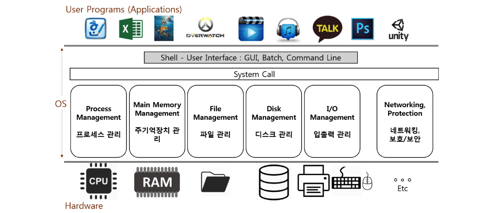

# 01. 운영체제의 역할

Operating System 또는 OS라고 부르며, 시스템 하드웨어를 관리하고, 응용 소프트웨어를 실행하기 위해 필요한 시스템 소프트웨어이다.

## 운영체제가 필요한 이유

컴퓨터 하드웨어는 스스로 할 수 있는 것이 없기 때문에 운영체제가 이를 관리해 주어야 한다.

예를 들어 CPU, Memory, 저장매체, 입력장치 등을 얼마나 사용할지, 어느 공간에 할당해주어야 하는 지 등을 결정하는 일을 운영체제가 담당한다.

사용자의 명령을 전달하면서 해당 명령을 수행하기 위해 시스템 자원을 어떻게 분배할 것인지를 결정한다.

## 대표적인 운영체제

- Windows OS, Mac OS, UNIX
- UNIX OS
  - UNIX 계열 OS
    - UNIX와 사용법이나, OS 구조가 유사하다.
  - LINUX (리눅스) OS
    - 서버 작업에 주로 사용한다.

## 운영체제 역할

### 1. 시스템 자원(System Resource) 관리자

- 시스템 자원(System Resource) = 컴퓨터 하드웨어

  - CPU(중앙처리장치), Memory(DRAM, RAM)
  - I/O Devices(입/출력장치)
    - Monitor, Mouse, Keyboard, Network

  - 저장매체: SSD, HDD(하드디스크)

### 2. 사용자 컴퓨터간의 커뮤니케이션 지원

사용자 ↔ 운영체제 ↔ 컴퓨터

### 3. 컴퓨터 하드웨어와 프로그램을 제어

운영체제는 하드웨어와 응용 프로그램을 제어할 수 있도록 다음과 같은 구조를 가진다. Shell을 통해 사용자와 컴퓨터간의 커뮤니케이션을 지원한다.

