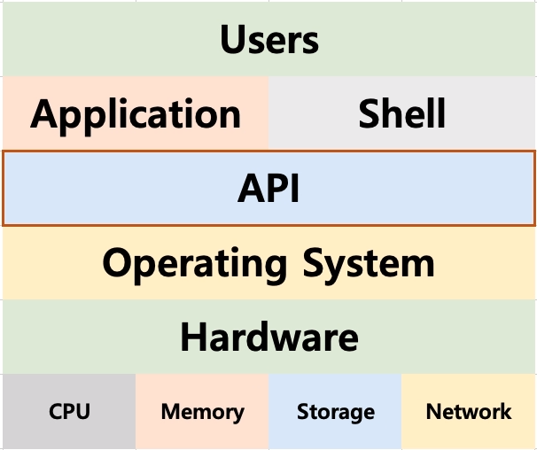

# 03. 운영체제의 구조 - 시스템 콜

## 응용 프로그램, 운영체제, 컴퓨터 하드웨어(시스템 리소스) 관계

- 운영체제는 응용 프로그램이 요청하는 메모리를 허가하고, 분배, CPU 시간을 제공하며 IO Devices 사용을 허가/ 제어한다.
- 사용자가 응용 프로그램을 사용 -> 응용 프로그램이 운영체제에 시스템 자원 요청 -> 운영체제가 해당 자원을 하드웨어에서 응용 프로그램으로 빌려준다.

## 쉘(Shell)

- 사용자가 운영체제 기능과 서비스를 조작할 수 있도록 인터페이스를 제공하는 프로그램이다.
- 쉘은 터미널 환경(CLI)과, GUI 환경 두 종류로 분류된다.

## API(Application Programming Interface)

- 각 언어별 운영체제 기능 호출 인터페이스 함수이다.

- 보통은 라이브러리(library) 형태로 제공한다.
- 운영체제로 보내는 요청서 같은 것이다.

## 시스템 콜

- 시스템 콜 또는 시스템 호출 인터페이스라고 부른다.
- 운영체제가 운영체제 각 기능을 사용할 수 있도록 시스템 콜이라는 명령 또는 함수를 제공한다.
- API 내부에는 시스템 콜을 호출하는 형태로 만들어지는 경우가 대부분이다.

## 운영체제 제작 순서

1. 운영체제를 개발한다.(kernel)
2. 시스템 콜을 개발
3. C API(library)
4. Shell 프로그램
5. 응용 프로그램 개발

## 정리

- 운영체제는 컴퓨터 하드웨어와 응용 프로그램을 관리한다.
- 사용자 인터페이스를 제공하기 위해 쉘 프로그램을 제공한다.
- 응용 프로그램이 운영체제 기능을 요청하기 위해서, 운영체제는 시스템 콜을 제공한다.
  - 보통 시스템 콜을 직접 사용하기 보다는, 해당 시스템 콜을 사용해서 만든 각 언어별 라이브러리(API)를 사용한다.
