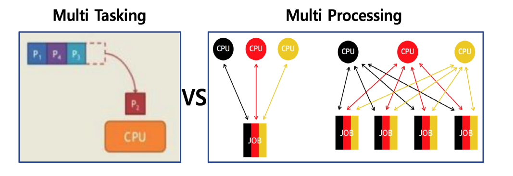

# 05. 스케줄링 - 배치 처리, 멀티 태스킹, 멀티프로세싱

프로세스 : 응용 프로그램이라고 볼 수 있다.

스케쥴링 : 배치 처리 시스템, 시분할 시스템, 멀티 태스킹 등의 방식으로 여러가지 응용 프로그램을 시간 순서로  CPU에 배치하는 방법이다.

## 배치 처리 시스템

자동으로 다음 응용 프로그램이 이어서 실행될 수 있도록 하는 시스템이다.

여러 프로그램을 순차적으로 실행시킨다.

단점으로는 실행시킨 프로그램의 실행 시간이 너무 많이 걸려서, 다른 프로그램이 실행하는데 시간을 많이 기다려야 하는 경우가 생긴다.

또한 동시에 여러 응용 프로그램 실행과 다중 사용자 지원이 불가능하다.

-그래서 멀티 프로그래밍 / 시분할 시스템이 등장했다.

## 시분할 시스템

응용 프로그램이 CPU를 점유하는 시간을 잘게 쪼개어 실행될 수 있도록 하는 시스템이다.

## 멀티 태스킹

단일 CPU에서, 여러 응용 프로그램이 동시에 실행되는 것 처럼 보이도록 하는 시스템이다.

10 ~ 20 ms 단위로 실행 응용 프로그램이 바뀌어 사용자에게는 동시에 실행되는 것처럼 보인다.

## 멀티태스킹과 멀티 프로세싱

출처 : https://donghoson.tistory.com/15

멀티 태스킹 : 단일 CPU에서 여러 프로그램을 수행하는 시스템이다.

멀티 프로세싱 : 여러 CPU에 하나의 프로그램을 병렬로 실행해서 실행속도를 극대화시키는 시스템이다.

## 정리

- 배치 처리 시스템

- 시분할 시스템 (다중 사용자 지원, 응답시간 최소화)
- 멀티 태스킹 (동시 실행시키는 것 처럼 보이도록)
- 멀티 프로세싱 (여러 CPU에 하나의 프로그램을 병렬로 실행시키는 시스템)

