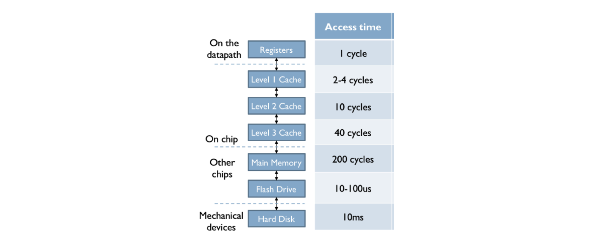
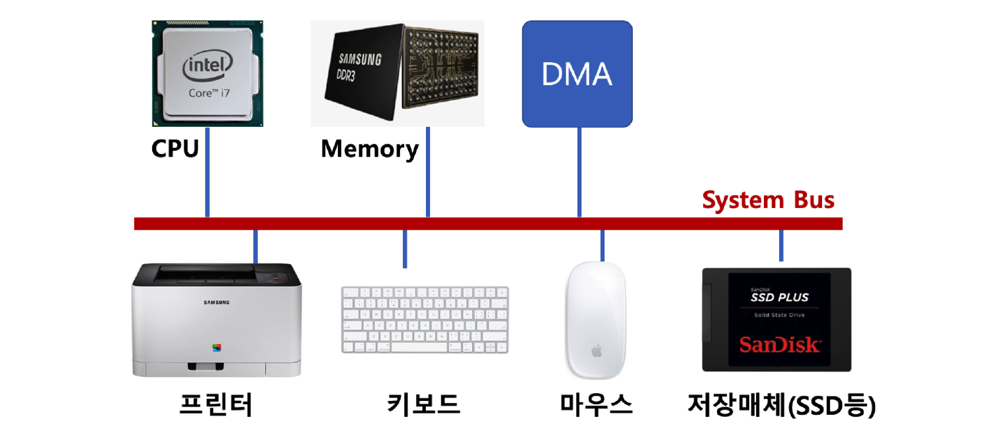

# 05. 스케줄링 - 멀티 프로그래밍

## 멀티 프로그래밍

최대한 CPU를 많이 활용하도록 하는 시스템

- 시간 대비 CPU 활용도를 높인다.
- 응용 프로그램을 짧은 시간 안에 실행 완료 시킬 수 있다.

응용 프로그램은 온전히 CPU를 쓰기 보다, 다른 작업을 중간에 필요로 하는 경우가 많다.

- ex) 응용 프로그램이 실행되다가 파일을 읽거나 프린팅을 한다.

그래서 그 사이에 CPU가 쉬는 타이밍이 발생하는걸 방지하기 위해 멀티 프로그래밍 시스템을 사용한다.

## 메모리 계층

출처 : https://computationstructures.org/lectures/caches/caches.html

## System Bus

CPU는 메모리나 저장 매체 등에 직접 접근하지 않고 DMA를 통해 요청을 하여 데이터를 전달하고 받는다.

## 정리

> 실제로는 시분할 시스템, 멀티 프로그래밍, 멀티 태스킹이 유사한 의미로 통용된다.

- 핵심
  - 여러 응용 프로그램 실행을 가능토록 한다.
  - 응용 프로그램이 동시에 실행되는 것처럼 보이도록 한다.
  - CPU를 쉬지 않고 응용 프로그램을 실행토록 해서, 짧은 시간 안에 응용 프로그램이 실행 완료 될 수 있도록 한다.
  - 컴퓨터 응답 시간도 짧게 해서, 다중 사용자도 지원한다.

- 시분할 시스템 : 다중 사용자 지원, 컴퓨터 응답 시간을 최소화하는 시스템이다.
- 멀티 태스킹 : 단일 CPU에서 여러 응용 프로그램을 동시에 실행하는 것처럼 보이게 하는 시스템이다.
- 멀티 프로세싱 : 여러 CPU에서 하나의 응용 프로그램을 병렬로 실행하게 해서, 실행속도를 높이는 기법이다.
- 멀티 프로그래밍 : 최대한 CPU를 일정 시간당 많이 활용하는 시스템이다.