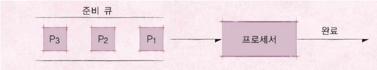
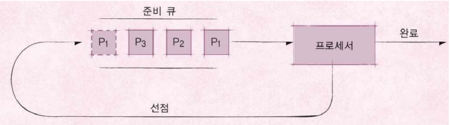

# 07. 스케줄링 알고리즘 기본

## 프로세스(process)

메모리에 올려져서 실행 중인 프로그램을 프로세스라고 한다.

실행 파일은 코드 이미지(바이너리)라고 하고 그 예로는 ELF format이 있다.

> 프로세스라는 용어는 작업, task, job 이라는 용어와 혼용하여 사용한다.

응용 프로그램은 프로세스라고 볼 수 없다. 왜나하면 응용 프로그램은 여러 개의 프로세스로 이루어질 수 있기 때문이다.

또한 하나의 응용 프로그램은 여러 개의 프로세스(프로그램)가 상호작용을 하면서 실행될 수도 있다.

> 간단한 C/C++ 프로그램을 만든다면 -> 하나의 프로세스
>
> 여러 프로그램을 만들어서, 서로 통신하면서 프로그램을 작성할 수도 있음(IPC 기법)

## 스케줄링 알고리즘

프로세스를 관리하는 것이 스케줄러이다. 어떠한 순서로 프로세스를 실행시킬 것인지를 정하는 것을 스케줄링 알고리즘이라고 한다.

시분할 시스템 예 : 프로세스 응답 시간을 가능한 짧게

멀티 프로그래밍 예 : CPU 활용도를 최대로 높여서, 프로세스를 빨리 실행

## FIFO 스케줄러

가장 간단한 스케줄러이며 배치 처리 시스템을 위한 스케줄러이다.

큐 구조와 동일하다.

## 최단 작업 우선(SJF) 스케줄러

SJF(Shortest Job First) 스케줄러는 가장 프로세스 실행 시간이 짧은 프로세스부터 먼저 실행을 시키는 알고리즘이다.

실행 시간을 알아야 사용가능하다

## OS 종류

- RealTime OS (RTOS) : 응용 프로그램 실시간 성능 보장을 목표로 하는 OS
  - 정확하게 프로그램 시작, 완료 시간을 보장한다.
  - Hardware RTOS, Software RTOS
  - 시간에 민감한 경우 사용한다.

- General Purpos OS(GPOS)
  - 프로세스 실행시간에 민감하지 않고, 일반적인 목적으로 사용하는 OS이다. (예. Windows, Linux)

## 우선 순위 기반(Priority-Based) 스케줄러

우선 순위에 따라 프로세스 실행 순서를 결정한다.

- 정적 우선 순위 : 프로세스마다 우선 순위를 미리 지정한다.

- 동적 우선 순위 : 스케줄러가 상황에 따라 우선 순위를 동적으로 변경한다.

> 현실적으로 모든 프로세스의 우선 순위를 미리 지정하는 것은 어렵다.

## Round Robin 스케줄러

시분할 시스템의 기반이 되는 스케줄러로 Ready-Queue에 각 프로세스를 넣어두고 각 시간별로 프로세서에 전달해 실행 후 완료되면 제거하고 완료되지 않으면 다시 선점하는 방식이다.

## 정리

- 다양한 기본 스케줄링 알고리즘
  - FIFO (FCFS) 스케줄링 알고리즘 (배치 처리 시스템을 위한 알고리즘)
  - 최단 작업 우선(SJF) 스케줄링 알고리즘
  - 우선 순위 기반 스케줄링 알고리즘
    - 정적 우선순위, 동적 우선순위
  - Round Robin 스케줄링 알고리즘
    - 시분할 시스템 기반
