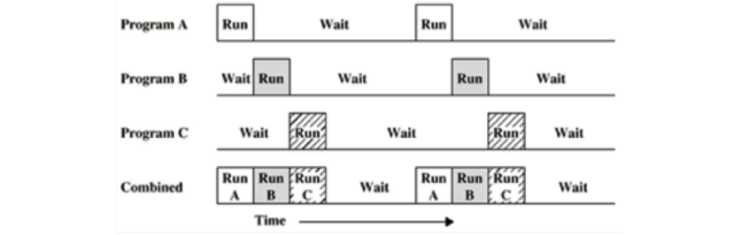
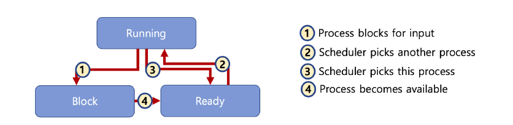
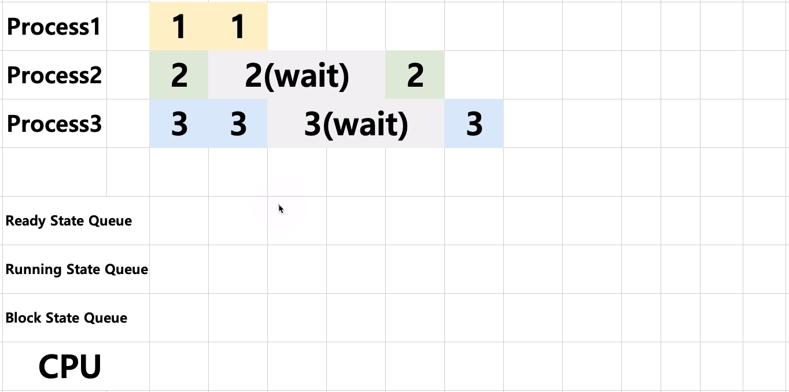
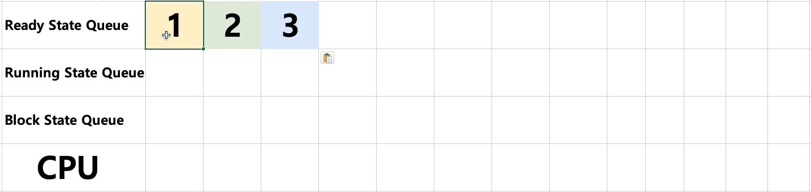
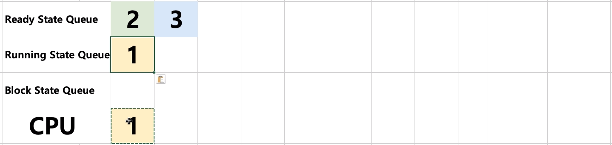
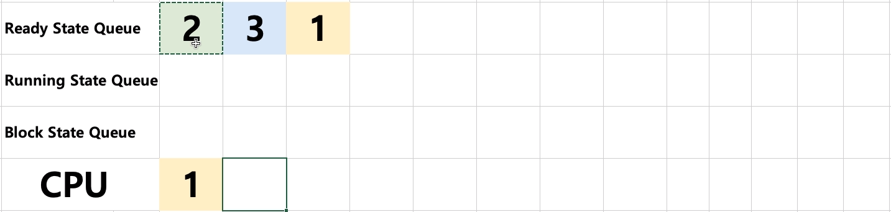
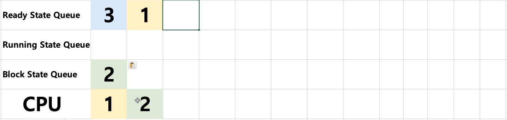
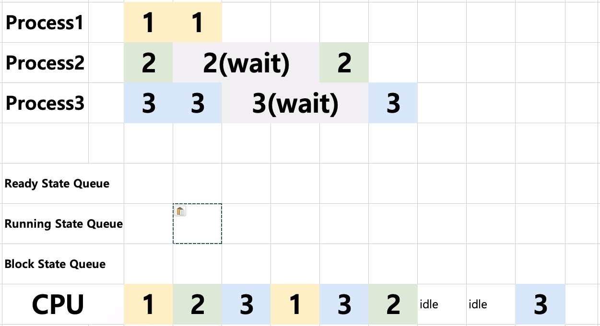

# 08. 프로세스 상태와 스케줄러

## 멀티 프로그래밍과  Wait

- 멀티 프로그래밍 : CPU 활용도를 극대화 하는 스케줄링 알고리즘이다.
- Wait : 간단히 저장매체로부터 파일 읽기를 기다리는 시간으로 가정한다.

다음과 같이 A, B, C 프로세스들이 CPU에서 진행되는 순서는 Combined의 순서로 진행될 것이다.

## 프로세스 상태

- running state : 현재 CPU에서 실행 상태
- ready state : CPU에서 실행 가능 상태(실행 대기 상태)
- block state : 특정 이벤트 발생 대기 상태(예 : 프린팅이 다 되었다.)

## 프로세스 상태간 관계

## 프로세스 상태 기반 알고리즘

프로세스 3개의 상태가 다음과 같다고 가정할 때 각 상태별 큐가 존재한다.

최초 시점에는 모두 실행이 가능한 Ready 상태이기 때문에 모두 Ready 큐에 들어간다.

ReadyQueue.pop()을 통해 Ready 큐로부터 프로세스를 가져와 처리한다. 이 때 실행 중이기 때문에 Running 큐에 삽입된다.

일정 시간 진행 후에는 종료 후 상태를 판단하여 해당 상태에 맞는 큐에 삽입된다.

프로세스 1의 경우 여전히 진행 가능한 상태이기 때문에 Ready 큐로 삽입된다.

다음에는 Ready 큐의 가장 앞에 있는 프로세스 2를 가져와 CPU에서 처리를 하고 종료가 된 뒤 상태는 Block이 된다. 

따라서 다음과 같이 Block 큐로 삽입된다.

큐 3개에 동일하게 작동을 하며 프로세스 처리가 되면 최종적인 CPU 프로세스 처리 순서는 다음과 같다.

idle은 Ready 큐에 실행 가능한 프로세스가 없어 대기 상태일 때를 뜻한다.

