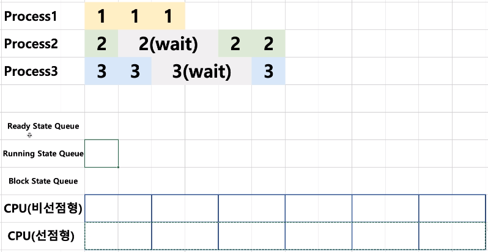
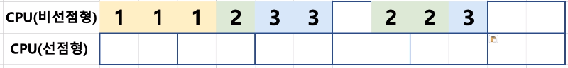
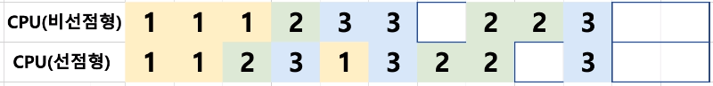

# 09. 선점형과 비선점형 스케줄러

- 선점형 스케줄러 (Preemptive Scheduling)
  - 하나의 프로세스가 다른 프로세스 대신에 프로세서(CPU)를 대신할 수 있다.
  - 프로세스 running 중에 스케줄러가 이를 중단시키고, 다른 프로세스로 교체 가능
- 비선점형 스케줄러 (Non-preemptive Scheduling)
  - 하나의 프로세스가 끝나지 않으면 다른 프로세스는 CPU를 사용할 수 없다.
  - 프로세스가 자발적으로 blocking 상태로 들어가거나, 실행이 끝났을 때만, 다른 프로세스로 교체 가능하다.

## 선점형과 비선점형 스케줄러 동작 비교

다음과 같은 프로세스와 선점형, 비선점형 스케줄러가 존재하고 선점형 스케줄러는 각 단위(지금은 2칸)마다 프로세스를 강제 전환한다.

비선점형 스케줄러의 경우 프로세스가 자발적으로 끝나거나  block 상태가 되었을 때에만 전환이 가능하기 때문에 다음과 같은 스케줄링 형태가 된다.

선점형 스케줄러의 경우 각 단위(2칸)마다 혹은 프로세스가 자발적으로 끝나거나 block 상태가 되었을 때 동작하기 때문에 다음과 같은 스케줄링 형태가 된다.

