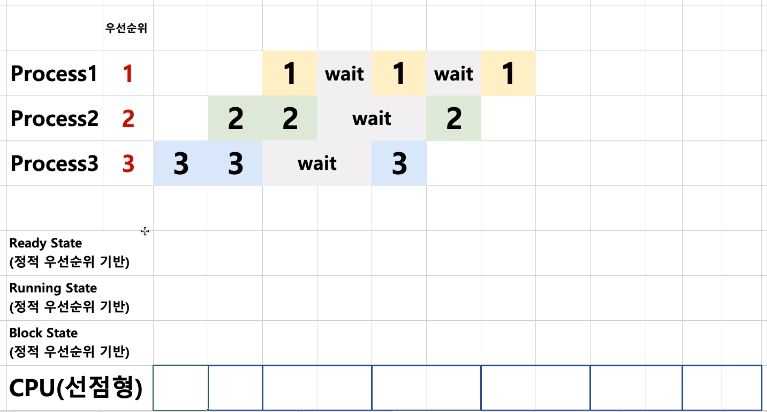
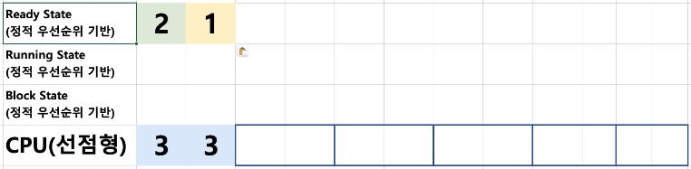
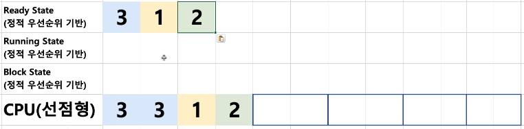
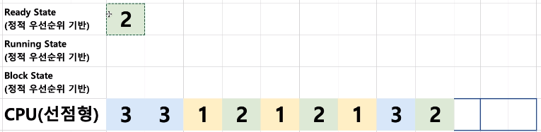

# 10. 스케줄링 알고리즘 조합

## 스케줄러 구분(정책, policy)

- FIFO(FCFS), SJF, Priority-based : 어떤 프로세스를 먼저 실행시킬지에 대한 알고리즘 (비선점형 스케줄러)
- RoundRobin : 시분할 시스템을 위한 기본 알고리즘 (선점형 스케줄러)

 

## 동작

다음과 같이 정적 우선순위를 기반으로 하며 시분할 방식을 채택하고 선점형인 스케줄러를 사용할 때, CPU 사용 기록을 본다.

해당 프로세스들은 다른 시간에 들어온다는 점을 참고한다.

2칸마다 스케줄러가 개입한다.

3번 프로세스가 가장 먼저 들어왔기에 단위 시간(2칸)동안 먼저 실행되고 그 사이 2번가 1번이 Ready 큐에 들어오게 된다.

이후 스케줄러가 개입하는 시점이 되어 Ready 큐에 있는 프로세스 중 우선 순위가 높은 1번 프로세스부터 진행시킨다. 

하지만 1번 프로세스는 단위 시간이 끝나기도 전에 block 상태가 되어 다음 우선 순위인 2번 프로세스가 진행된다.

이후에도 동일한 작업들이 반복되고 우선 순위와 시분할 시스템에 맞춰 동작하면 다음과 같은 결과가 나온다.

