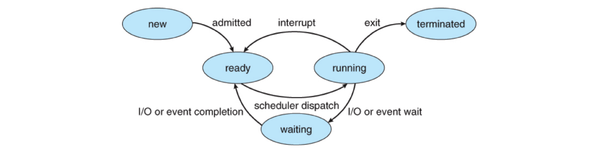
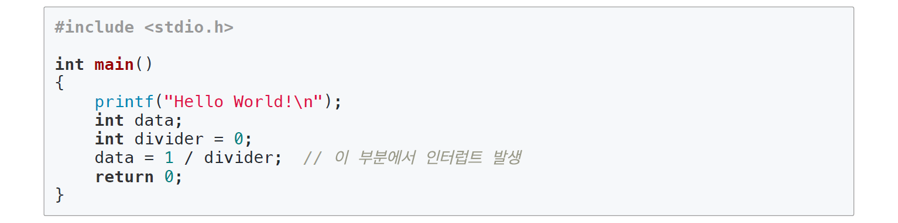
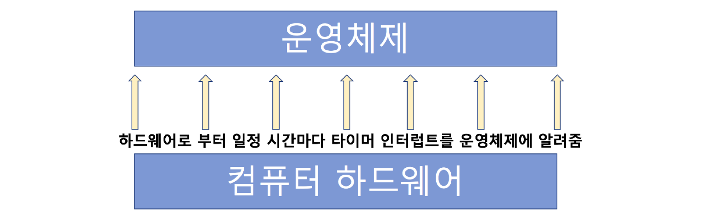
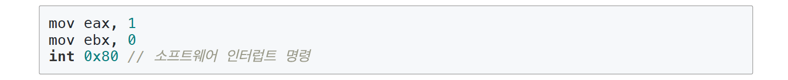
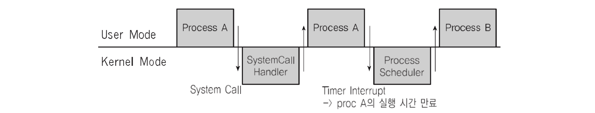

# 11. 인터럽트

CPU가 프로그램을 실행하고 있을 때, 입출력 하드웨어 등의 장치나 또는 예외상황이 발생하여 처리가 필요할 경우에 CPU에 알려서 처리하는 기술이다.

## 인터럽트 필요 이유

- 선점형 스케줄러 구현
  - 프로세스 running중에 스케줄러가 이를 중단시키고, 다른 프로세스로 교체하기 위해, 현재 프로세스 실행을 중단시킨다.
    - 그러려면, 스케줄러 코드가 실행이 되서, 현 프로세스 실행을 중지시켜야 한다.
- IO Device와의 커뮤니케이션
  - 저장매체에서 데이터 처리 완료시, 프로세스를 깨워야 한다. (block state -> ready state)
- 예외 상황 핸들링
  - CPU가 프로그램을 실행하고 있을 때, 입출력 하드웨어 등의 장치나 또는 예외상황이 발생할 경우, CPU가 해당 처리를 할 수 있도록 CPU에 알려줘야 한다.

## 인터럽트 처리 예

- CPU가 프로그램을 실행하고 있을 때,
  - 입출력 하드웨어 등의 장치 이슈 발생
    - 파일 처리가 끝났다는 것을 운영체제에 알려주기
    - 운영체제는 해당 프로세스를 block state에서 실행 대기(ready) 상태로 프로세스 상태 변경하기
  - 또는 예외 상황이 발생
    - 0으로 나누는 계산이 발생해서, 예외 발생을 운영체제에 알려주기
    - 운영체제가 해당 프로세스 실행 중지/에러 표시

## 이벤트와 인터럽트

- 인터럽트는 일종의 이벤트로 불린다.
- 이벤트에 맞게 운영체제가 처리한다.

## 주요 인터럽트(Interrupt)

1. 계산하는 코드에서 0으로 나누는 코드 실행시 (Divide-by-Zero Interrupt)

   

2. 타이머 인터럽트

   - 선점형 스케줄러를 위해 필요하다.

   

3. 입출력(IO) 인터럽트

   - 프린터, 키보드, 마우스, 저장매체(SSD등)

## 인터럽트 종류

### 내부 인터럽트 (소프트웨어 인터럽트)

주로 프로그램 내부에서 잘못된 명령 또는 잘못된 데이터 사용시 발생한다.

- 0으로 나눴을 때
- 사용자 모드에서 허용되지 않은 명령 또는 공간 접근시
- 계산 결과가 Overflow/Underflow가 발생할 때

### 외부 인터럽트 (하드웨어 인터럽트)

주로 하드웨어에서 발생되는 이벤트이다. (프로그램 외부)

- 전원 이상
- 기계 문제
- 키보드 등 IO 관련 이벤트
- Timer 이벤트

## 시스템 콜 인터럽트

- 시스템 콜 실행을 위해서는 강제로 코드에 인터럽트 명령을 넣어 CPU에 실행시켜야 한다.

- 시스템 콜 실제 코드

  

  - eax 레지스터에 시스템 콜 번호를 넣는다.
  - ebx 레지스터에는 시스템 콜에 해당하는 인자 값을 넣는다.
  - 소프트웨어 인터럽트 명령을 호출하면서 0x80값을 넘겨준다.

- 시스템 콜 인터럽트 명령을 호출하면서 0x80값을 넘겨준다.
  1. CPU는 사용자 모드를 커널모드로 바꿔준다.
  2. IDT(Interrupt Descriptor Table)에서 0x80에 해당하는 주소(함수)를 찾아서 실행한다.
  3. system_call() 함수에서 eax로부터 시스템 콜 번호를 찾아서, 해당 번호에 맞는 시스템 콜 함수로 이동한다.
  4. 해당 시스템 콜 함수 실행 후, 다시 커널 모드에서 사용자 모드로 변경하고, 다시 해당 프로세스 다음 코드로 진행한다.

## 사용자/커널 모드와 프로세스, 인터럽트

## 인터럽트와 IDT

- 인터럽트는 미리 정의되어 각각 번호와 실행 코드를 가리키는 주소가 기록되어 있다.
  - 컴퓨터 부팅시 운영체제가 운영체제 내부 코드를 IDT(Interrupt Descriptor Table)에 기록한다. 
- IDT 예시
  - 항상 인터럽트 발생 시, IDT를 확인
  - 시스템콜 인터럽트 명령은 0x80 번호가 미리 정의
  - 인터럽트 0x80에 해당하는 운영체제 코드는 system_call()이라는 함수
  - 즉, IDT에는 0x80->system_call()와 같은 정보가 기록되어 있다.

- 리눅스 예시
  - 0~31 : 예외상황 인터럽트 (일부는 정의 안된 채로 남겨져 있다.)
  - 32 ~ 47 : 하드웨어 인터럽트 (주변장치 종류/갯수에 따라 변경 가능)
  - 128(0x80) : 시스템 콜

## 인터럽트와 프로세스

인터럽트가 발생하는 과정을 정리하면 다음과 같다.

1. 프로세스 실행 중 인터럽트 발생
2. 현 프로세스 실행 중단
3. 인터럽트 처리 함수 실행(운영체제)
4. 현 프로세스 재실행

## 인터럽트와 스케줄러

- 수시로 타이머 인터럽트 발생
  - 운영체제가 타이머 인터럽트 발생 횟수를 기억해서 5번 타이머 인터럽트 발생하면, 현재 프로세스를 다른 프로세스로 바꿔준다.