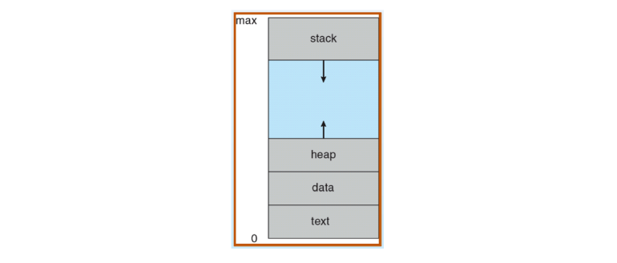
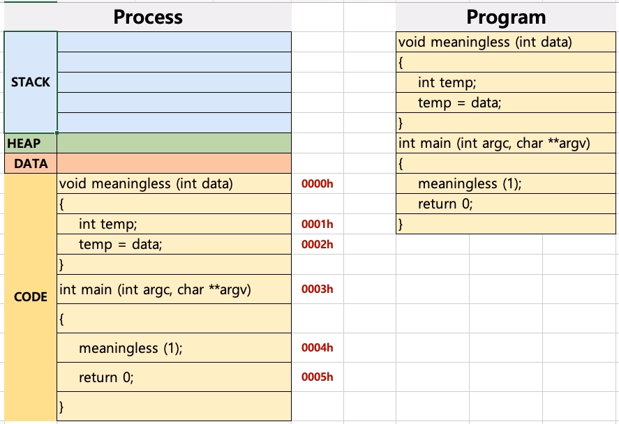
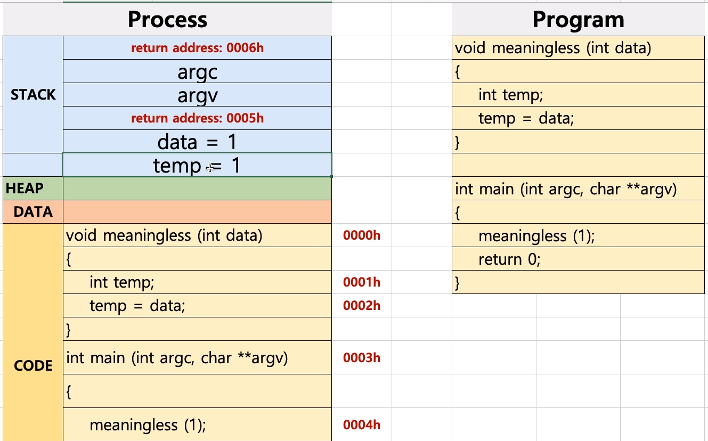
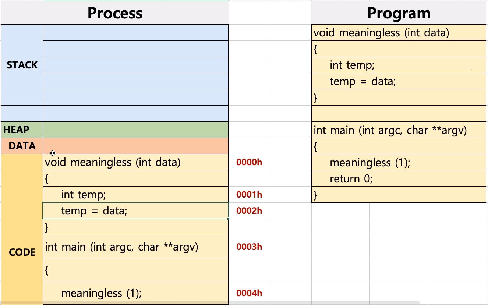
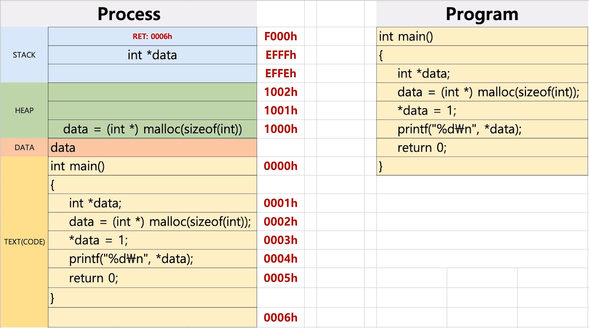
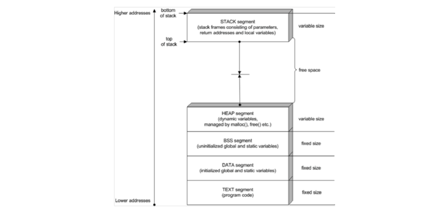
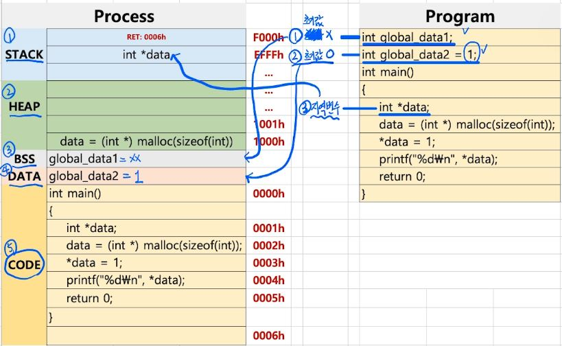

# 12. 프로세스 구조

프로세스는 다음과 같이 4가지 영역으로 나눌 수 있다.

- text(CODE) : 코드
- data : 변수/초기화된 데이터
- stack : 임시 데이터(함수 호출, 로컬 변수 등)
- heap : 코드에서 동적으로 만들어지는 데이터

## 프로세스와 프로그램 동작

PC(Program Counter) : 중앙 처리 장치 내부에 있는 레지스터 중의 하나로서, 다음에 실행될 명령어의 주소를 가지고 있어 실행할 기계어 코드의 위치를 지정한다.

SP(Stack Pointer) : 중앙 처리 장치 내부에 있는 레지스터 중의 하나로서, 스택에 데이터가 채워진 위치를 가리킨다.

프로그램이 실행되면 text 영역에 코드들이 전달 된다.

이후 PC(Program Counter)가 코드가 존재하는 주소(메모리 주소)를 각각 가리키며 실행이 되고, 실행 중 필요시 stack, heap, data 영역에 read/write 한다.

중간에 return address가 있는 이유는 함수 내에 함수가 존재하는 경우도 있으므로 그런 경우 return address를 지정하여 다시 돌아가 작업이 이어지도록 하기 위함이다.

일련의 연산과정이 끝나면 stack에서 차례대로 다시 제거가 되며 이후 모든 작업이 완료되었을 경우 다음과 같은 상태가 되고 프로그램이 종료된다.

## 프로세스의 힙 영역

HEAP 영역은 동적 할당 된 데이터의 주소가 존재하는 곳이다.

C언어에서는 malloc 함수를 통해 제어한다. 메모리 해제 시에는 free 함수를 사용한다.

## 프로세스의 데이터 영역

DATA 영역은 BSS와 DATA 영역으로 나뉜다.

- BSS : 초기화되지 않은 전역 및 스태틱 변수
- DATA : 초기화 된 전역 및 스태틱 변수

출처 : https://www.drdobbs.com/security/anatomy-of-a-stack-smashing-attack-and-h/240001832

다음과 같은 프로그램이 있을 때 초기화되지 않은 global_data1은 BSS 영역에, 초기화 된 global_data2는 DATA 영역에 존재하게 된다.

