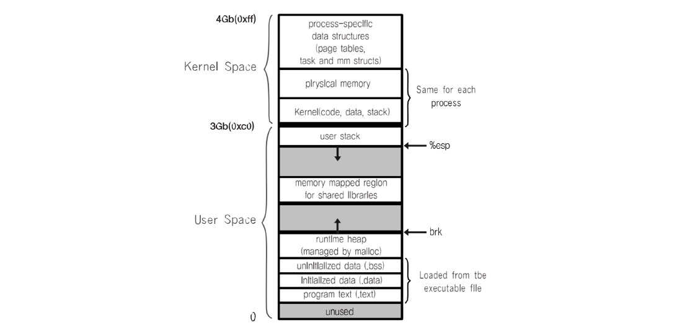
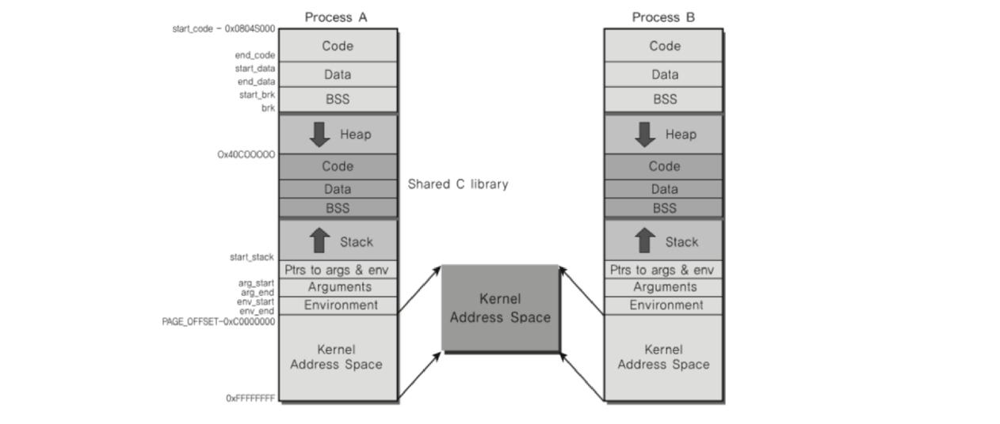
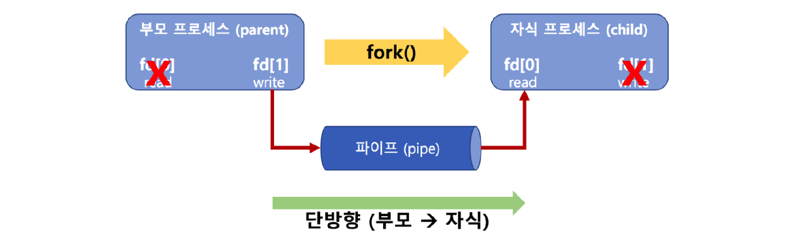
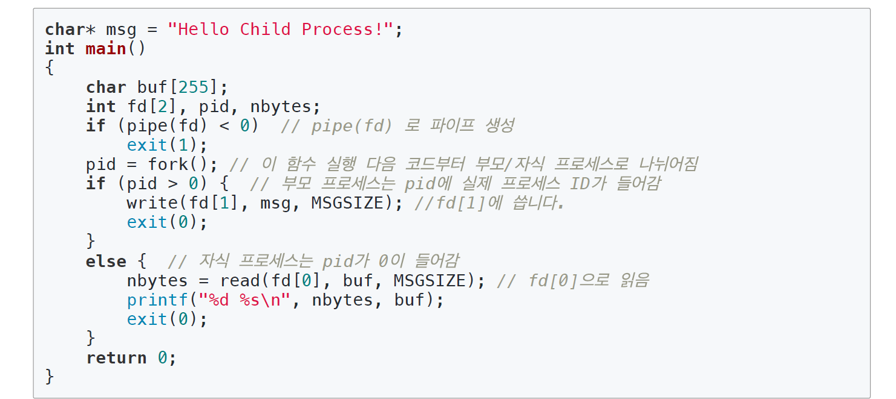
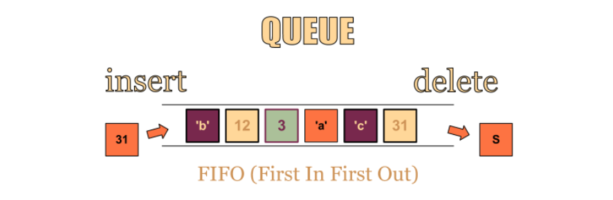
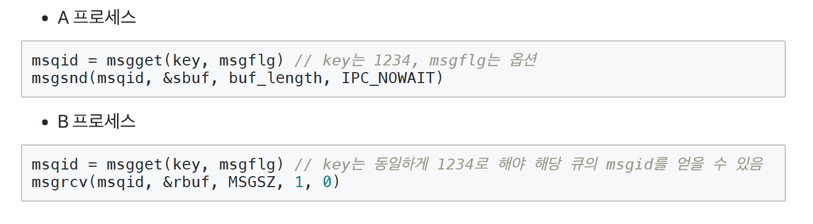
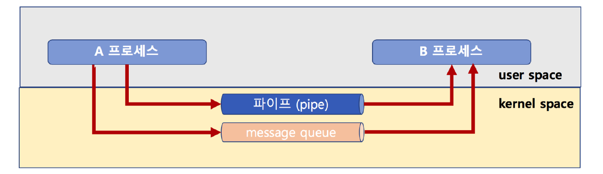
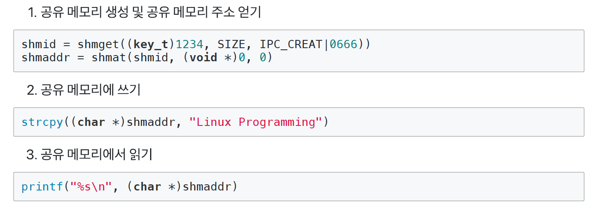

# 14. InterProcess Communication

## 프로세스 간 커뮤니케이션

프로세스들이 서로의 공간을 쉽게 접근할 수 있다면 프로세스 데이터/코드가 변경될 수 있기 때문에 위험하다. 따라서 프로세스는 다른 프로세스 공간을 접근할 수 없도록 설계되었다.

하지만 프로세스 간 커뮤니케이션이 필요했으므로 프로세스 간 통신 방법을 제공하며 이를 IPC(InterProcess Communication)이라고 한다.

### IPC의 필요 이유

- 여러 프로세스 동시 실행을 통한 성능 개선
- 복잡한 프로그램을 위해 프로세스간 통신 필요

### IPC 예제

#### 여러 프로세스 동시 실행

1~10000을 더하는 작업이 있을 때 fork() 함수로 10개의 프로세스를 생성하여 1000단위로 잘라 1~1000, 1001~2000, ... 범위로 더한 결과를 합하여 더 빠르게 동작이 가능하다.

#### 웹 서버

웹 서버는 요청이 오면 HTML 파일을 클라이언트에 제공하는 프로그램이며 새로운 사용자 요청이 올 때마다 fork() 함수로 새로운 프로세스를 만들고 각 사용자 요청에 즉시 대응한다.

> CPU 병렬 처리가 가능하다면 더 빠른 대응이 가능하다.

#### 파일을 통한 커뮤니케이션

다른 프로세스에 전달할 내용을 파일에 쓰고 다른 프로세스가 해당 파일을 읽는 방식이다.

하지만 실시간으로 데이터 전달을 하는 데에 한계가 있으며, 해당 파일이 쓰였는지 아닌지 알 수 있는 방버이 없어 주기적으로 확인해야 하므로 불편함이 있다.

### 프로세스 공간

프로세스 공간은 4GB 정도의 메모리 공간을 할당 받으며 사용자 공간과 커널 공간으로 분리되어 있다.

이는 실제 주소가 아닌 가상 메모리 공간을 매칭하여 실제 물리 메모리보다 더 많은 가상 메모리 공간을 활용할 수 있다.

커널 공간은 서로 공유하기 때문에 이를 통해 IPC가 이루어질 수 있다.

## 다양한 IPC 기법

1. File 사용
2. Message Queue
3. Shared Memory
4. Pipe
5. Signal
6. Semaphore
7. Socket

> 첫 번째 방법을 제외한 나머지 방법은 모두 커널 공간을 사용한다.

### Pipe

기본 파이프는 단방향 통신이며 fork()로 자식 프로세스를 만들었을 때, 부모와 자식 간의 통신이 가능하다.

#### 코드 예제

fork()를 통해 자식 프로세스를 생성하며 부모 프로세스에는 실제 ID(Integer)값이 들어가고, 자식 프로세스에는 0이 들어간다.

이를 통해 부모와 자식간의 구분이 가능하며, fd[1]에서 write, fd[0]에서 read가 가능하다.

### Message Queue

큐이기 때문에 기본적으로 FIFO 정책으로 데이터를 전송한다.

프로세스 제한 없이 어느 프로세스와도 데이터 송/수신이 가능하다.

#### 코드 예제

### 파이프와 메세지 큐

#### 두 IPC 기법의 차이점

- 파이프는 부모/자식 프로세스 간에만 데이터 송/수신이 가능하지만, 메세지 큐는 어느 프로세스 간에라도 데이터 송/수신이 가능하다.
- 파이프는 단방향, 메세지 큐는 양방향 통신이다.

#### 공통점

- 커널 공간의 메모리를 사용한다.

### Shared Memory

커널 공간에 메모리 공간을 확보하고 해당 메모리 주소를 변수처럼 쓰는 방식이다.

공유 메모리 키를 가지며 여러 프로세스가 접근 가능하다.

#### 코드 예제

