# 15. Thread (스레드)

## 특징

- Light Weight Process 라고도 불리며 프로세스 내에 다중으로 존재할 수 있는 작업 단위이다.

- 프로세스 간에는 각 프로세스의 데이터 접근이 불가능하다.

- 하나의 프로세스에 여러 개의 스레드 생성 가능하다.

- 스레드들은 동시에 실행 가능하다.

- 프로세스 안에 있으므로, 프로세스의 데이터를 모두 접근 가능하다.

- 각기 실행이 불가능한 stack 존재한다.

## Multi Thread (멀티 스레드)

- 소프트웨어 병행 작업 처리를 위해 Multi Thread를 사용한다.

> 최근 CPU는 멀티 코어를 가지므로, Thread를 여러 개 만들어, 멀티 코어를 활용도를 높임

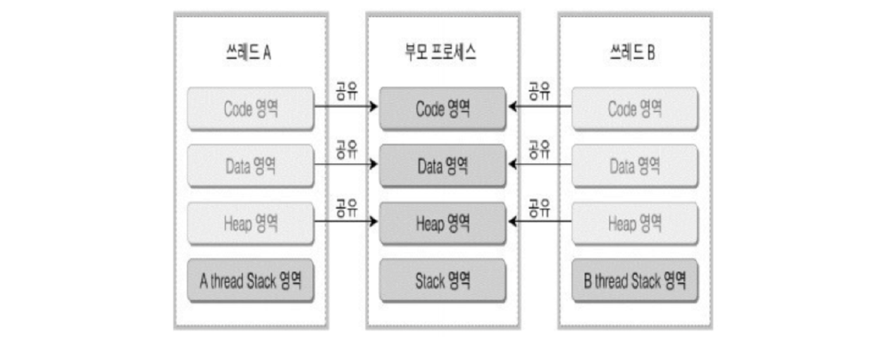

### 멀티 프로세스 vs 멀티 태스킹

최근 CPU는 멀티 코어를 가지므로 Thread를 여러 개 생성하여 멀티 코어의 활용도를 높인다.

멀티 프로세싱을 구현하기 위해서 하나의 JOB에 여러 Thread를 생성하여 진행하는 것이다.

- 출처 : https://donghoson.tistory.com/15

즉. 아래와 같이 다양한 방식으로 실행할 수 있도록 운영체제를 구성할 수 있다.

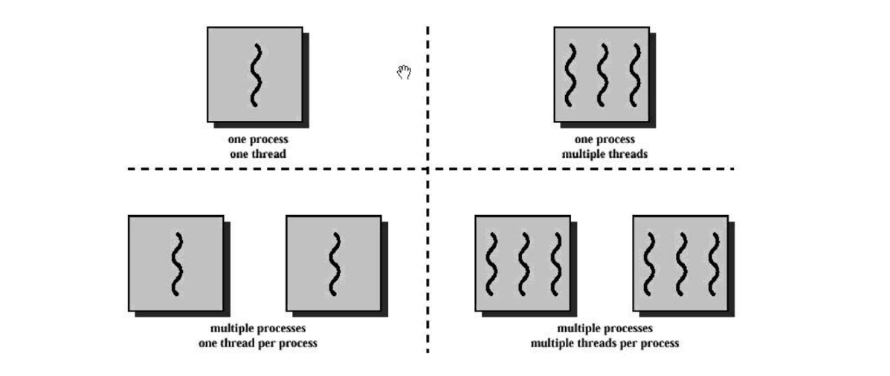

## Thread의 장점과 단점

### 장점

- 사용자에 대한 응답성 향상한다.

- 자원 공유 효율이 좋다.

  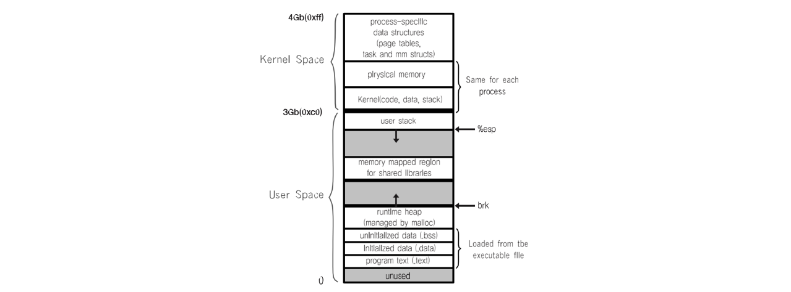

  - IPC 기법과 같이 프로세스간 자원 공유를 위해 번거로운 작업이 필요 없다.
  - 프로세스 안에 있으므로, 프로세스의 데이터를 모두 접근 가능하다.

- 작업이 분리되어 코드가 간결하다.

### 단점

- 스레드 상호 과의존
  - 스레드 중 한 스레드만 문제가 있어도, 전체 프로세스가 영향을 받는다.

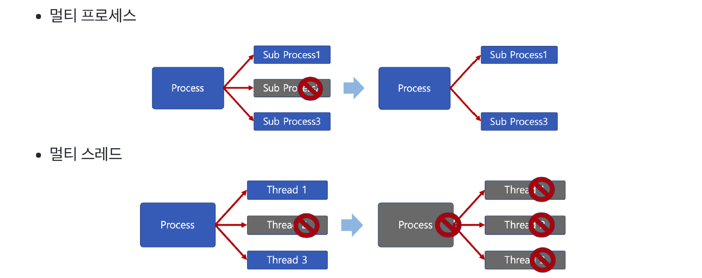

- 스레드를 많이 생성하면, Context Switching이 많이 일어나, 성능 저하가 일어난다.
  - 예 : 리눅스 OS에서는 Thread를 Process와 같이 다룬다.
    - 스레드를 많이 생성하면, 모든 스레드를 스케줄링해야 하므로, Context Switching이 빈번할 수 밖에 없다.

## Process vs Thread

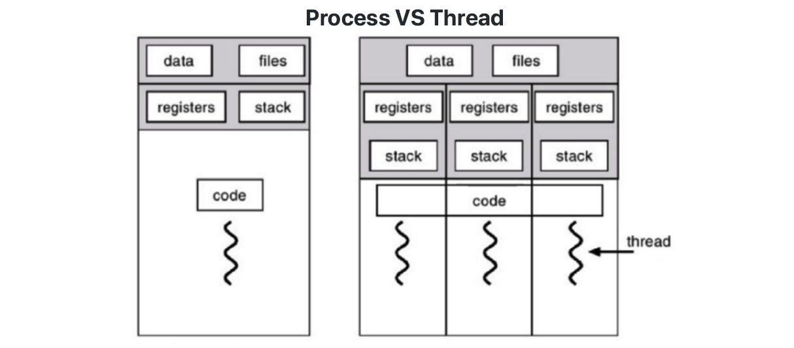

- 프로세스는 독립적, 스레드는 프로세스의 서브셋이다.
- 프로세스는 각각 독립적인 자원을 가짐, 스레드는 프로세스 자원 공유한다.
- 프로세스는 자신만의 주소영역을 가짐, 스레드는 주소영역 공유한다.
- 프로세스간에는 IPC 기법으로 통신해야 함, 스레드는 필요 없다.

## PThread

- POSIX 스레드(POSIX Threads, 약어 : PThread)
  - Thread 관련 표준 API

## 동기화(Synchronization) 이슈

동기화란 작업들 사이에 실행 시기를 맞추는 것이다.

여러 쓰레드가 동일한 자원(데이터) 접근시 동기화 이슈가 발생한다. 동일 자원을 여러 쓰레드가 동시 수정시, 각 쓰레드 결과에 영향을 준다.

### 코드 예제

다음 파이썬 코드는 쓰레드를 50개 생성하여 1,000,000을 더해 총 합을 구한다.

결과 값은 50,000,000이 나와야하지만 훨씬 적은 값인 12470682가 나오는 걸 알 수 있다.

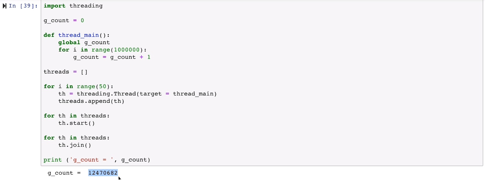

### 동기화 이슈 발생 원리

> g_count = g_count + 1

위의 코드는 읽기 / 연산 / 저장 3가지 작업으로 분리되어 있다.

하지만 쓰레드도 컨텍스트 스위칭으로 인해 각 작업이 중단되는 경우가 생기는데, 

연산이 진행 후 저장 직전에 넘어가고 저장되지 않은 값을 불러와 다음 쓰레드가 일을 처리하고 저장하는 식의 과정이 반복되며 누락되는 연산이 생긴다.

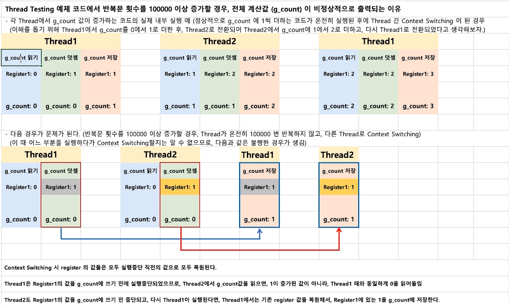

### 동기화 이슈 해결 방안

- Mutual exclusion(상호 배제)
- 쓰레드는 프로세스 모든 데이터를 접근할 수 있으므로,
  - 여러 쓰레드가 변경하는 공유 변수에 대해 Exclusive Access가 필요하다.
  - 어느 한 쓰레드가 공유 변수를 갱신하는 동안 다른 쓰레드가 동시 접근하지 못하도록 막는다.

### Mutual exclusion (상호 배제)

동기화 이슈를 막기 위해서 공유 변수에 대해 Exclusive Access가 필요하다.

어느 한 쓰레드가 공유 변수를 갱신하는 동안은 접근하지 못하도록 막는 것이다.

다음 threading 라이브러리 내에 Lock 클래스에 있는 acquire/release 함수를 통해 갱신 중 타 쓰레드 작업을 막는다.

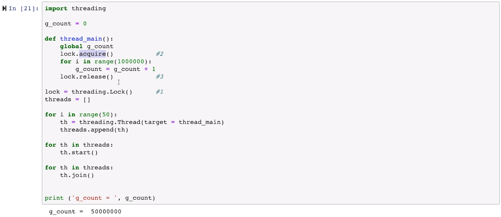

> 이 때 공유되는 자원을 임계 자원(critical resource), 해당 구간을 임계 영역(critical section)이라고 한다.

## 동기화와 세마포어

### Mutex와 세마포어 (Semaphore)

임계구역(Critical Section)에 대한 접근을 막기 위해 LOCKING 메커니즘이 필요하다.

- Mutex(binary semaphore)
  - 임계 구역에 하나의 쓰레드만 들어갈 수 있다.
- Semaphore
  - 임계 구역에 여러 쓰레드가 들어갈 수 있다.
  - counter를 두어서 동시에 리소스에 접근 할 수 있는 허용 가능한 쓰레드 수를 제어한다.

### 세마포어 (Semaphore)

- P: 검사 (임계영역에 들어갈 때)
  - S값이 1 이상이면, 임계 영역 진입 후, S값 1 차감한다. (S값이 0이면 대기)
- V: 증가 (임계영역에서 나올 때)
  - S값을 1 더하고, 임계 영역을 나온다.
- S: 세마포어 값 (초기 값만큼 여러 프로세스가 동시 임계영역 접근 가능)

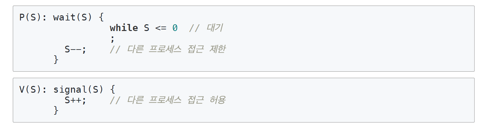

### 세마포어 (Semaphore) - 바쁜 대기

- wait()은 S가 0이라면, 임계영역에 들어가기 위해, 반복만 수행한다.
  - 바쁜 대기, busy waiting

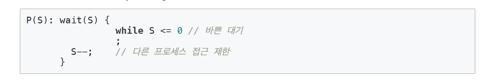

> 프로그래밍은 근본적으로 중단이 없다.
>
> 중단은 대부분 loop으로 표현한다.
>
> loop는 CPU에 부하를 걸리게 한다.

### Ready Queue

위와 같은 단점이 있어 반복문을 수행하는 것 대신 대기 큐에 넣는다.

S가 음수일 경우, 바쁜 대기 대신 대기 큐에 넣는다.

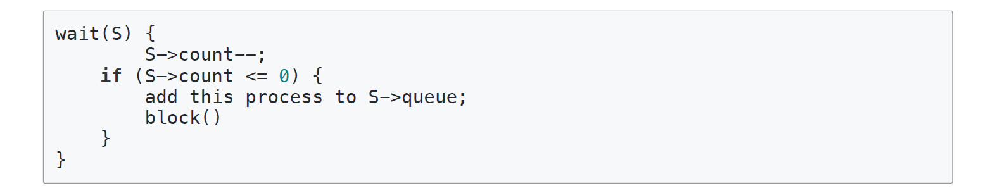

wakeup() 함수를 통해 대기 큐에 있는 프로세스를 재실행함으로 의미 없는 CPU 부하를 제거할 수 있다.

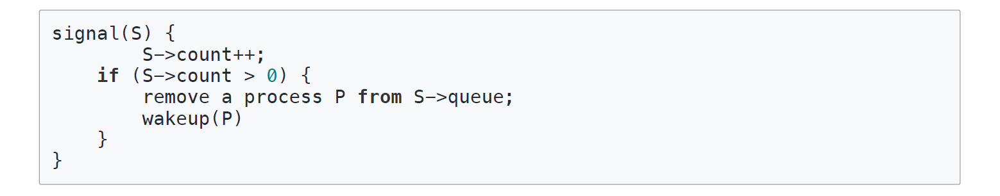

### 주요 세마포어 함수

POSIX 세마포어에 다음과 같은 주요 함수가 있다.

- sem_open() : 세마포어 생성한다.
- sem_wait() : 임계영역 접근 전, 세마포어를 잠그고, 세마포어가 잠겨있다면 풀릴 때까지 대기한다.
- sem_post() : 공유자원에 대한 접근이 끝났을 때, 세마포어 잠금을 해제한다.

## 정리

- Thread 개념 정리
  - 프로세스와 달리 스레드간 자원 공유한다.
- 스레드 장점
  - CPU 활용돌르 높인다.
  - 성능 개선 가능
  - 응답성 향상
  - 자원 공유 효율 (IPC를 안써도 됨)
- 스레드 단점
  - 하나의 스레드 문제가, 프로세스 전반에 영향을 미친다.
  - 여러 스레드 생성시 성능 저하 가능하다.