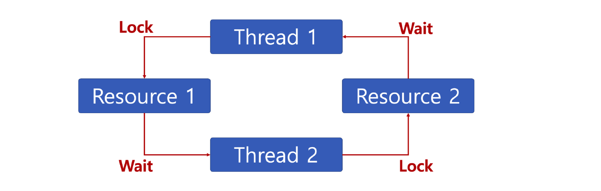

# 16. 교착상태(Deadlock)와 기아상태(Starvation)

## 교착상태 (Deadlock)

무한 대기 상태라고도 하며, 두 개 이상의 작업이 서로 상대방의 작업이 끝나기 만을 기다리고 있기 때문에, 다음 단계로 진행하지 못하는 상태

> 배치 처리 시스템에서는 일어나지 않는 문제이다.
>
> 프로세스, 쓰레드 둘 다 이와 같은 상태가 일어날 수 있다.

### 교착상태 발생 조건

다음 네 가지 조건이 모두 성립될 때, 교착상태 발생 가능성이 있다.

1. 상호배제(Mutual exclusion) : 프로세스들이 필요로 하는 자원에 대해 배타적인 통제권을 요구한다.
2. 점유대기(Hold and wait) : 프로세스가 할당된 자원을 가진 상태에서 다른 자원을 기다린다.
3. 비선점(No preemption) : 프로세스가 어떤 자원의 사용을 끝낼 때까지 그 자원을 뺏을 수 없다.
4. 순환대기(Circular wait) : 각 프로세스는 순환적으로 다음 프로세스가 요구하는 자원을 가지고 있다.

> 위의 조건 중 한 조건이라도 성립하지 않으면 교착상태가 일어나지 않도록 할 수 있다.

### 교착상태 해결 방법

#### 1. 교착상태 예방(deadlock prevention)

4가지 조건 중 하나를 제거하는 방법이다.

1. 상호배제 조건의 제거 : 임계 영역 제거한다.
2. 점유와 대기 조건의 제거 : 한번에 모든 필요 자원 점유 및 해제한다.
3. 비선점 조건 제거 : 선점 가능 기법을 만들어준다.
4. 순환 대기 조건 제거 : 자원 유형에 따라 순서를 매긴다.

#### 2. 교착상태 회피(deadlock avoidance)

교착상태 조건 1, 2, 3은 놔두고, 4번만 제거한다.

- 1, 2, 3 제거시, 프로세스 실행 비효율성이 증대한다.

교착상태 조건 중, 자원 할당 순서를 정의하지 않는다. (순환 대기 조건 제거)

#### 3. 교착상태 발견과 회복(deadlock detection and recovery)

- 교착상태 발견(deadlock detection)
  - 교착상태가 발생했는지 점검하여 교착 상태에 있는 프로세스와 자원을 발견하는 것이다.
- 교착상태 회복(deadlock recovery)
  - 교착상태를 일으킨 프로세스를 종료하거나 교착상태의 프로세스에 해당된 자원을 선점하여 프로세스나 자원을 회복하는 것이다.

## 기아상태(starvation)

특정 프로세스의 우선순위가 낮아서 원하는 자원을 계속 할당 받지 못하는 상태이다.

- 교착상태 : 여러 프로세스가 동일 자원 점유를 요청할 때 발생한다.
- 기이상태 : 여러 프로세스가 부족한 자원을 점유하기 위해 경쟁할 때, 특정 프로세스는 영원히 자원 할당이 안되는 경우를 주로 의미한다.

### 해결 방안

- 우선순위 변경
  - 프로세스 우선순위를 수시로 변경해서, 각 프로세스가 높인 우선순위를 가질 기회주기
  - 오래 기다린 프로세스의 우선 순위를 높여준다.
  - 우선순위가 아닌 요청 순서대로 처리하는 FIFO 기반 요청 큐 사용한다.