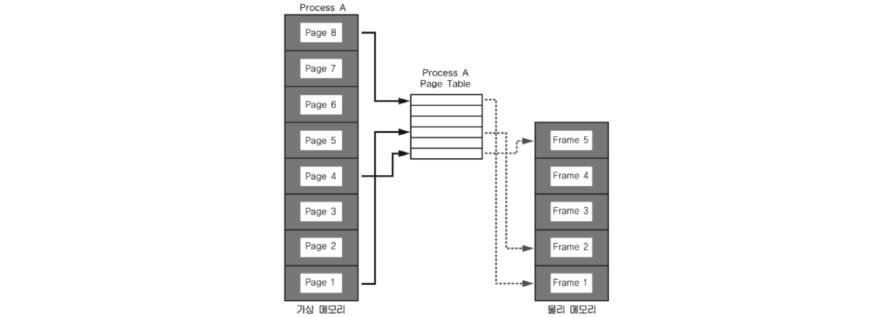
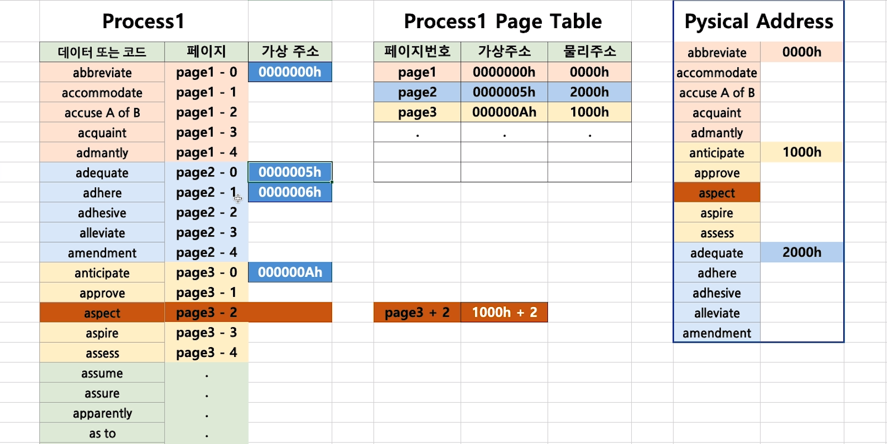
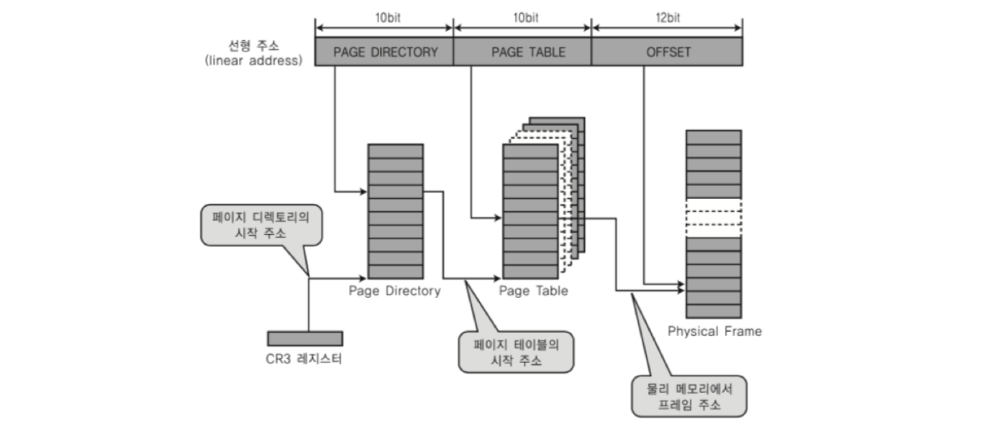
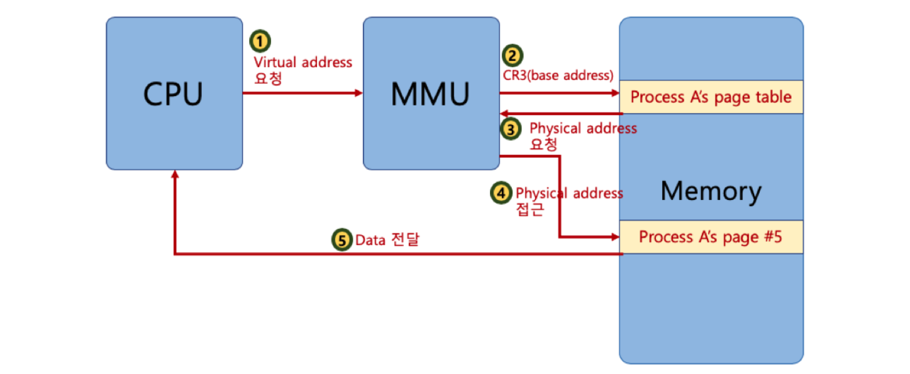
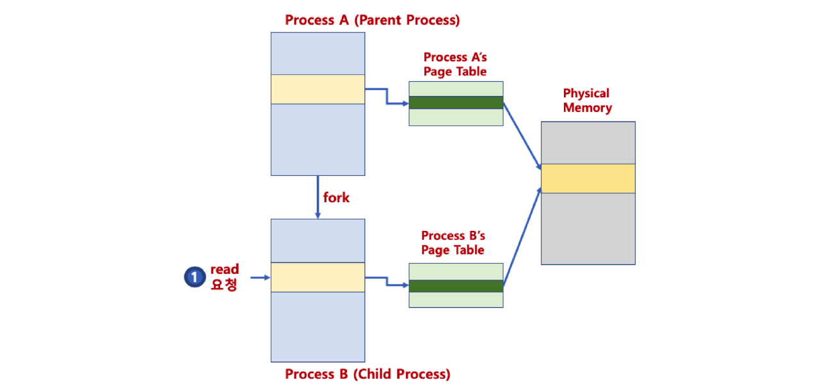
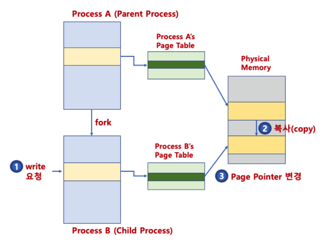
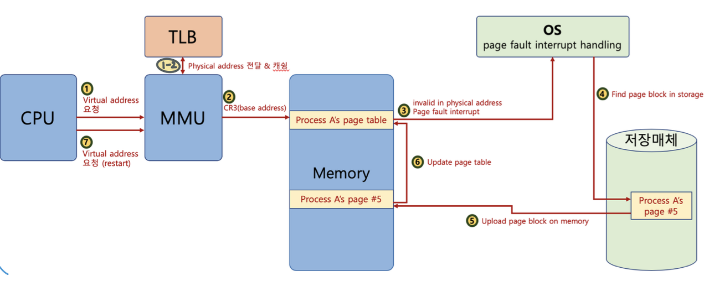
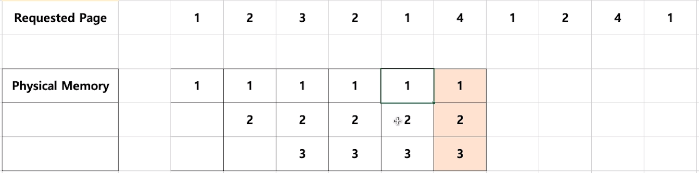
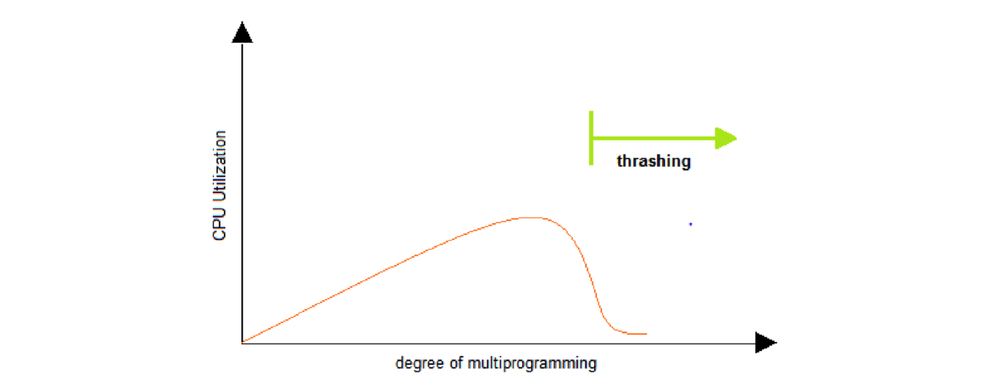

# 18. 페이징 시스템 (paging system)

## 페이징 시스템 개념

크기가 동일한 페이지로 가상 주소 공간과 이에 매칭하는 물리 주소 공간을 관리하는 것이다.

하드웨어의 자원이 필요하며, 페이지 번호를 기반으로 가상 주소/물리 주소 매핑 정보를 기록하고 사용한다.

- Intel x86(32bit) -> 4KB, 2MB, 1GB 지원
- 리눅스 -> 4KB Paging

프로세스(4GB)의 PCB에 Page Table 구조체를 가리키는 주소가 들어 있다.

Page Table에는 가상 주소와 물리 주소간 매핑 정보가 있다.

## 페이징 시스템 구조

page 또는 page frame : 고정된 크기의 block (4KB)

- 가상 주소 v = (p,d)

  - p : 가상 메모리 페이지
  - d : p안에서 참조하는 위치

  

예) 페이지 크기가 4KB일 때, 가상 주소의 0 ~ 11bit가 변위(d)를 나타내고 12bit부터 페이지 번호가 될 수 있다.

> 잠깐 상식 : 프로세스가 4GB를 사용하는 이유는 32bit 시스템에서 2의 32승이 4GB이기 때문이다.

## 페이징 테이블

### 페이지 테이블 (page table)

물리 주소에 있는 페이지 번호와 해당 페이지의 첫 물리 주소 정보를 매핑한 표이다.

가상 주소 v = (p, d)라면 p는 페이지 번호, d는 페이지 처음부터 얼마나 떨어진 위치인지 나타낸다.

### 페이징 시스템 동작

해당 프로세스에서 특정 가상 주소 엑세스를 하려면

- 해당 프로세스의 page table에 해당 가상 주소가 포함된 page 번호가 있는지 확인한다.
- page 번호가 있으면 이 page가 매핑된 첫 물리주소를 알아내고(p')
- p' + d가 실제 물리 주소가 된다.

예를 들어 다음과 같이 프로세스와 메모리가 존재 할 때 aspect라는 부분에 접근하기 위해서는

1. 해당 페이지인 page3를 테이블로부터 찾는다. (0000005h)
2. 해당하는 물리주소를 확인한다. (1000h)
3. 물리주소를 계산하여 접근한다. (1000h + 2)

> 프로세스가 생성이 되어 가상/물리 주소가 할당되었지만 실질적으로 메모리에 올렸는지 여부를 판가름하는 valid-invalid bit가 존재한다. (사용 여부 결정)

## 페이징 시스템과 MMU(컴퓨터 구조)

CPU는 가상 주소에 접근할 때 MMU 하드웨어를 통해 물리 메모리에 접근한다.

- 프로세스 생성시, 페이지 테이블 정보를 생성 절차
  - PCB 등에서 해당 페이지 테이블 접근이 가능하고, 관련 정보는 물리 메모리에 적재한다.
  - 프로세스 구동시, 해당 페이지 테이블 base 주소가 별도 레지스터에 저장된다.(CR3)
  - CPU가 가상 주소 접근시, MMU가 페이지 테이블 base 주소를 접근해서, 물리 주소를 가져온다.

## 다중 단계 페이징 시스템

32bit 시스템에서 4kb 페이지를 위한 페이징 시스템은 하위 12bit는 오프셋, 상위 20bit가 페이징 번호이므로 2의 20승(1048576)개의 페이지 정보가 필요하다.

이 때 페이징 정보를 단계를 나누어 생성하여 필요 없는 페이지는 생성하지 않으면 공간 절약이 가능하다.

### 다중 단계 페이징 시스템 구조

페이지 번호를 나타내는 bit를 구분해서 단계를 나눈다. (리눅스는 3단계, 최근 4단계)

## MMU와 TLB

MMU가 물리 주소를 확인하기 위해 메모를 왔다 가야 한다. 하지만 레지스터나 캐시에 비해 메모리를 거치는 것이 더 많은 시간을 소요하기 때문에 TLB가 등장하였다.

TLB는 Translation Lookaside Buffer로 페이지 정보 캐시라고 한다.

최근 물리 주소로 변환된 가상 주소 정보를 저장하여 페이지 정보를 캐쉬할 수 있다.

다음과 같이 TLB를 활용하여 바로 physical address에 접근하도록 할 수 있다.

## 페이징 시스템과 공유 메모리

페이지 테이블에서 프로세스 간 동일한 물리 주소를 가리킬 수 있으며, 이를 통해 공간 및 시간을 절약할 수 있다.

다음과 같이 부모 프로세스로부터  fork()하여 자식 프로세스를 생성할 때 페이지 테이블의 내용이 동일한 물리 주소를 가리켜 복사하는데 공간 절약과 메모리 할당 시간 절약이 가능하다.

물리 주소에 데이터 수정 시도시, 물리 주소를 복사할 수 있다. (copy-on-write)

## 요구 정책 알고리즘(Demand Paging)

프로세스 모든 데이터를 메모리로 적재하지 않고, 실행 중 필요한 시점에만 메모리로 적재한다.

더 이상 필요하지 않은 페이지 프레임은 다시 저장매체에 저장한다. (페이지 교체 알고리즘 필요)

선행 페이징(anticipatory paging)은 미리 프로세스 관련 데이터를 메모리에 적재하는데 이와 반대된다.

### 페이지 폴트(Page fault)

어떤 페이지가 실제 물리 메모리에 없을 때 일어나는 인터럽트이다.

운영체제가 페이지 폴트를 발생 시킬 때 해당 페이지를 물리 메모리에 올린다.

여기까지의 과정을 MMU와 TLB에 더해 도표로 나타내었다.

page table 확인 후 메모리 상 없다면 OS에서 page fault interrupt를 발생 시키며 이후 저장 매체에서 필요 페이지를 찾아 메모리에 적재시키고 페이지 테이블에 등록하는 일련의 과정을 거친다.

## 페이지 교체 알고리즘

### 페이지 교체 정책

운영체제가 특정 페이지를 물리 메모리에 올리려 하는데 물리 메모리가 더 이상 공간이 없다면 기존 페이지 중 하나를 물리 메모리에서 저장 매체에 저장하고 새로운 페이지를 해당 물리 공간에 올린다.

> 이 때 페이지를 결정하는 것이 Page Replacement Algorithm이다.

#### FIFO

FIFO Page Replacement Algorithm은 이름과 같이 먼저 들어온 페이지를 내리는 기법이다.

#### OPT

OPTimal Replacement Algorithm은 앞으로 가장 오랫동안 사용하지 않을 페이지를 내리는 기법이다.

일반 OS에서는 구현이 불가능하다.

#### LRU

Least Recently Used Page Replacement Algorithm은 가장 오래 전에 사용된 페이지를 교체한다.

OPT 교체 알고리즘이 구현 불가하므로 이렇게 과거 기반으로 시도한다. 가장 많이 사용되는 알고리즘이다.

다음과 같이 색칠 된 시점에서 메모리에 올라가지 않은 4번 페이지가 요청되면 가장 오래 전에 사용되었던 3번 페이지를 내리고 4번을 올린다.

#### LFU

Least Frequently Used Page Replacement Algorithm은 가장 적게 사용된 페이지를 내리는 기법이다.

#### NUR

Not Used Recently Page Replacement Algorithm은 LRU와 마찬가지로 최근에 사용하지 않은 페이지부터 교체하는 기법이며 각 페이지마다 참조비트(R), 수정비트(M)을 둔다.

따라서 각 페이지마다 (R, M) 쌍의 정보를 가지게 되며 읽기 요청만 있으면 (1, 0) 수정 요청만 있으면 (0, 1)과 같은 식으로 저장된다.

> (0, 0), (0, 1), (1, 0), (1, 1) 순으로 페이지 교체

### Thrashing

반복적으로 페이지 폴트가 발생하여 과도하게 페이지 교체 작업이 일어나 실제로는 아무일도 하지 못하게 되는 상황을 Thrashing이라고 한다.

