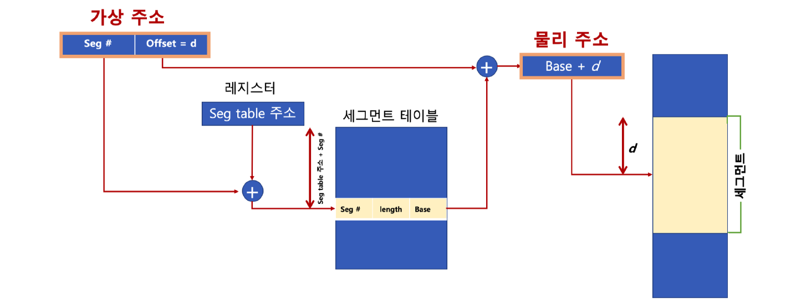
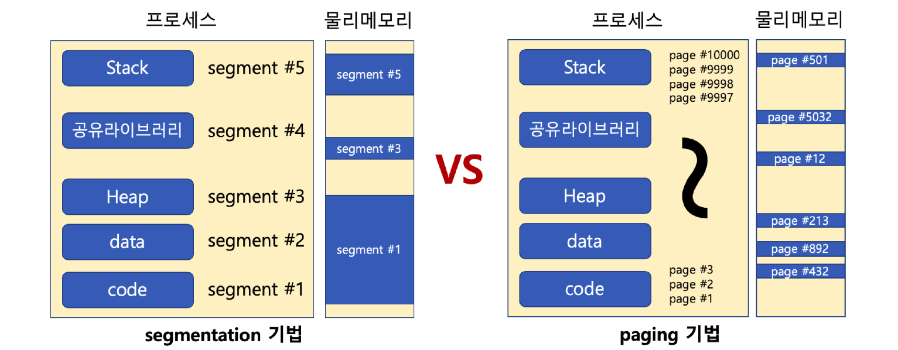

# 19. 세그멘테이션

## 세그멘테이션 기법

가상 메모리를 서로 다른 크기의 논리적 단위인 세그먼트(Segment)로 분할하는 것을 말한다.

페이징 기법에서는 가상 메모리를 같은 크기의 블록으로 분할하는 것과 차이가 있다.

예를 들어 x86 리얼모드에서는 CS(Code Segment), DS(Data Segment), SS(Stack Segment), ES(Extra Segment)로 나누어 메모리에 접근한다.

### 세그멘테이션 구조

세그멘트 가상 주소는 다음과 같이 표현할 수 있다.

- v = (s, d)
  - s : 세그먼트 번호
  - d : 블록 내 세그먼트 변위

세그멘테이션은 다음 그림과 같이 크기가 다른 segment 단위로 물리 메모리에 로딩한다.

### 페이지 / 세그멘테이션 기법의 단점

- 페이지 (내부 단편화)
  - 페이지 블록만큼 데이터가 딱 맞게 채워져 있지 않을 때 공간 낭비 발생한다.
- 세그멘테이션 (외부 단편화)
  - 물리 메모리가 원하는 연속된 크기의 메모리를 제공해주지 못하는 경우 실행 불가하다.

> 세그멘테이션/페이징 모두 하드웨어의 지원 필요

다양한 컴퓨터 시스템의 이식성을 중요시하는 리눅스는 페이징 기법으로 구현한다.

