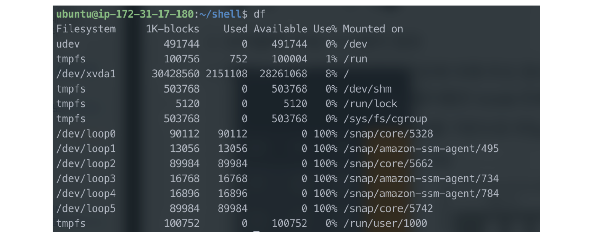
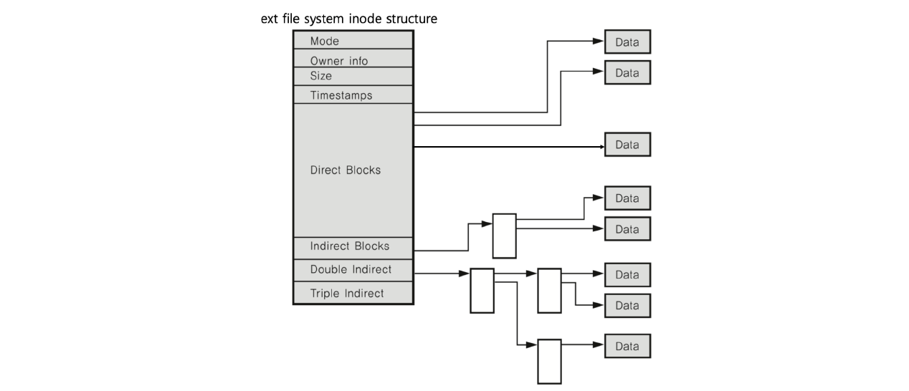
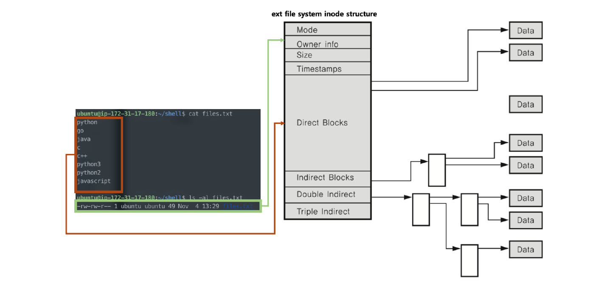
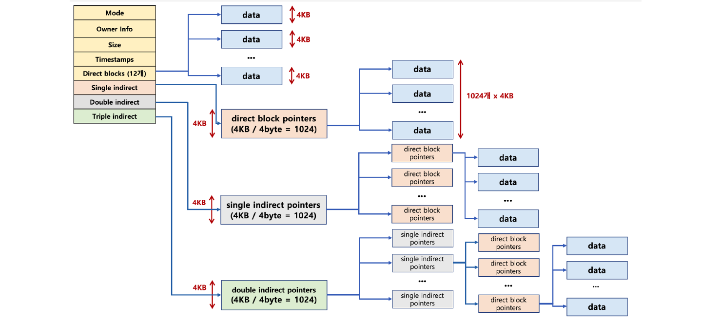
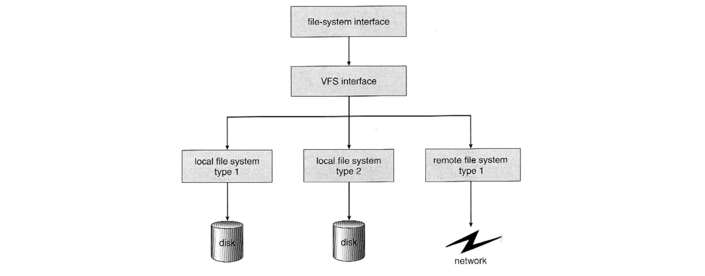

# 20. 파일 시스템

운영체제가 저장매체에 파일을 쓰기 위한 자료구조 또는 알고리즘이다.

비트로 관리하기에는 오버헤드가 너무 커서 초기에는 블록마다 고유번호를 부여해서 블록 단위로 저장 매체에 관리를 했었다. (보통 4KB)

하지만 이마저도 용량이 늘어나면 각 블록 고유 번호를 관리하기 어려운 지경에 이르렀고 따라서 추상적(논리적) 객체가 필요하게 되었다.

## 파일 시스템 필요 이유

### 파일

사용자가 각 블록 고유 번호를 관리하기 어렵기 때문에 추상적(논리적) 객체인 파일로 구분한다.

 사용자는 파일 단위로 관리하며 각 파일은 블록 단위로 관리한다.

### 저장 방법

저장 매체에 효율적으로 파일을 저장하는 방법은 가능한 연속적인 공간에 파일을 저장하는 것이지만 외부 단편화 파일 사이즈 변경 문제로 불연속 공간에 파일 저장 기능이 필요하다.

따라서 다음 두 가지 방법 중 하나를 활용한다.

- 블록 체인 : 블록을 링크드 리스트로 연결한다.
  - 끝에 있는 블록을 찾으려면, 맨 처음 블록부터 주소를 따라가야 하는 단점이 있다.
- 인덱스 블록 : 각 블록에 대한 위치 정보를 기록해서, 한번에 끝 블록을 찾아갈 수 있도록 한다. (배열과 비슷하다.)

## 다양한 파일 시스템

### Windows : FAT, FAT32, NTFS

블록 위치를 FAT라는 자료 구조에 기록한다.

### 리눅스(UINIX) : ext2, ext3, ext4

일종의 인덱스 블록 기법인 inode 방식을 사용한다.

## 파일 시스템과 시스템 콜

동일한 시스템 콜을 사용해서 다양한 파일 시스템을 지원 가능토록 구현한다.

read/write 시스템 콜 호출 시, 각 기기 및 파일 시스템에 따라 실질적인 처리를 담당하는 함수를 구현한다.

- 예) read_spec/write_spec

파일을 실제 어떻게 저장할지는 다를 수 있다.

- 리눅스의 경우 ext4 외 NTFS, FAT32 파일 시스템을 지원한다.

## inode 방식 파일 시스템

파일 시스템의 기본 구조로 다음과 같은 3가지 블록으로 구분된다.

- 수퍼 블록 : 파일 시스템 정보
- 아이노드 블록 : 파일 상세 정보
- 데이터 블록 : 실제 데이터

### 수퍼 블록

파일 시스템 정보 및 파티션 정보를 포함한다.

### inode와 파일

파일은 inode 고유 값과 자료구조에 의해 주요 정보를 관리한다.

- '파일이름:inode'로 파일이름은 inode 번호와 매칭한다.
- 파일 시스템에서는 inode를 기반으로 파일을 엑세스한다.
- inode 기반으로 메타 데이터를 저장한다.

### inode 구조

inode 기반 메타 데이터는 다음과 같은 구조이다.

(파일 권한, 소유자 정보, 파일 사이즈, 생성 시간 관련 정보, 데이터 저장 위치 등)

cat이라는 명령어를 통해 파일 내용을 열어 볼 때 등장하는 내용들은 inode 구조 상 Direct Blocks에 존재하는 데이터이며 ls - al 이라는 명령을 통해 파일의 정보를 볼 때 등장하는 정보는 Mode, Owner info, Timestamp 등에 있다.

기존에 Direct Block만 존재하여 4KB 크기의 데이터 12개만 처리가 가능하였고 최대 48KB의 데이터만 핸들링 할 수 있었다. 

하지만 더 큰 크기의 데이터를 내포해야 할 필요가 있었고 Single indirect는 가능한 깊이 들어가서 Direct Block을 연결한 것이다.

따라서 여기에는 4KB/4byte = 1024개, 즉 4MB 만큼의 data를 포함할 수 있게 된다.

동일한 원리로 Double indirect는 두 깊이가 들어가고 Triple indirect는 세 깊이가 더 깊게 연결되어 더 큰 용량의 데이터를 포함시킬 수 있다.

### 디렉토리 엔트리

리눅스의 경우 파일 탐색을 할 때 -/home/ubuntu/link.txt와 같은 형식으로 엔트리를 탐색한다.

즉 엔트리는 해당 디렉토리 파일/디렉토리 정보를 가지고 있다.

다음과 같은 예시에서는 '/' dentry에서 'home'을 찾고, 'home'에서 'ubuntu'를 찾고, 'ubuntu'에서 link.txt 파일 이름에 해당하는 inode를 얻는다.

### 가상 파일 시스템 (Virtual File System)

네트워크 등 다양한 기기도 동일한 파일 시스템 인터페이스를 통해 관리가 가능하다.

- 예) read/write 시스템 콜 사용, 각 기기별 read_spec/write_spec 코드 구현 (운영체제 내부)

모든 인터렉션은 파일을 읽고 쓰는 것처럼 이루어져 있다.

마우스, 키보드와 같은 디바이스 관련 기술도 파일과 같이 다루어지며 이를 통해 엔드 유저는 이 추상화된 인터페이스만 다룰 수 있으면 모든 것을 통제할 수 있게 되는 편의를 얻게 된다.