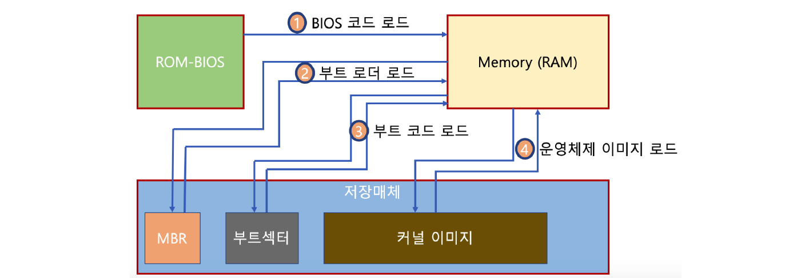

# 21. 부팅

## Boot

컴퓨터를 켜서 동작시키는 절차로 Boot Program이 있다.

Boot Program은 운영체제 커널을 Storage에서 특정 주소의 물리 메모리로 복사하고 커널의 처음 실행 위치로 PC를 가져다 놓는 프로그램이다.

## 부팅 과정

BIOS가 특정 Storage를 읽어 bootstrap loader를 메모리에 올리고 실행한다.

이후 bootstrap loader 프로그램이 있는 곳을 찾아서 실행시킨다.

