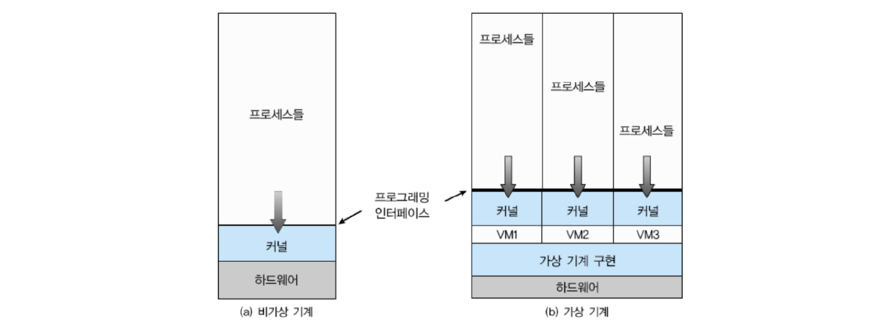
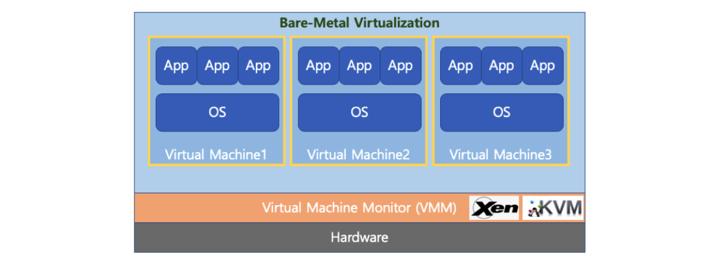
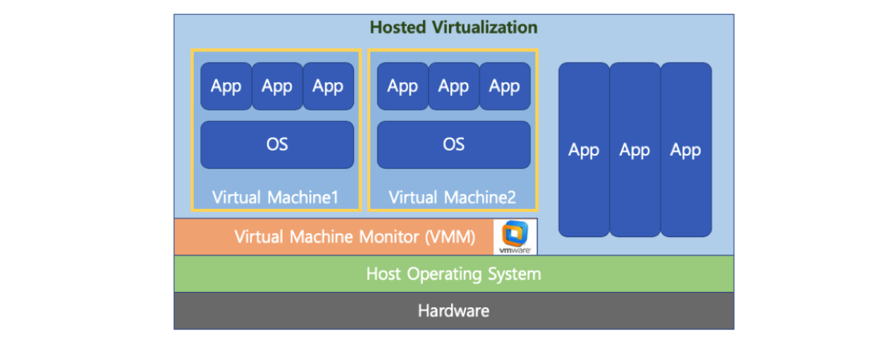
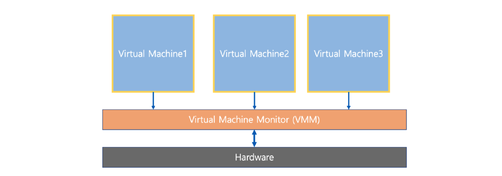
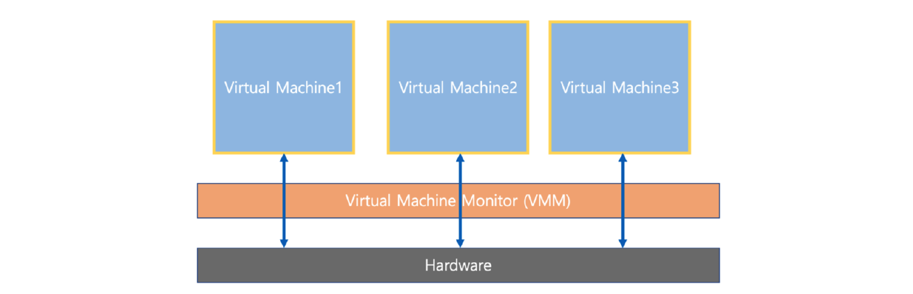
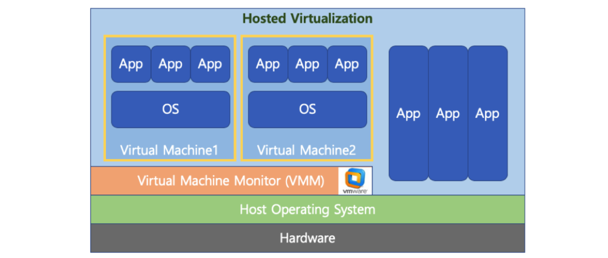
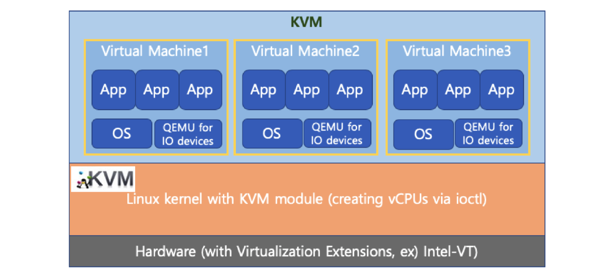
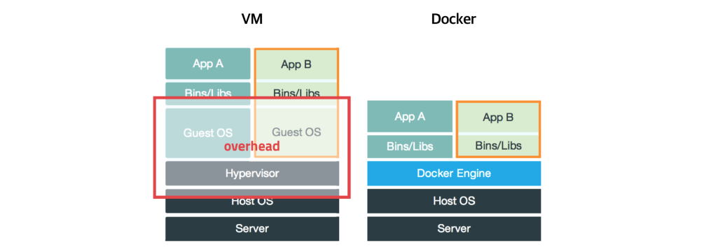

# 22. 가상 머신

## Virtual Machine

하나의 하드웨어(CPU, Memory 등)에 다수의 운영체제를 설치하고, 개별 컴퓨터처럼 동작하도록 하는 프로그램이다.

### Virtual Machine Type

#### Type 1 (native 또는 bare metal)

하이퍼 바이저(또는 VMM)은 운영체제와 응용 프로그램을 물리적 하드웨어에서 분리하는 프로스세이다.

하이퍼 바이저 또는 버추얼 머신 모니터 (VMM)라고 하는 소프트웨어가 Hardware에서 직접 구동된다.

- Xen, KVM

#### Type2

하이퍼 바이저 또는 버추얼 머신 모니터 (VMM)라고 하는 소프트웨어가 Host OS 상위에 설치된다.

- VMWare, Parallels Desktop (Mac)

### Full Virtualization(전가상화) VS Half Virtualization(반가상화)

#### Full Virtualization

전가상화는 각 가상머신이 하이퍼 바이저를 통해서 하드웨어와 통신하는 상태이다.

하이퍼 바이저가 마치 하드웨어인 것 처럼 동작하므로, 가상 머신의 OS는 자신이 가상 머신인 상태인지를 모른다.

#### Half Virtualization

반가상화는 각 가상머신에서 직접 하드웨어와 통신한다.

각 가상머신에 설치되는 OS는 가상머신인 경우, 이를 인지하고 각 명령에 하이퍼 바이저 명령을 추가해서 하드웨어와 통신한다.

> 최근에는 HW 성능 개선으로 전가상화 기술을 선호한다.

### 가상 머신의 예시

#### VMWare

대중적인 Type2 가상머신 프로그램이다.

#### KVM

AWS(아마존 클라우드 컴퓨팅 서비스) 등에서 사용되는 Type1 가상머신 프로그램이다.

### Docker

가상머신은 컴퓨터 하드웨어를 가상화(하드웨어 전체 추상화)하여 하이퍼 바이저를 사용한다.

그러나 이럴 경우 추가 OSS 필요 등 성능 저하 이슈가 존재한다.

이에 반해 Docker는 운영체제 레벨에서 별도로 분리된 실행 환경을 제공한다. (커널 추상화)

마치 리눅스를 처음 설치했을 때와 유사한 실행환경을 만들어주는 리눅스 컨테이너 기술을 기반한다.

리눅스 컨테이너 기술이므로 macOS나 Windows에 설치할 경우에는 가상 머신 기반이다.

## 정리

- Bare-Metal 방식이 하드웨어를 직접  엑세스하기에 가장 성능이 좋아 AWS(클라우드 컴퓨팅 환경) 등에서 활용된다. (KVM)

- Docker는 경량 이미지로 실행환경을 통째로 백업, 실행이 가능하며 실무에서 많이 사용된다.
  - Data Engineering에서 Docker로 시스템 환경 설정 + 프로그램을 한 번에 배포한다.
  - 예) 프로그램 업데이트 -> Docker 이미지 작성 -> Jenkins로 배치잡 생성 및 실행(AWS EC2 재생성 및 Docker 이미지 설치, 실행)