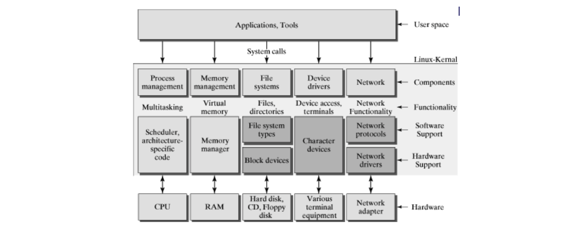
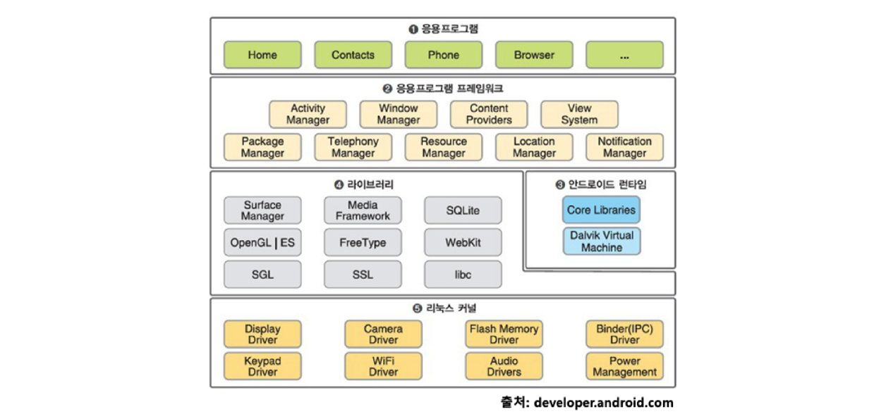
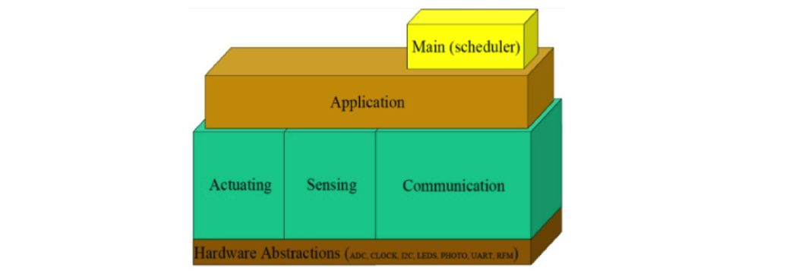

# 23. 실제 운영체제의 이해

## 리눅스 운영체제

리눅스 커널(운영체제) + 시스템 프로그램(쉘) + 응용 프로그램으로 구성되어 있으며 다음과 같은 구성이다.

## 쉘 종류

Shell은 사용자와 컴퓨터 하드웨어 또는 운영체제간 인터페이스이다.

- 사용자의 명령을 해석하여 커널에 명령을 요청해주는 역할이다.
- 관련된 시스템 콜을 사용하여 프로그래밍이 작성되어 있다.

쉘 종류

- Bourne-Again Shell (bash) : GNU 프로젝트의 일환으로 개발되었으며, 리눅스의 디폴트 쉘로 사용된다.
- Bourne Shell (sh)
- C Shell (csh)
- Korn Shell (ksh) : 유닉스에서 가장 많이 사용된다.

## 정리

- ### Process Management

  - 응용 프로그램은 여러 개의 프로세스로 관리된다.
  - 프로세스 스케줄러가 프로세스를 실행/종료 및 인터럽트 처리를 관리한다.

- ### Memory Management

  - 가상 메모리를 통해 page 기반의 관리를 진행한다.

- ### IO Device Management

  - VFS (Virtual File System)
  - File, Device drivers, Network를 관리한다.

- ### System Program

  - 핵심은 쉘이다.
    - bash (Bourne-again shell)
    - 내부는 시스템 콜을 호출하도록 구현되어있다.
  - 각 프로그래밍 언어에서 필요시 해당 운영체제의 시스템 콜을 호출한다.

## 안드로이드 스마트폰

Linux Kernel + (Shell + Some basic programs) + Android Framework

## 사물 인터넷 (Internet of Things : IoT)

각종 사물에 센서와 통신 기능을 내장하여 인터넷을 연결하는 기술이다.

사용되는 기기들은 단순한 동작을 하고 배터리 사용량을 최소화해야 하기 때문에 IoT 하드웨어 사양 혹은 OS 기능을 최소화 시켜야 한다.

