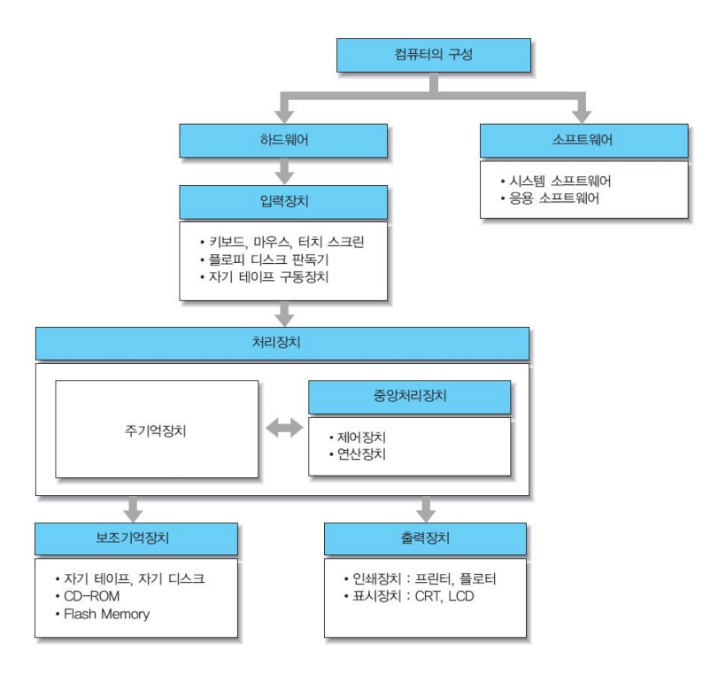

# 01. 컴퓨터 구조 기초

## 컴퓨터의 구성

## 데이터의 표현

- 정보
  - 어떤 사물에 대한 소식이나 자료
  - 가공된 데이터
- 데이터
  - 정보를 작성하기 위해 필요한 자료나 정보를 처리하거나 전송할 때 이진(binary)이나 디지털과 같은 좀 더 편리한 형태로 바뀌어진 자료
  - 정보의 원재료

## 데이터 표현 및 단위

- 수치 데이터(Numerical data) : 연산용 데이터
- 비 수치 데이터(Alphanumerical data) : 입/출력용 데이터
- 특수문자(Special Character) : 입/출력, 연산용 데이터

| 비트(bit)                | 0, 1                                        |
| ------------------------ | ------------------------------------------- |
| 바이트(byte)             | 1byte = 8bit                                |
| 워드(Word)               | 기계에 따라 상이함, 1 Word = 32bit or 64bit |
| 킬로바이트(KB, KiloByte) | 1KB = 1024 byte = 2의 10승 byte             |
| 메가바이트(MB, MegaByte) | 1MB = 1024 Kbyte = 2의 20승 byte            |
| 기가바이트(GB, GigaByte) | 1GB = 1024 Mbyte = 2의 30승 byte            |
| 테라바이트(TB, TeraByte) | 1TB = 1024 Gbyte = 2의 40승 byte            |

