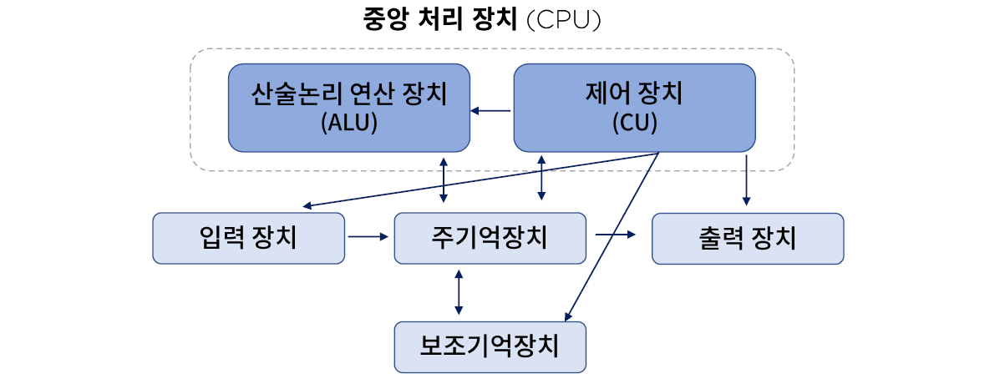
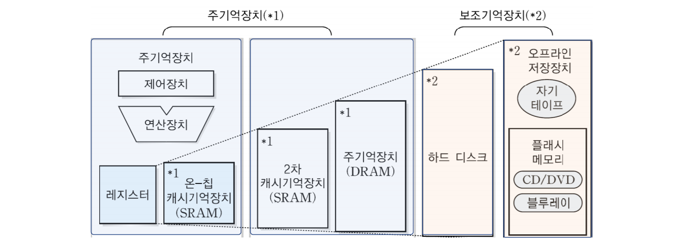
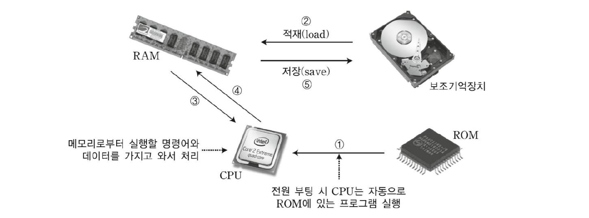

# 02. 컴퓨터 구성 요소의 기능 및 이해

## 컴퓨터 구성요소의 인지와 기능의 조합

- 중앙처리장치(Central Processing Unit)
  - CPU/MPU
  - 사물 인터넷 디바이스 H/W 플랫폼 종류
- 주변장치(Peripheral Device)
  - 기억장치(Memory unit)
  - 보조기억장치(Auxiliary memory device)
  - 입·출력장치(Input/Output device)

### 중앙처리장치

#### CPU(Central Processing Unit)

> 마더보드(mother board) : 데이터의 전달 통로가 디자인 되어 있는 메인보드

실행 프로그램의 명령 해석, 실행, 장치 제어, ALU, CU, 각종 레지스터로 구성

#### MPU(Micro Processor Unit)

- CPU를 LSI(고밀도 집적회로)화 한 일종의 통합장치이다.
- CISC(Complex Instruction Set Computer) 
  - 모든 고급언어 문장들에 대해 각각 기계 명령어가 대응되도록 하는 것이다.
  - 복잡하고 기능이 많은 명령어로 구성된 프로세서이다.
- RISC(Reduced Instruction Set Computer)
  - CISC의 많은 명령어 중 주로 쓰이는 것만을 추려서 하드웨어로 구현하는 것이다.
  - CPU의 명령어를 최소화하여 단순하게 제작된 프로세서이다.
- Bit Slice MPU 등이 존재: 위의 두 종류의 MPU를 사용자가 원하는 형태로 조합해서 합친 MPU이다.

#### 사물인터넷 디바이스 H/W 플랫폼 종류

- 아두이노
  - 대표적인 오픈소스 H/W 플랫폼이다.
- Rasberry Pi, Galileo, Edison

### 주변 장치

#### 기억장치

- RAM(Random Access Memory) : 효율을 위해 칠판같은 형태로 구성한다.
  - DRAM(Dynamic RAM)
  - SRAM(Static RAM)
- ROM(Read Only Memory) : 부팅될 때 운영체제를 불러옴, 프로그램을 불러올 때 작동하는 기억장치이다.

#### 입/출력장치

- 키보드, 마우스, 스캐너, 터치스크린, 조이스틱, 광학마스크 판독기(OMR), 바코드 판독기

#### 보조기억장치

- 부피와 속도는 반비례, 속도가 느리면 가격이 저렴하고 많은 데이털르 저장할 수 있다.

##### 주기억장치와 보조기억장치의 관계

- 종류
  - 플래시기억장치 - EEPROM(RAM과 ROM의 중간), CF메모리, SSD
  - USB
  - SD card(Secure Digital Card)
  - 메모리 스틱