# 03. 데이터의 종류

## 컴퓨터에서의 데이터 표현

- 진법과 진법 변환
- 정수 표현
- 실수 표현
- 디지털 코드
- 에러 검출 코드

## 진법과 진법 변환

### 디지털 정보의 단위

- 1nibble = 4bits
- 1byte = 8bits
- 1byte = 1문자(character)
- 영어 - 1byte, 한글 - 2byte
- 1word : 특정CPU에서 취급하는 명령어나 데이터의 길이에 해당하는 비트 수
- 워드 길이는 8-16-32-64비트 등 8의 배수가 가능하다.

### 진법(number system)

- 2진법 : 0, 1
- 8진법 : 0 ~ 7
- 10진법 : 0 ~ 9
- 16진법 : 0 ~ 9, A ~ F

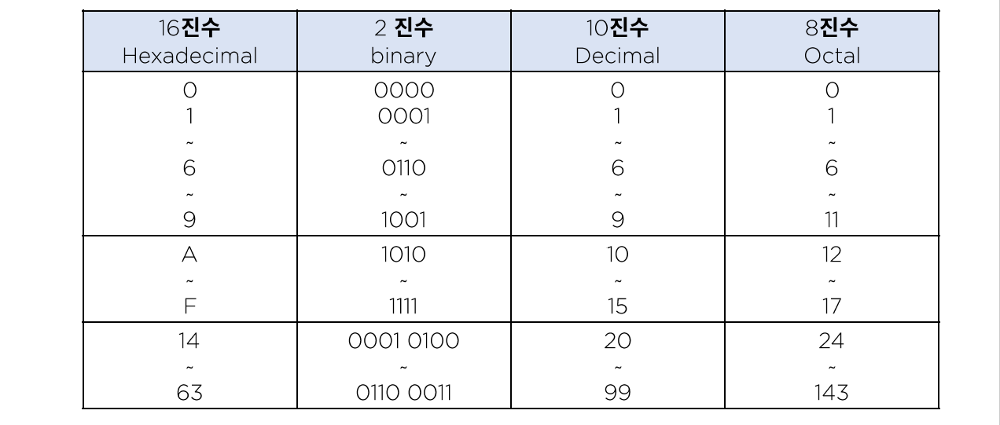

### 진법의 변환

- 10진수 -> 2진수

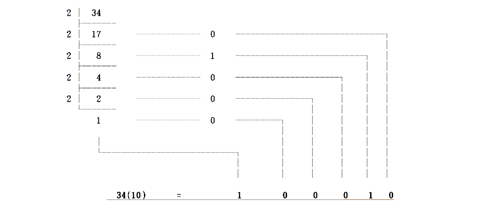

- 2진수 -> 10진수

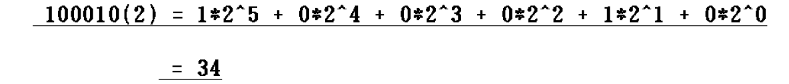

- 8/16진수 <-> 2진수

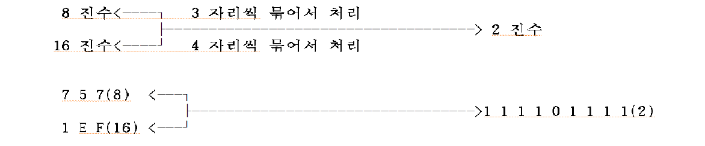

​	자리수가 모자라면 모자란 만큼 0을 붙인다고 생각하고 계산한다.

- 분수(실수)의 변환

  정수 자리는 위와 똑같이 처리하고 실수 자리는 2씩 곱해주면서 변환한다.

  - 항상 딱 떨어지는 결과가 나오지는 않는다.

  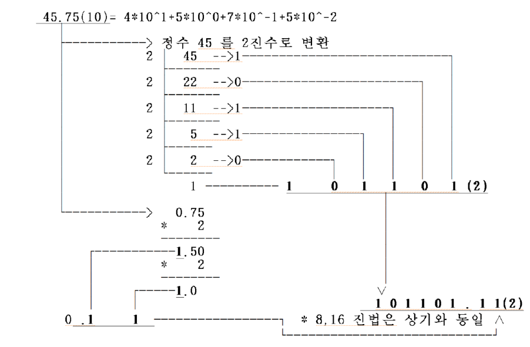

### 보수(Complement)

- 최대값(해당 bit에서 가장 큰 표현형)을 형성하는데 서로 보완 관계에 있는 두 수 사이의 관계를 one's COMPLEMENT라고 한다.

- MODULUS(최대 표현 자리 수)를 형성하는데 서로 보완관계에 있는 두 수 사이의 관계를 two's COMPLEMENT라고 한다.

  ex) 10진수 1의 보수 : A+B = 9, A+B = 99 / 2의 보수 : A+B = 10, A+B = 100

  ex) 2진수 1의 보수 : A+B = 1, A+B = 11 / 2의 보수 : A+B = 10, A+B = 100

> 2진수의 1의 보수는 자신의 수를 반대로 바꾸면 된다. (0 <-> 1)
>
> 2진수의 2의 보수는 1의 보수에 +1 또는 주어진 수의 우단으로부터 최초의 유효 BIT까지는 그대로 두고 나머지를 모두 반대로 (0<->1) 바꾸면 된다.

### 정수형(고정 소숫점, FIXED POINT NUMBER)의 표현

- 부호화 절대치(SIGNED MAGNITUDE)

  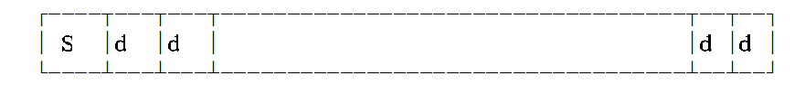

  sign bit -0(+) 1(-)

  - 정수의 부호와 절대치를 따로 보관
    - 음수 표현은 절대치가 같은 양수의 부호만 다르다.
  - 표현 범위(n bit 사용) : -(2^(n-1)) ~ +(2^(n-1))
  - +0과 -0이 공존한다.

- 보수

  - -0과 +0이 공존하는 문제를 해결하기 위해 사용한다.

  - R의 보수, R-1의 보수가 존재한다.

  - 양수의 표현은 절대값 표현 방식과 동일하다.

  - 표현 범위(n bit 사용)

    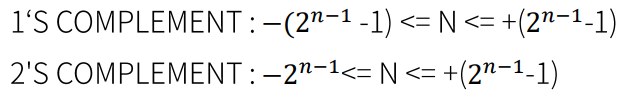

- 10진수형 정수 표현

  - **Unpacked decimal**

    - zoned decimal 이라고 하며, EBCDIC의 숫자 표현과 동일하다.

    - 1byte -> 10진수 한자만 표현한다.

      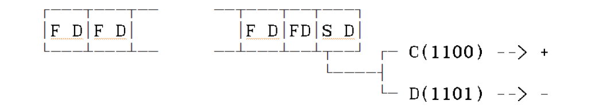

  - Packed decimal

    - 1byte에 2자의 10진수를 표현한다.(BCD code 사용)

    - 마지막 4개의 비트로는 부호를 표현한다.

      

    - 연산에 이용, 입/출력이 불가능하다.

    - Unpacked decimal에서 F를 모두 빼고 s를 맨 앞으로 이동한다.

    - 완벽히 떨어지지 않는 수가 존재할 수 있다.

### 실수 표현(부동 소수점, Floating-point)

- 과학적 표기의 지수(exponent)를 사용하여 소수점의 위치를 이동시킬 수 있는 표현 방법이다.

- 표현의 범위가 확대된다.

- 비트 수에 따른 분류가 가능하다.

  - 단일 정밀도 부동 소수점 형식

    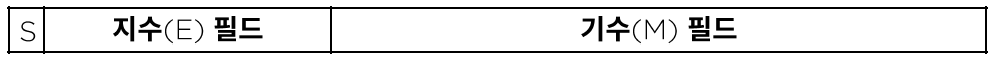

    S(1) + E(7) = 8bit, M = 27bit

    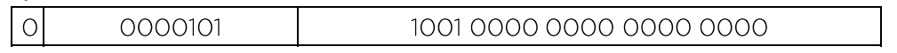

    - 0 : 부호비트 [+]
    - 0000101 : 지수(E) [5]
    - 1001 0000 0000 0000 0000 : 기수(M) [0.9]
    - (+0.1001 * 2^5) -> 임의의 표현법 10진수로 표현하면 [+0.9 * 10^5]

### 디지털 코드

- BCD 코드(Binary Coded Decimal Code : 2진화 10진 코드, 8421 코드)

  - 일일히 나눠주는 것이 번거롭기 때문에 체계가 만들어진다.

  - 연산이 불가능하고 입/출력용이다.

    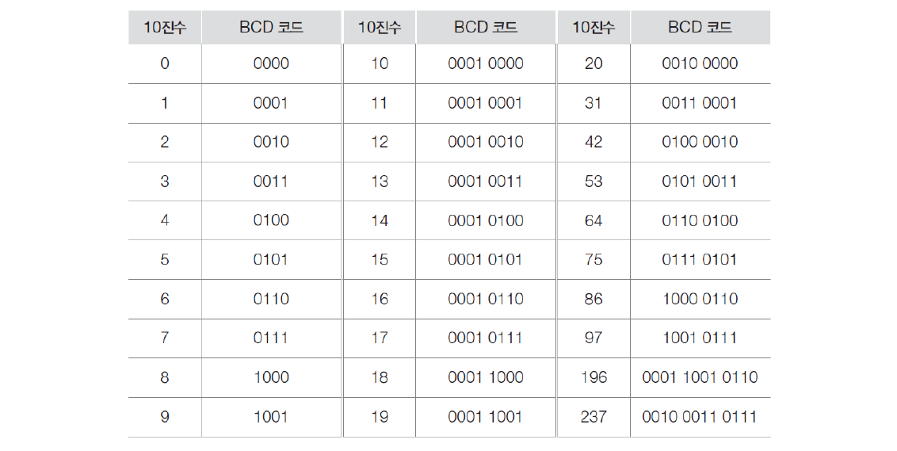

- 3초과 코드(excess-3 코드)

  - 통신에서 사용되던 코드체계이다.

  

### 에러 검출 코드

#### 패리티 비트

- 데이터의 진위 여부를 검사하는 방법이다.

- 짝수 패리티는 패킷에서 1의 개수가 짝수이면 0, 홀수이면 1을 넣어 짝수개를 유지시켜주는 체계이다.

- 홀수 패리티는 패킷에서 1의 개수가 짝수이면 1 홀수이면 0을 넣어 홀수를 유지시켜주는 체계이다.

- 동시에 두 군데에 발생하면 체크되지 못한다.

- 패리티 비트가 발전하여 해시함수 -> 해시코드 -> 해시 알고리즘에 의해 보안 개념이 잡힌다.

  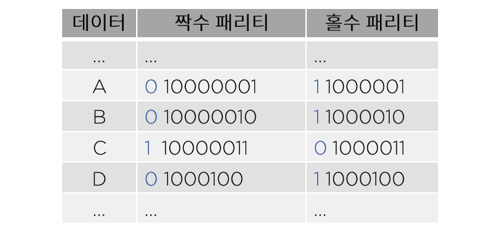

#### 해밍 비트

- 8비트 데이터의 에러 정정 코드

  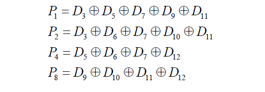