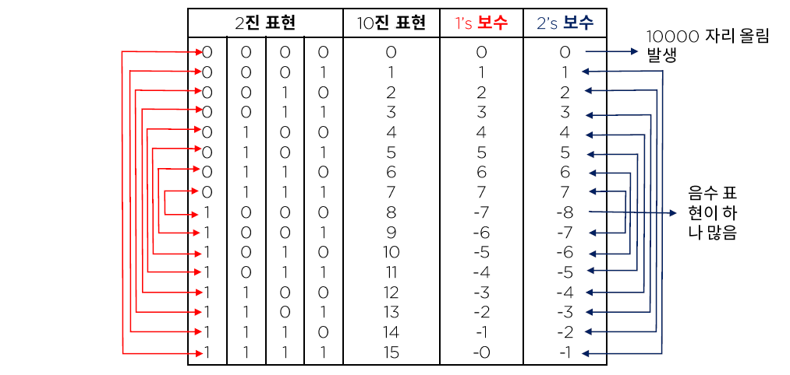
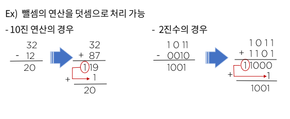
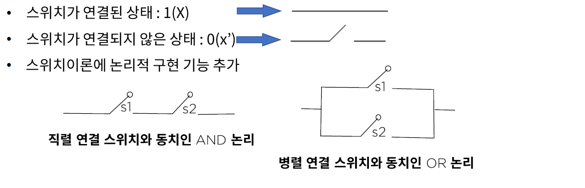
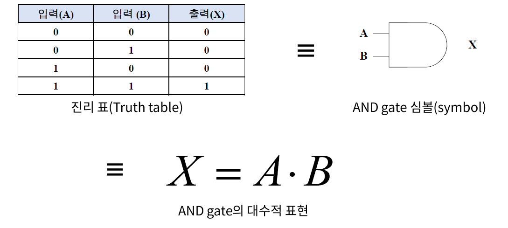
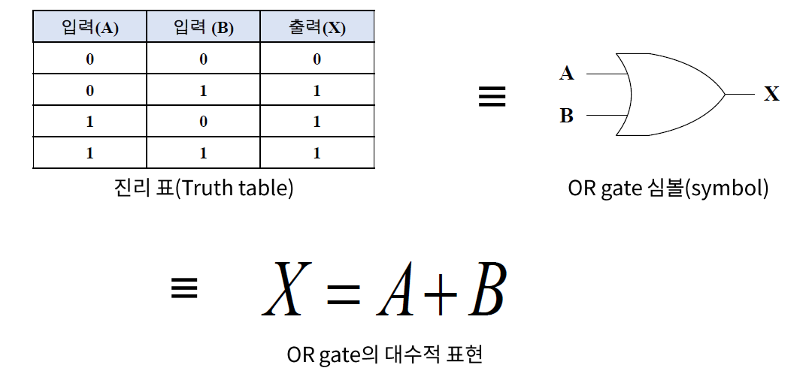
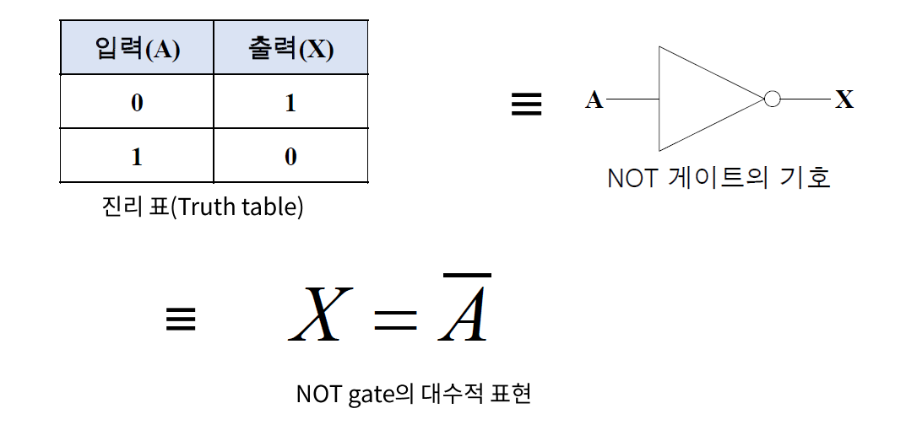
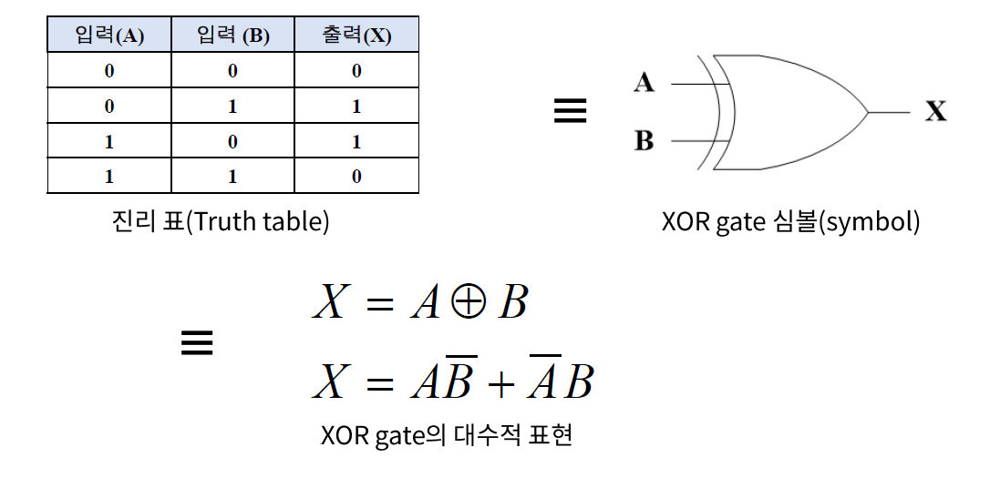
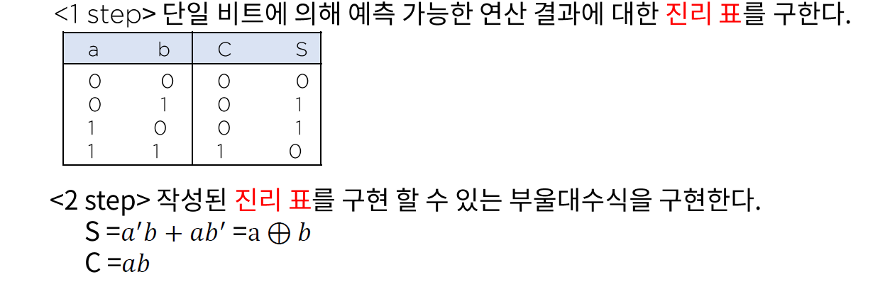
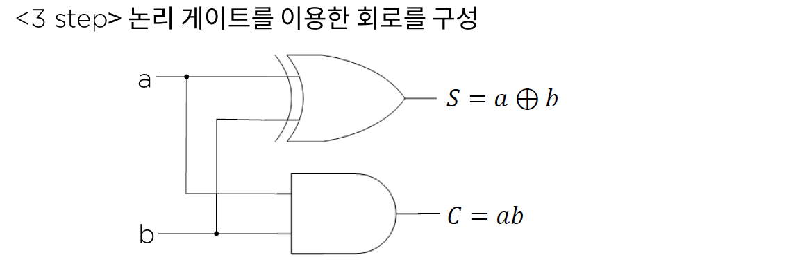

# 04. 논리회로와 데이터 표현

## 데이터 표현 실습 - 데이터 종류

인류가 오랫동안 사용해온 10진수 체계는 전기를 사용하는 컴퓨터에게는 10진수가 맞지 않기 때문에 2/8/16진수로 변환하여 사용한다.

- 진 이진수 : 연산이 가능한 형태로 변환
- 코드화 변환 : 연산이 필요하지 않은 경우의 변환
- 정-실수&연산용 변환

### 보수(Complement)의 활용

- 양/음수로 활용

  

- 연산에 활용

  - 10진 연산의 경우

    12의 보수를 더해준다. : 1->8, 2->7

  - 2진수의 경우

    뒤의 2진수의 보수를 더해주고 여기서 발생한 캐리비트를 나머지에 더해준다.

  > - 캐리비트가 발생하지 않는 경우에는 다른 방법으로 계산한다.
  > - 2의 보수도 다른 방법

  

### 논리 게이트

논리 연산을 수행하는 전자소서로서 주어진 입력 변수 값에 대하여 정해진 논리 함수를 수행하여 그 함수의 연산 경과와 동일한 결과 값을 출력하는 하드웨어이다.

컴퓨터를 구성하는 가장 기본적인 요소이다.

#### 스위칭 이론

1983년 미국의 샤논에 의해 스위치로 2진 정보를 표현하거나 논리 연산의 실행을 가능하도록 구성된 이론이다.

### 논리 연산의 기본 표현

- 논리곱(AND)

  

- 논리합(OR)

  

- 논리부정(NOT)

  

- 배타적 논리합(exclusive OR)

  - 값이 서로 다를 때만 True

  

#### 실무 적용 사례

- 1bit 덧셈의 구현 <-> 논리 회로를 이용한 반가산기(Half adder)의 구현

  a + b = S 라는 연산을 구현하고자 하는 경우

  

  