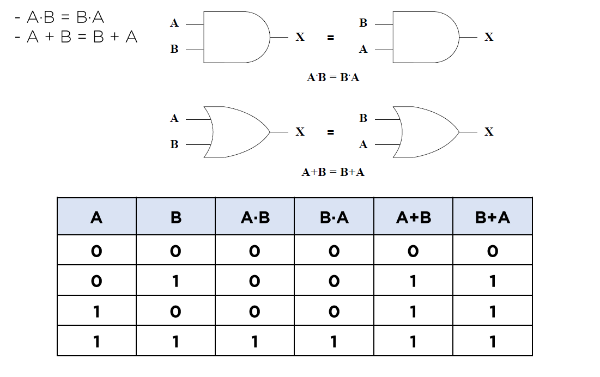
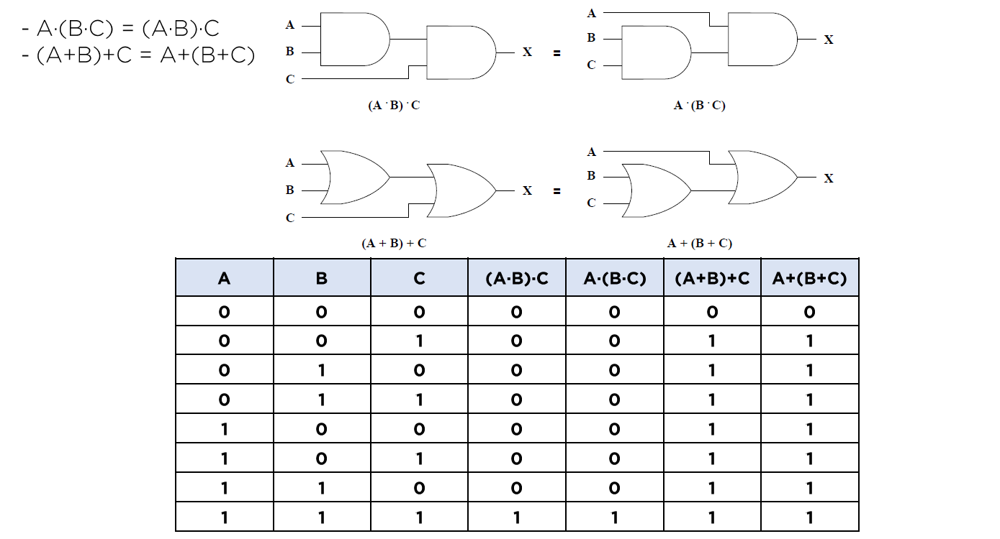
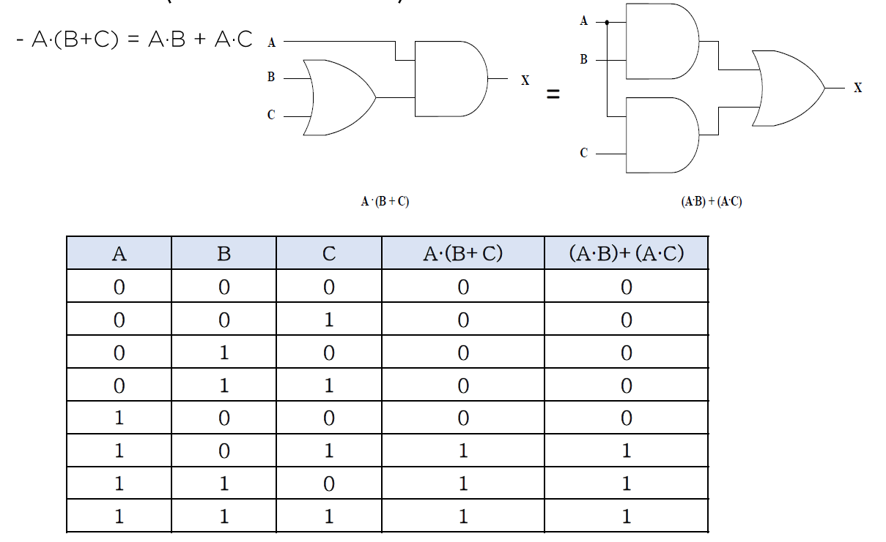
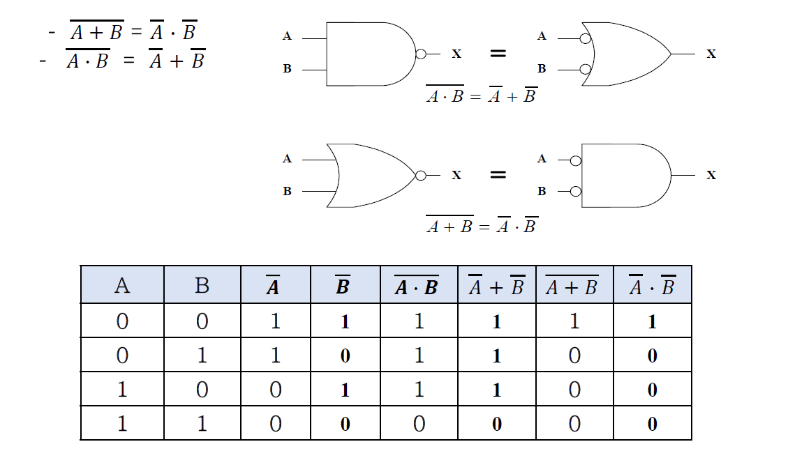
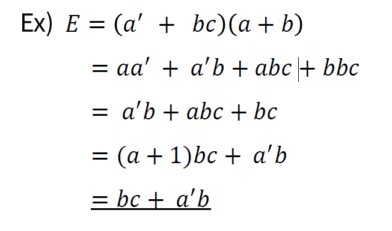
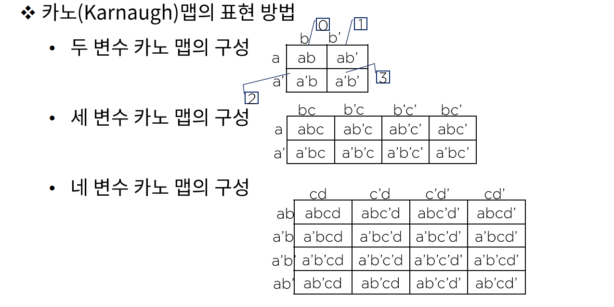
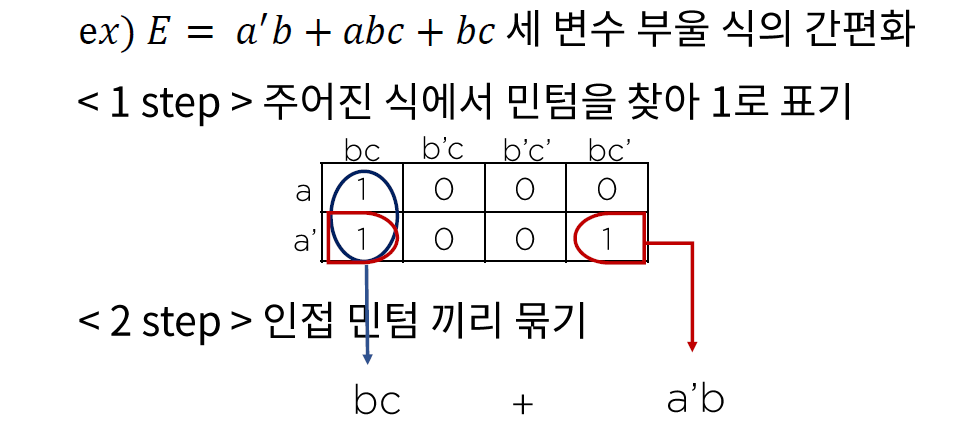

# 05. 부울 대수와 논리식의 간편화

## 부울 대수(Boolean Algebra)

참(True)과 거짓(False)을 판별할 수 있는 논리적 명제를 수학적 표현의 논리 전개식으로 구현한 것으로 1845년 영국의 수학자 부울(G.Boole)에 의해서 구현되었다.

- 논리 회로의 형태와 구조를 기술하는데 필요한 수학적인 이론
- 부울 대수를 사용하면 변수들의 진리표 관계를 대수식으로 표현하기에 용이하다.
- 동일한 성능을 가지는 더 간단한 회로를 만들기에 편리하다.

### 부울 대수의 기본 법칙

- 교환법칙(Commutative Law)

  

- 결합법칙(Associative Law)

  

- 분배법칙(Distribute Law)
  

- 드모르강의 정리(De Morgan's Law)

  

### 부울 대수를 이용한 간략화

## 논리식의 간편화 카노(Karnaugh) 맵

논리 표현식은 붕루 대수를 이용해 간단히 만들 수 있으나 여러가지 규칙이 있다.

맵(map) 방법은 부울 함수를 곧바로 간소화 할 수 있으므로 널리 활용된다.

### 카노(Karnaugh) 맵의 표현 방법

- 만약 변수가 n개라면 카노 맵은 2^n개의 민텀(minterm)으로 구성한다.
- 각 인접 민텀은 하나의 변수만이 변경되어야 한다.
- 출력이 1인 기본 곱에 해당하는 민텀은 1로, 나머지는 0으로 표시한다.

- 예시

  