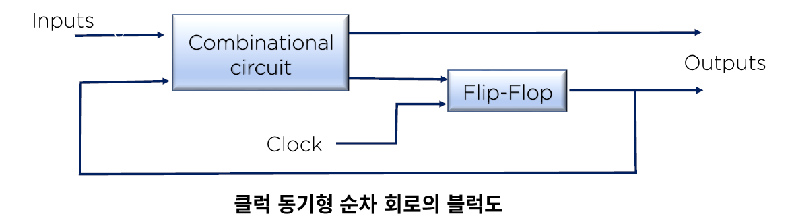
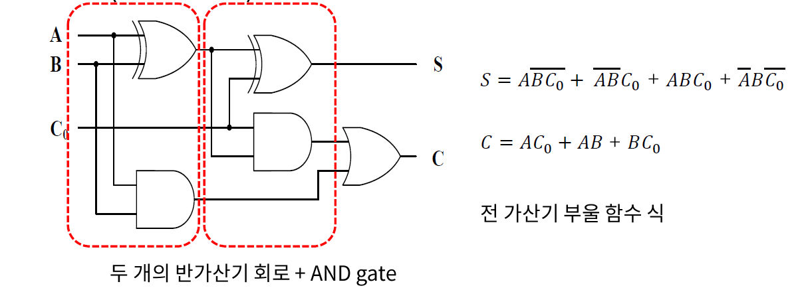
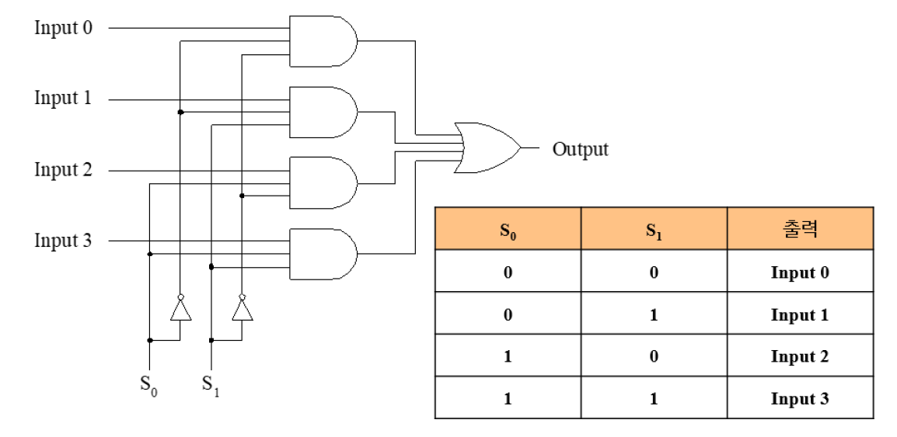
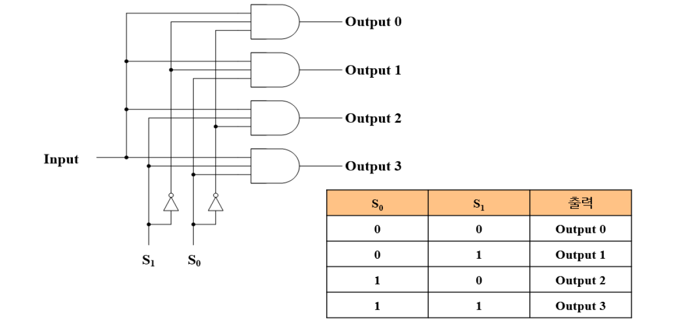
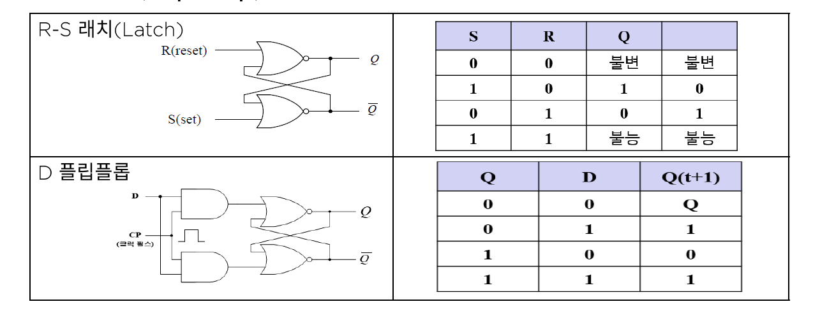
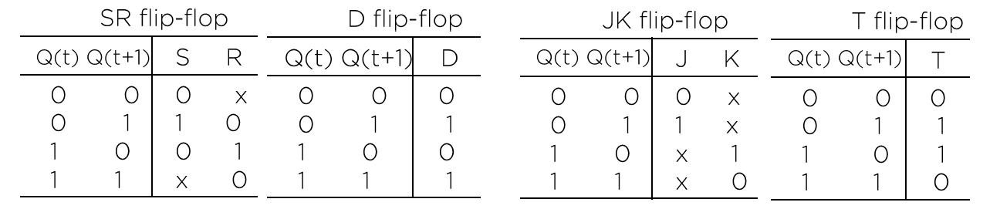
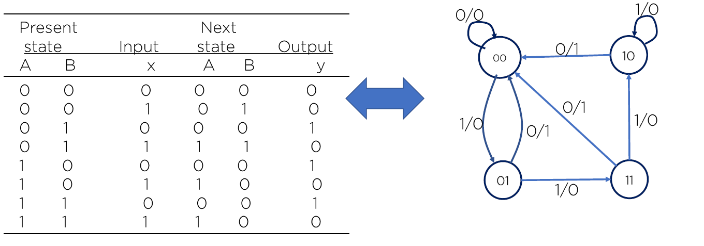

# 06. 조합/기억 논리회로

## 조합 논리회로

- 조합회로 : 입력과 출력을 가진 논리 게이트의 집합으로 출력은 현재 입력(0, 1)값과 조합의 함수이다.
- 순차 논리회로 : 게이트 뿐만 아니라 기억능력이 있는 플립플롭(Flip-Flop)으로 구성되어 있다.

### 조합 회로의 설계 절차

1. 문제가 제시된다.
2. 입력과 출력 변수에 문자 기호를 붙인다.
3. 입력과 출력 사이의 관계를 정의하는 진리표를 유도한다.
4. 각 출력에 대한 간소화된 부울 함수를 얻는다.
5. 논리도를 작성한다.

### 대표적인 조합회로

- 가산기(Adder) : 두 개(그 이상)의 입력을 받아 결과물을 출력하는 조합 논리회로 / bit와 bit 사이의 연산이 가능하다.

- 반 가산기(Half Adder) : 기본 게이트 설명시 다루었다.

- 전 가산기(Full Adder)

  반 가산기 2개의 캐리비티를 처리해주는 부분의 조합이다.

  

- 멀티플렉서(Multiplexer)

  다수의 입력 선 중 하나만을 선별적(시그널 조작)으로 출력 가능하게 해주는 조합 논리회로

  

- 디멀티플렉서(Demultiplexer)

  하나의 입력 선(값)을 다수 개의 출력 선으로 분해하는 기능의 조합회로(멀티플렉서 역기능)

  ex) 10진수 3 -> 2진수 011

  

## 기억회로의 구성 및 작동 원리

대부분의 디티절 시스템들이 조합회로를 가지고 있지만, 그 경우 **순차회로로 구현되는 저장요소**를 필요로 한다.

이러한 종류의 회로를 플립플롭(Flip Flop)이라고 한다.

### 플립플롭 종류

## 순차회로

순차회로는 플립플롭과 게이트를 서로 연결한 것이다.

게이트들로만 이루어진 회로는 조합회로이지만, 플립플롭이 포함될 때 순차회로가 된다.

순차회로의 외부 출력은 외부 입력과 플립플롭의 현 상태의 함수로 표시된다.

### 네 가지 플립플롭에 대한 표

### 순차회로의 상태표와 상태도

순차회로의 특성은 입력, 출력 및 플립플롭의 상태로부터 특정지어진다.

출력과 다음 상태는 모두 입력과 현 상태의 함수이다.

이 사이의 관계를 상태표라고 한다.

또한 이러한 상태표를 그림으로 도시한 것이 상태도이다.

