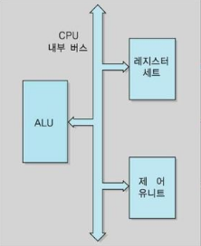
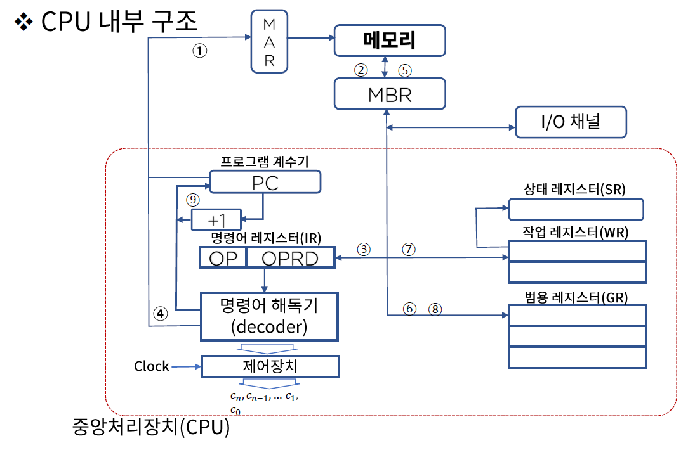
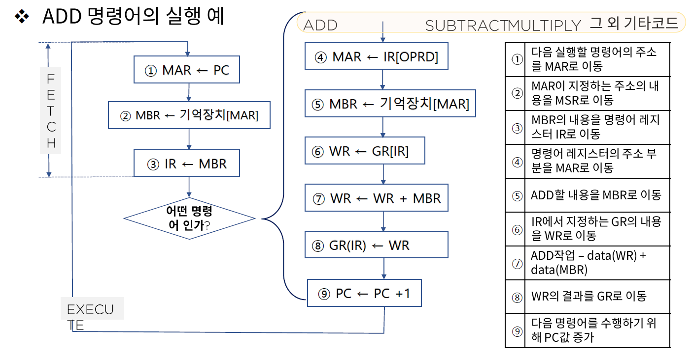

# 07. CPU 내부 구조와 레지스터

## CPU 구성요소

컴퓨터에서 데이터 처리동작을 수행하는 부분을 **중앙 처리 장치**라고 하며 줄여서 CPU(Central Processing Unit) 라고 부른다.

CPU는 레지스터 세트(Register set), 산술논리장치(ALU : Arithmetic Logic Unit), 제어장치(Control Unit)로 구성된다.

- Control Unit : RS 간 정보전송 감시, ALU에게 수행할 동작을 지시한다.
- Register set : 명령어를 실행하는데 필요한 데이터를 보관한다.
- Arithmetic Logic Unit(ALU) : 명령어를 실행하기 위한 마이크로 연산을 수행한다.

- MAR(Memory Address Register) : 메모리의 상태를 체크(주차장에 주차된 차량 위치를 확인하는 것 처럼)
- MBR(Memory Buffer Register) : 메모리에 들어가기 전에 임시 저장공간, MAR의 명령(어디로 들어가야하는지)을 받아야 들어갈 수 있다.
- PC(Program Counter) : 프로그램 계수기 / 수행될 명령어가 들어있는 주기억장치의 주소를 기억하고 있는 레지스터로 IC(Instruction Counter : 명령어 계수기) 혹은 LC(Location Counter : 위치 계수기)라고도 부른다.
- IR(Instruction Register) : 프로그램 계수기(PC)가 지정하는 주소에 기억되어 있는 명령어를 해독하기 위해 임시 기억하는 레지스터이다.
- ID(Instruction Decoder) : 명령어 해독기 / IR에 들어있는 명령코드의 해석(각종 명령코드 -> 제어 신호화 하여 기계 사이클로 전송)을 담당하는 논리회로이다.
- CU(Control Unit) : 제어장치 / ID로부터 보내진 신호에 따라 명령어를 실행 / clock에 의해 발생
- GR(General purpose Register) : 범용 레지스터 / 작업 레지스터에서 DATA가 용이하게 처리되도록 임시로 자료를 저장하는 경우에 사용된다.
- WR(Working Register) : 작업 레지스터 / 산술 논리 연산을 실행할 수 있고 자료를 저장하여 그 결과를 저장한다.(GPR과의 차이점은 ALU연결 유무)
- SR(Status Register) : 상태 레지스터 / CPU의 상태를 나타내는 특수 목적의 레지스터 / 연산 결과의 상태와 다음의 내용들을 처리 영 Z(Zero) / 부호 S(Sign) / 오버플로우 V(Overflow) / 캐리 C(Carry) / 인터럽트 I(Interrupt)

- FETCH 부분에서는 실제 연산이 일어나기 전 어떤 연산인지 파악한다.
- EXECUTE 부분에서는 실제 연산이 일어난다.