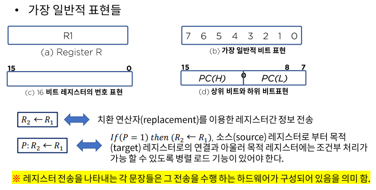
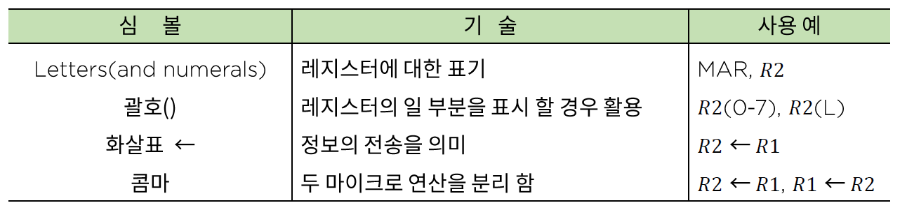
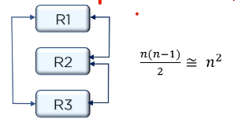
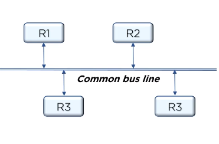
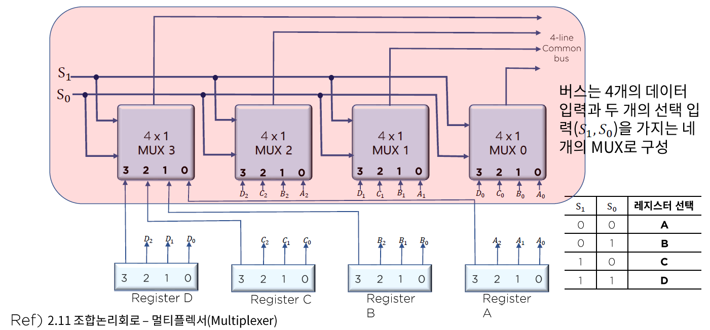
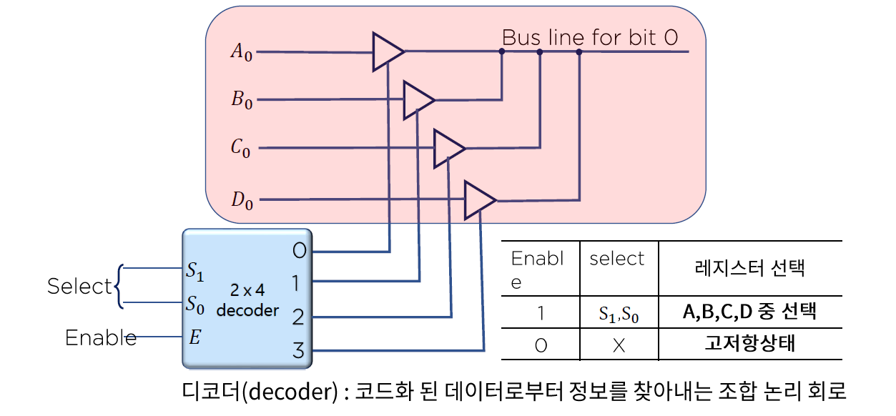
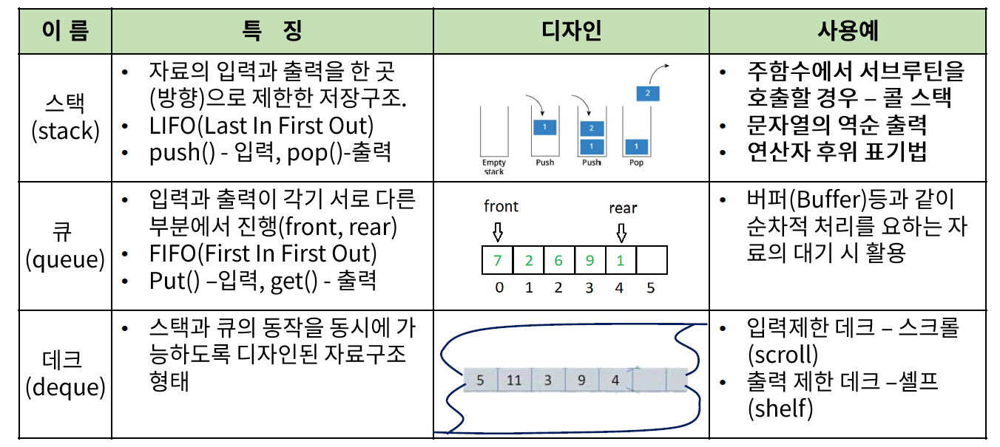

# 08. CPU 내부 구조와 명령어 집합

## 명령어 구성과 실행

### 명령어 코드

- 레지스터 전송문으로 나타내어지는 기본 컴퓨터의 각 연산이 어떻게 동작하는지
- 컴퓨터의 구조(CPU 구조)는 내부 레지스터, 타이밍과 제어구조 명령어 집합에 의해 정의된다.

### 레지스터 전송 언어

> 플립플롭 : 정보를 기억하는 단위
>
> 레지스터 - 플립플롭은 비트 하나만 저장되고 플립플롭을 여러 개 묶은게 레지스터이다.

레지스터(Register)에 저장된 데이터의 조작을 위해 실행되는 동작을 마이크로연산(micro-operation)

- 클럭 펄스 내에서 실행되는 기본적인 동작
  - 시프트(shift) 카운트(count) 클리어(clear) 로드(road)

### 디지털 컴퓨터의 구조를 정의하기 위해 논의 되어야 할 내용

- 레지스터의 종류와 그 기능
- 레지스터에 저장된 이진 정보를 가지고 수행되는 일련의 마이크로 연산들
- 일련의 마이크로 동작을 온/오프 시킬 수 있는 제어기능

### 레지스터 전송

#### 레지스터 전송의 기본 기호

- 괄호 : R2의 0 ~7번 비트를 표현, R2의 로우바운드
- 콤마 : 두 연산이 서로 관련이 없다는 것을 의미

## CPU(Central Processing Unit) 디자인

> 하드웨어는 소프트웨어에 의해 동작한다.
>
> 이 떄 소프트웨어는 시간이 지남에 따라 계속 업데이트가 되는데 소프트웨어가 업데이트될 때마다 하드웨어도 바뀌어야 한다면 굉장히 비효율적이다.
>
> 그렇기 때문에 소프트웨어와 하드웨어는 독립적이어야 한다.

- 직접 연결 : 연결 복잡도가 장치 수의 제곱의 비례한다.

  - 가장 간편한 방법이지만 확장성이 떨어진다.

  

- 버스 연결 : 공용선에 의한 연결

  - 가장 가성비 높은 연결 방식
  - 관리를 위한 다양한 방법이 제시된다.

  

- 공용선에 의한 레지스터 상호 연결

  - 멀티 플렉서

    

  - 3-상태 버스 버퍼

    

    - 멀티 플렉서와 비슷하지만 Enable을 사용한다는 점에서 다르다. -> 버퍼에 사용된다.

### CPU 내의 자료구조

