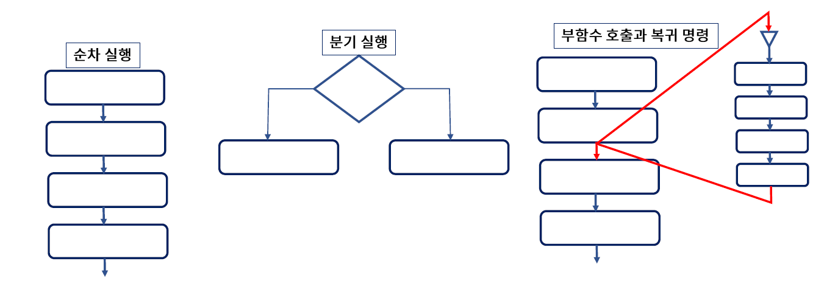
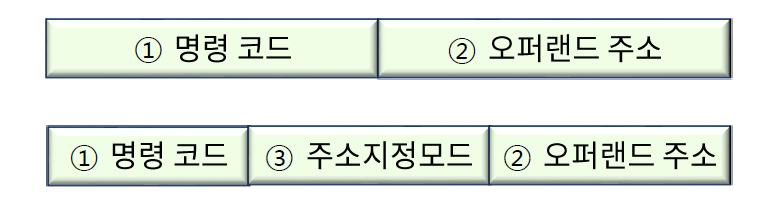
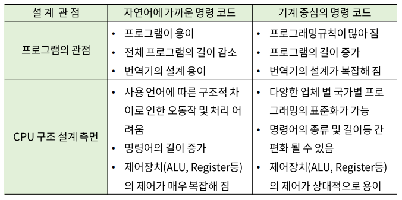
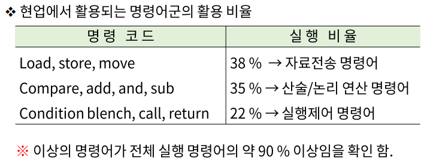
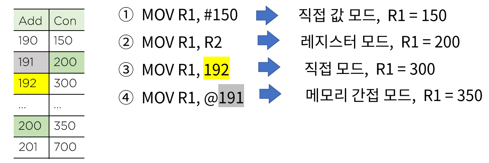

# 10. 마이크로 명령어 집합과 구성

## 명령어(instruction) 집합

### 실행 순서에 따른 명령어 분류

- 순차적 실행 명령어 - 전체 실행 명령어의 70~80% 차지 / 가장 익숙한 타입

- 분기 명령어

  예) `P: R1 <- R2` (`if (P == 1) then R1 <- R2`)

- 부 함수 호출 명령어

  메인과 서브로 나누어져있고 메인이 실행되는 중간에 서브가 실행된 후 서브의 실행이 끝나면 메인으로 피드백된다

- 복귀 명령어

  

### 명령어 구문 형식

> 프로그램과 하드웨어 간의 독립성을 위해 direct mode에서 indirect mode로 변화하였다.

1. 명령 코드 : CPU가 실행할 수 있도록 디자인 된 연산
2. 오퍼랜드 : 연산에 사용되는 자료 값, 자료가 지정 된 주소에 관한 정보
3. 주소 지정 모드(addressing mode) : 오퍼랜드가 저장된 위치를 인덱싱(지정)하는 방법

### 명령어 집합의 설계

#### 현업에서 활용되는 명령어군의 활용 비율

## 주소 지정 모드(Addressing Mode)

> 찾아볼 것: **명령어 구문 형식**

명령어의 구조상 자료가 저장되어 있는 장소를 지정하는 방법이 필요하다. (하드웨어와 소프트웨어의 독립성을 최대한 유지하여 프로그램의 유연성(pointer, indexing 등)을 가능하게 하여 명령어의 수와 길이를 줄이기 위해 - 세계 표준화 기법임)

#### 묵시적 모드(operand가 명령어에 포함되어 있지 않은 특수 모드)

- NOP : NO operation, 오퍼랜드가 필요없는 명령어
- INC : 묵시적 오퍼랜드인 누산기(AC)의 연산 명령어
- ADD : 스택 구조의 명령어(스택에 오퍼랜드가 저장)

#### 직접 값 모드(operand 자체가 명령어에 포함되어 있는 모드)

ex ) `MOV R1, #100;` 십진수 값 100이 두번째 오퍼랜드로 직접 명령문에 포함되어 있는 경우

#### 레지스터 모드(Register mode : 오퍼랜드가 레지스터에 저장된 모드)

ex ) `ADD R1 R2;` 레지스터 R1과 R2에 보유하고 있는 값이 오퍼랜드이다.

#### 메모리 직접 주소 모드(Direct mode : 오퍼랜드가 저장된 메모리 주소를 나타내는 모드)

ex ) `MOV R1, 100;` R1에 100번지의 내용을 이동하라는 내용(기종에 따라 반대의 경우도 가능), 100번지의 내용이 두번째 오퍼랜드가 된다.

#### 메모리 간접 주소 모드(Memory indirect addressing mode)

메모리를 이용하여 간접적으로 주소를 지정하는 모드

ex ) `MOV R1, @100;` `R1 ⬅ M[100] or M[100] ⬅ R1`

### 주소 지정 모드 예

R1 = 100, R2 = 200이라고 가정한다.

