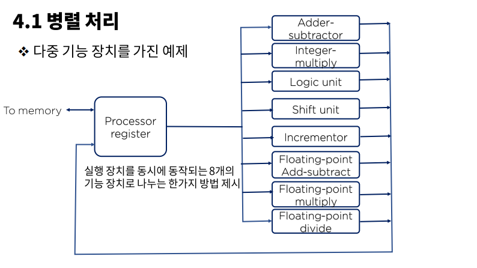
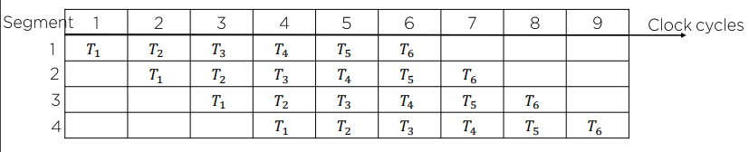
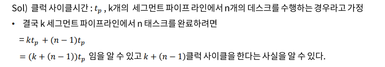
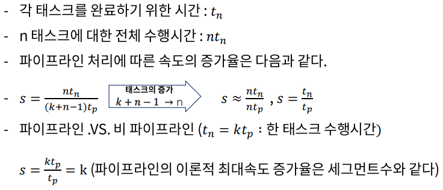

# 14. 병렬처리 그리고 파이프라인

## 병렬처리(Parallel Processing)

컴퓨터 시스템의 계산 속도 향상을 목적으로 하여 동시 데이터 처리기능을 제공하는 광범위한 개념의 기술을 의미한다.

### 복잡도에 따른 병렬처리의 다양한 단계

- 사용 레지스터의 형태에 따른 병렬 성 구현
- ex) 시프트 레지스터 .VS. 워드 당 동시에 전송이 가능한 병렬성을 갖는 레지스터
- 동일한 또는 서로 다른 동작을 동시에 수행하는 여러 개의 기능 장치(functional unit)를 가지고서 데이터를 각각의 장치에 분산 시켜 작업을 수행하는 경우
  - ex) 산술, 논리, 시프트 동작을 세 개의 장치로 분류하고 제어장치의 관리에 따라 피연산자를 각 장치들 사이에서 전환시킨다.

> 이전 연산의 결과가 필요한 연산인 경우에는 이전의 연산이 끝날 때까지 기다려야한다.
>
> 때문에 다른 플래그를 두어 모든 결과값을 저장하고 필요할 때마다 꺼내 쓰는 방법으로 해결한다.

### M.J Flynn의 분류 방법

동시에 처리되는 명령어와 데이터 항목 수에 의해 컴퓨터 시스템의 구조를 파악하려는 분류 방법 제안

> 명령어 흐름(instruction stream) ➡ 메모리로부터 읽어온 명령어의 순서
>
> 데이터 흐름(data stream) ➡ 데이터에 대해 수헹되는 동작

- SISD ➡단일 명령어 흐름, 단일 데이터 흐름
- SIMD➡단일 명령어 흐름, 다중 데이터 흐름
- MISD➡다중 명령어 흐름, 단일 데이터 흐름
- MIMD➡다중 명령어 흐름, 다중 데이터 흐름

| 분류     | 설명                                                         |
| :------- | :----------------------------------------------------------- |
| **SISD** | - 제어장치, 처리장치, 메모리 장치를 가지는 단일 컴퓨터 구조 - 명령어들은 순차적으로 실행되고, 병렬처리는 다중 기능 장치나 파이프라인 처리에 의해서 구현된다. |
| **SIMD** | - 공통의 제어장치 아래에 여러 개의 처리 장치를 두는 구조 - 모든 프로세서는 동일한 명령어를 서로 다른 데이터 항목에 대하여 실행시킬 수 있다. - 모든 프로세서가 동시에 메모리에 접근 할 수 있도록 다중 모듈을 가진 공유 메모리 장치가 필요하다. |
| MISD     | 이론적으로만 연구되고 있다.                                  |
| MIMD     | - 여러 프로그램을 동시에 수행하는 능력을 가진 컴퓨터 시스템 - 대부분의 다중 프로세서와 다중 컴퓨터 시스템이 이 범주에 속한다. |

## 파이프 라인

### 파이프 라인 구조의 성능

파이프 라인의 동작은 공간-시간표에 의해 설명되는데, 이것은 시간에 대한 함수로서 세그먼트의 사용 상황을 보여준다.

비 파이프라인의 경우

