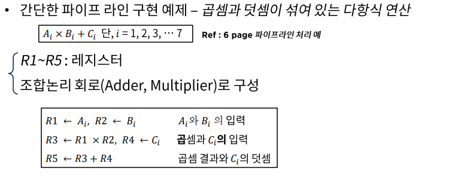
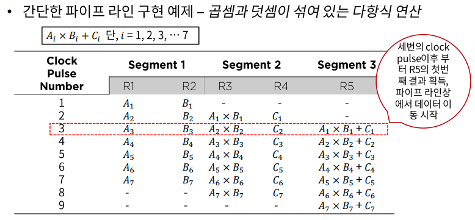
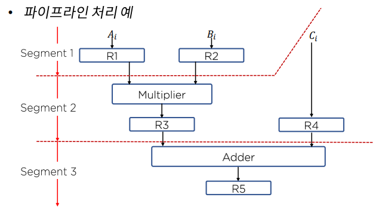
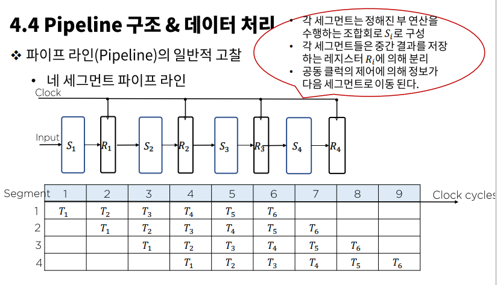
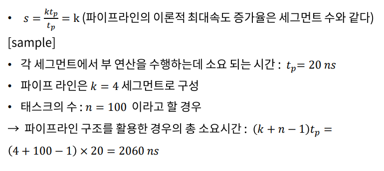
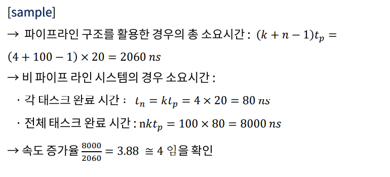

# 15. 파이프라인 구조 - 데이터/구조

## 파이프라인 구조 & 구현

### 파이프라인의 구현

- 하나의 프로세스를 서로 다른 기능을 가진 여러 개의 **서브 프로세스**로 나누어 각 프로세스가 동시에 서로 다른 데이터를 취급하도록 하는 기법이다.
- 각 **세그먼트**에서 수행된 연산 결과는 세그먼트로 연속적으로 넘어가게 되어 데이터가 마지막 세그먼트를 통과하게 되면 최종적인 연산 결과를 얻게 된다.
  - 하나의 프로세스를 다양한 연산으로 중복시킬 수 있는 근간은 각 세그먼트마다의 **레지스터**이다.

## 파이프라인 구조 & 데이터 처리

### 파이프라인의 일반적 고찰

- 동일한 복잡도의 부연산들로 나뉘어지는 어떠한 연산 동작도 파이프라인 프로세서에 의해 구현 될 수 있다.
- 파이프라인 기술은 매번 다른 데이터 집합을 동일한 태스크에 적용시켜 여러 번 반복하는 응용에 효과적이다.

