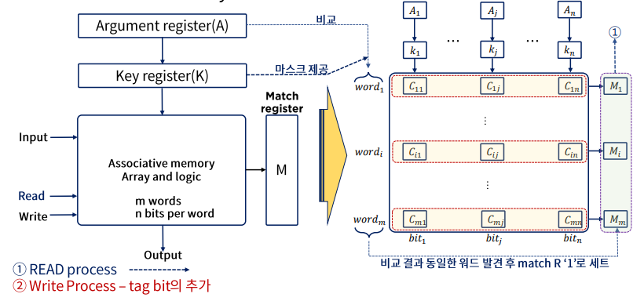
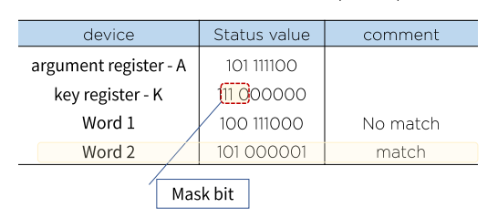
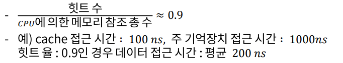

# 19. 효율적 메모리 관리 정책

## Associative Memory

내용에 의해 접근하는 메모리 장치를 이르는 용어이다.

- 메모리 장치란 자료의 저장과 접근을 용이하게 하기 위해 필요로 하는 장치이다.
- 결국 이상의 필요에 따라 CPU는 필요한 자료를 얻기 위해 메모리 장치에 **탐색**을 하게 될 수 밖에 없다.
- 좀 더 **효율적 탐색이 가능**할 수 있는 저장 공간의 필요에 의해 만들어진 저장 형태를 우리는 이렇게 명명(또는 내용 지정 메모리(content addressable memory, CAM))한다.

이 방식은 **데이터의 내용으로 병렬 탐색을 하기에 적합하도록 구성**되어 있으며, 탐색은 전체 워드 또는 한 워드 내의 일부만을 가지고 실행 될 수 있다.

각 셀이 저장 능력 뿐 아니라 **외부의 인자와 내용을 비교하기 위한 논리회로**를 갖고 있기 때문에 RAM보다 값이 비싸다. 따라서 탐색시간이 짧아야 하는 것이 중요한 이슈일 경우에 활용한다.

### Associative memory의 하드웨어 구성과 메모리

- m개의 words는 n개의 bits로 이루어져 있다.
- Match register - 일치하는 단어가 있으면 레지스터의 값이 1로 바뀌고 비교가 끝난 후에는 m개의 레지스터의 값을 읽으면서 과정이 끝난다.
- Mask - and 연산자를 사용해서 마스크하는 것이다.

### Key register의 역할

- 인자 워드(argument register)의 특정 영역이나 키를 선택하기 위한 마스크(mask)를 제공한다.

## Cache 메모리

### 참조의 국한성(locality of reference)

프로그램이 수행되는 동안 메모리 참조는 국한된 영역에서만 이루어지는 경향이 있음을 확인할 수 있다.

- 프로그램 루프와 서브루틴의 빈번한 활용
- 순차적 프로그램의 실행
- 데이터 메모리 참조에서도 동일한 경향이 있음을 확인할 수 있다.
  - 테이블-룩업(look-up) 절차
  - 공통 메모리와 배열 사용 예

캐시 메모리는 참조의 국한성(locality of reference)을 이용하여

- 속도는 빠르고 (CPU와 거의 동일)
- 조그마한 메모리(비싸서, 경제성)

를 이용하여 프로그램을 수행시키는데, 평균 메모리 접근 시간의 단축과 그에 따른 전체 프로그램의 수행 시간을 절약을 담보한다.

### Cache 메모리의 동작과 성능

Cache의 기본 동작(CPU가 메모리에 접근 할 필요가 있는 경우)

- Cache를 체크
- 워드가 Cache에서 발견되면(hit) 읽어들이고 아닐 경우(miss) 주 기억장치에 접근한다.
- 이 워드를 포함한 블록(1~16워드, 환경에 따라 다름)을 Cache로 전송한다.

히트율, hit ratio

### Cache 메모리의 매핑 프로세스

효율적 메모리 관리를 위해서는 효과적으로 cache를 구성하는 방법이 현존하는 메모리 관리 방법 중 최고의 방법이다.

이에는 다음과 같은 방법들이 존재한다.

- associative mapping
- Direct mapping
- Set-associative mapping

