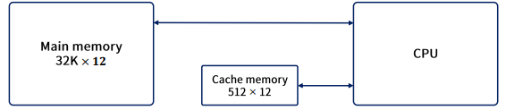
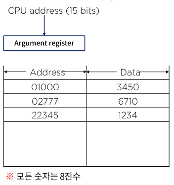
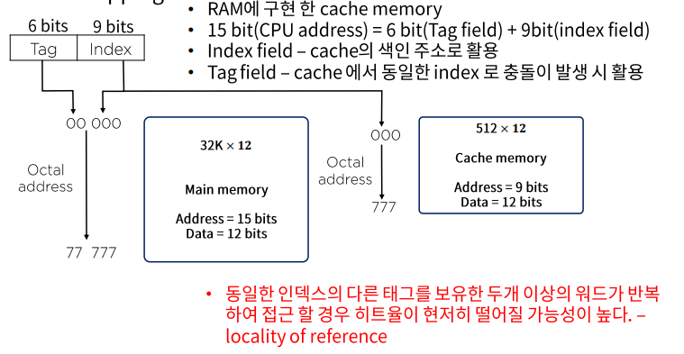
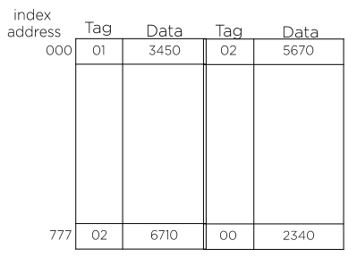
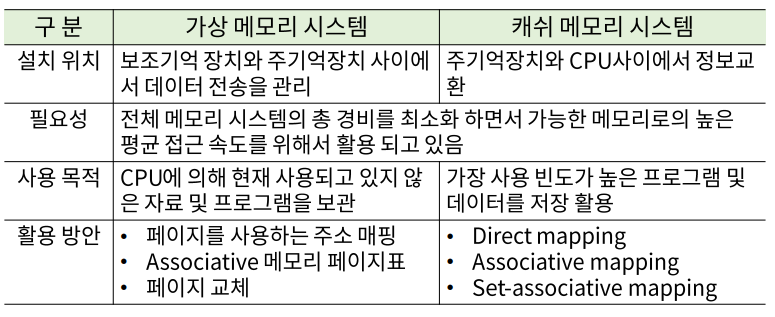

# 20. 컴퓨터 성능 개선을 위한 메모리 관리

## Cache 메모리 전송을 위한 다양한 매핑 방법

### Cache 메모리의 매핑 프로세스

- Associative mapping
- Direct mapping
- Set-associative mapping

- 상기의 내용을 설명하기 위해 다음과 같은 설정을 가정해본다.
  - 주기억장치 : 12bit 32K워드를 저장
  - Cache Memory : 512 words / 주어진 시간 내 저장
  - CPU는 Main/Cache Memory 모두 통신 가능
  - 우선 15bit의 주소를 cache로 보내어 hit가 발생하면 Cache로 부터 12bit의 데이터를 받아 들인다.
  - 만약 miss가 발생하면 주기억장치로부터 워드를 읽고, 이를 Cache로 이동 저장한다.

### Associative mapping

- 가장 빠르고 융통성 있는 cache 구조
- CPU의 15bit 주소는 인자 레지스터에 놓여지며, Associative Memory 내 주소와 같은 12bit의 데이터를 읽어 CPU로 보낸다.
- miss인 경우 CPU는 주기억장치에서 해당 자료를 찾아 Cache로 옮긴다.
- 만약 Cache에 여유 공간이 있다면 그 공간에 주소와 데이터를 저장한다.
- Cache가 꽉 차 있을 겨우 기존 Cache의 주소와 데이터 쌍 중 주어진 알고리즘에 의해 해당 주소 데이터 쌍이 새로운 쌍을 대체 된다.

### Direct mapping

### Set-associative mapping

- Cache의 각 워드는 인덱스 주소 아래 두 개 이상의 메모리 워드를 저장할 수 있게 함으로써 매핑의 단점을 보완한 논리이다.
- 한 인덱스 안에 두 개의 태그를 가지는 경우 Cache를 구현한 예가 위의 그림이다.
  - Cache 메모리의 크기 : 512 X 36(=2 X (6 + 12))
- 큰 규모의 Cache는 히트율을 높일 수 있으나 좀 더 복잡한 비교 논리 회로를 필요로 한다.
- 기존 데이터의 대체 알고리즘은 복잡해진다.

## 가상 메모리

### Virtual Memory VS Cache Memory

## 메모리 관리 하드웨어

### 메모리 관리 시스템

- 메모리의 광역화 (가상 메모리 + 캐시 메모리)와 멀티프로그램의 발달로 인해 시스템 내 상호 간섭도 시스템 기능 저하 요인의 중요한 부분이다.
- 프로그램과 프로그램 사이의 데이터 흐름, 선 후 데이터의 활용, 사용 메모리의 양 조절, 다른 프로그램의 흐름에 영향을 끼치지 못하게 하는 제어 등의 역할을 한다.
- 메모리 내의 여러 프로그램을 관리하기 위한 H/W와 S/W 절차의 집합체로 메모리 관리 소프트웨어는 운영체제(OS)의 일부이다.

### 메모리 관리 하드웨어

- 논리 메모리 참조를 물리 메모리 주소로 변환하는 동적 저장 장소 재배치를 위한 기능
- 메모리 내에서 서로 다른 사용자가 하나의프로그램을 같이 사용하기 위한 편의
- 사용자 간의 허락되지 않은 접근을 방지하고 사용자가 OS의 기능을 변경하지 못하도록 하는 정보의 보호