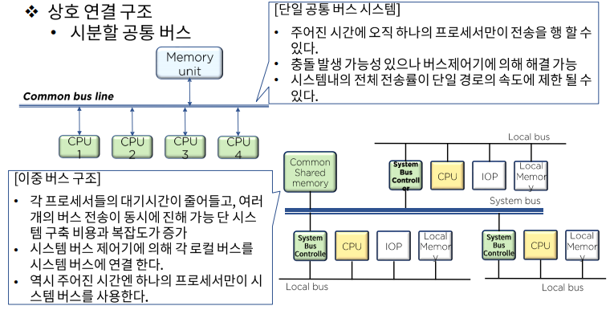
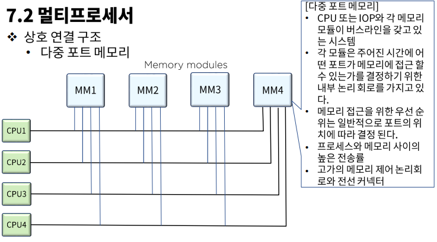
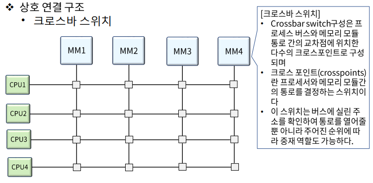

# 24. 멀티프로세서

## 병렬처리

### Serial Process System VS Parallel Process System

- #### Serial Process System

  - CPU가 하나 뿐인 시스템이다.
  - 과학, 계산, 영상, 네트워크 등 컴퓨터 처리 전 분야에 걸쳐 더 나은 성능 개선 요구가 끊임없이 제기되고 있다.
  - 하지만 기계적, 논리적 프로세싱으로는 가장 효율적이다.

- #### Parallel Process System

  - 동시에 여러 명령 또는 여러 작업을 실행할 수 있는 병렬 처리 시스템이다.
  - 병럴 처리 시스템이 가능한 시스템을 **병렬 구조**라고 한다.
  - 병렬 처리 시스템 구현 기술의 일환인 병렬 처리 소프트웨어(병렬 운영 체제, 병렬 컴파일러, 메모리 공유 등)가 과거에 비해 현저히 발전하고 있음으로 병렬 구조 개발 여건을 제공한다.
  - 다중 장치 구조
    - 다수의 CPU로 동시에 여러 개의 작업을 병렬로 처리할 수 있는 시스템이다.
    - 공간적 병렬성(Spatial Parallelism)
  - 파이프라인 구조
    - 다수의 작업을 각기 다른 실행 단계에서 병렬로 처리할 수 있도록 지원되는 구조이다.
    - 시간적 병렬성(Temporal Parallelism)

## 멀티프로세서

### 멀티프로세서의 특징

- 사용자가 명시적으로 병렬 실행이 가능한 작업이다.
  - 프로그램 실행의 병렬성을 구현할 수 있는 프로그래밍 언어의 제공이 선결 과제이다.
- 컴파일러가 자동적으로 프로그램의 병렬성을 감지해 처리한다.
  - 데이터 의존성을 검사하여 수행 순서나 병렬성을 찾아낸다.
- 멀티프로세서의 분류
  - 공유 메모리(Shared-Memory) 또는 밀착결합 멀티프로세세(Tightly Coupled Multiprocessor)
  - Distributed Memory
  - Loosely Coupled

### 상호 연결 구조

- 멀티프로세서 시스템은 CPU, IOP 그리고 여러 모듈로 분리된 메모리 장치에 의해 구성된다.
- 공유 메모리 시스템 - 프로세스와 메모리 사이의 경로 수에 따라
- 느슨히 결합된 시스템 - 프로세싱 요소들 사이의 경로 수에 따라 여러가지 물리적으로 다른 구성을 보인다.

#### 시분할 공통 버스

#### 다중 포트 메모리

#### 크로스바 스위치

#### 다단 교환망

- 다단망에서의 기본 요소는 2입력, 2출력 상호교환 스위치이다.
- 2개의 입력 중 하나만을 선택하여 전체 경로를 연결해주는 역할과 충돌을 중재하는 기능으로 구성된 연결 구조이다.
- 입력과 출력 단자를 연결할 수 있는 제어 신호도 있어야한다.

#### 하이퍼큐브 상호연결

- 2^n개의 프로세서각 n차원 이진 큐브로 연결된 느슨히 결합된 시스템을 의미한다.
- 각 프로세서는 큐브의 노드를 형성하는데 노드에는 CPU뿐만 아니라 로컬 메모리나 I/O인터페이스도 포함된다.