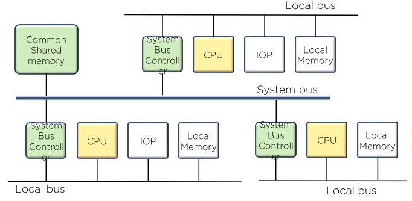
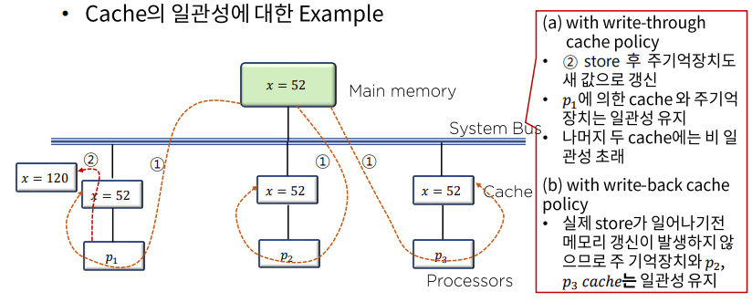

# 25. 시스템 성능 분석과 개선

## 프로세서간 중재

### 시스템 버스 VS 로컬 버스

- 컴퓨터 시스템에는 각 요소들 사이의 정보 전송을 위한 다양한 단계의 여러 버스가 존재하며 CPU내에서도 레지스터와 ALU사이의 정보 전송을 위한 여러 내부 버스가 존재한다.

#### 시스템 버스(System bus)

CPU, IOP(I/O Processor), Memory와 같은 주요 요소를 연결하는 연결체계이다.

#### 로컬 버스(Local bus)

메모리 버스 : 데이터, 주소 그리고 읽기/쓰기 정보 전송

통신 전용 버스 : 특정 포트 정보, 해당 프로토콜 정보 등을 송/수신

#### 공유 메모리 멀티프로세서 시스템

각 자원의 효율적 분배와 상호 충돌을 배재할 수 잇는 중재 프로세스는 전체 시스템 성능 향상에 지대한 영향을 미칠 수 밖에 없다.

### 메모리 공유 멀티프로세서를 위한 시스템 버스 구조

### 중재 Algorithm

- 일반적으로 시스템 버스는 100여개의 신호라인으로 구성되고 이 명령 라인에 의해 중재 논리가 성립된다. (ex, IEEE standard 796)
- 직렬(daisy-chain) 중재 절차
- 병렬 중재 논리
- 동적 중재 논리

### 프로세서 간 통신

- 멀티 프로세서 시스템에 있는 다양한 프로세서들은 공통의 입/출력 채널을 통하여 서로 통신한다.

- #### 공통 메모리(IOP에 연결된 자기 디스크 등)의 역할

  - 공유 메모리 멀티프로세서 시스템에서 메모리의 일부를 모든 프로세서가 접근할 수 있도록 할당한 공간이다.
  - 기본적으로 우편함과 같이 프로세서들 사이에서 오가는 메시지의 집중지 역할을 한다.
  - 송신 프로세서 -> 요구, 메시지, 프로시저 저장(상태 비트 : 수신 프로세서 지정 및 의미있는 정보의 유무를 공지) <- 수신 프로세서(**폴링 방식**에 의해 주기적 점검)
  - 보다 효율적인 방법은 인터럽트 신호를 통하여 송신 프로세서 -> 수신 프로세서

- #### 멀티프로세서를 위한 운영체제의 종류

  - 주종(master-slave)모드

    - 주(master)프로세서(OS기능 수행) <- 종(slave)프로세서는 필요에 의한 인터럽트 요청

    - 분리 운영체제(Separate Operating System)

      - 모든 프로세서가 자신의 운영체제를 가지고 운영된다. 이는 느슨한 결합(Loosely Coupled) 시스템에 적합한 형태라고 한다.

    - 분산 운영체제(Distributed Operating System)

      - 부동 운영체제(OS의 특정 기능은 한 순간에 하나의 프로세서에서만 작동된다.)

        즉, 운영체제가 여러 프로세서에 분산되어 있는 형태이다.

### 프로세서 간 동기화

- 멀티프로세서의 명령어 집합에는 함께 동작하는 프로세서와의 통신과 동기화를 구현하는 기본 명령어가 포함된다.
- 동기화의 필요성
  - 처리될 작업들간 정확한 순서를 유지한다.
  - 공용의 기록 가능한 변수에 대한 상호배제(mutual exclusive)적 접근을 보장한다.
- 멀티프로세서 시스템에서 자원의 동기화를 위해 가장 많이 활용되는 기법은 **하드웨어적 접근 방법인 이진 세마포**(Semaphore)를 이용하는 방법이다.

## 캐시의 일관성

### Cache관련 정책

- #### Cache의 일관성

  - 공유 메모리 멀티프로세서 시스템에서도 각 프로세서는 로컬 메모리(일부 or 전부 Cache)를 운영한다.
  - 이상의 경우 여러 개의 동일한 내용이 주기억장치나 각 로컬 메모리에 복사본으로 중복되어 저장되는 경우가 발생할 수 있고 정확한 메모리 동작을 위해 이 내용들이 모두 동일하게 유지되어야 한다는 정책이다.

- #### 메모리에 쓰기 동작시 메모리 갱신 정책

  - Write-Through 정책
    - 쓰기 동작의 발생시 Cache와 주기억장치 모두를 갱신한다.
  - Write-Back 정책
    - Cache만 갱신하고 다음에 메모리로 전달할 수 있도록 위치를 표시한다.

### Cache의 비 일관성에 대한 조건

- Cache의 일관성 문제는 각 프로세스별로 개별적인 cache를 가진 멀티프로세서에서 공통의 기록 가능한 데이터가 필요하기 때문에 발생한다.

### Cache의 일관성 문제에 대한 해결책

- 각 프로세서에 개별적인 Cache를 허용하지 않고 주기억장치에 공용 Cache 메모리를 두는 경우
  - 근접성 원리에 위배, 평균 접근 시간을 증가시킨다.
- 캐시가능(Cacheable)
  - 비 공유적이고 읽기 전용 데이터에 한해서 Cache에 저장되도록 하는 방안
- 스누피 캐시 제어기(Snoopy Cache Controller)
  - 기본적으로 버스에 부착된 모든 Cache에 대해 버스-감시 기능을 유지하도록 설계된 H/W장치이다.