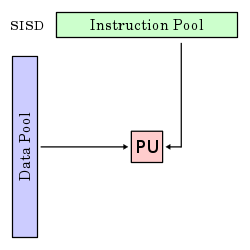
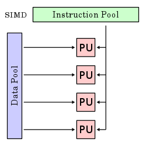
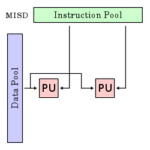
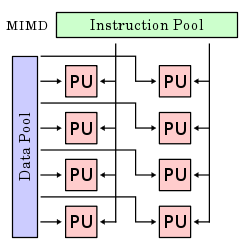

# 플린 분류 (Flynn's taxonomy)

* ## SISD(Single Instruction, Single Data stream)

  * 

  * 한 프로세서가 한번에 하나의 명령어를 처리할 때 하나의 메모리에 저장되어 있는 한 데이터를 이용하여 처리하는 방식이다.

  * 각 데이터를 처리하기 위해 매번 명령어를 읽어야 하기 때문에 효율이 떨어진다.

    

* ## SIMD(SIngle Instruction, Multiple Data streams)

  * 

  * 병렬 프로세서의 한 종류로, 하나의 명령어로 여러 개의 값을 동시에 계산하는 방식이다.

  * 벡터 프로세서에서 많이 사용되는 방식으로, 비디오 게임 콘솔이나 그래픽 카드와 같은 멀티미디어 분야에 자주 사용된다.

    * 벡터 프로세서(Vector processor) : 다수의 데이터를 처리하는 명령어를 가진 CPU이다. 어레이 프로세서라고(Array processor)도 불린다.

      

* ## MISD(Multiple Instruction, Single Data stream)

  * 

  * 각기 다른 명령어를 처리하는 다수의 처리기가 동일한 데이터를 처리하는 방식이다.

  * CPU의 파이프라인 기법이 이에 속한다.

    

* ## MIMD(Multiple Instruction, Multiple Data streams)

  * 
  * 각각 다른 명령어를 처리하는 다수의 처리기가 여러 개의 자료를 처리하는 방식이다.

