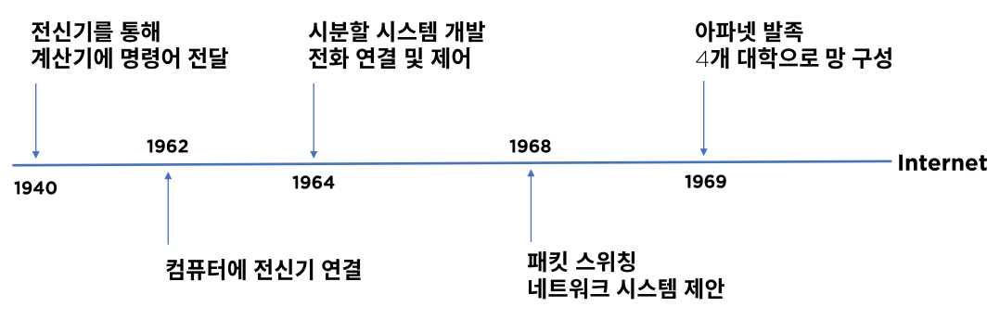
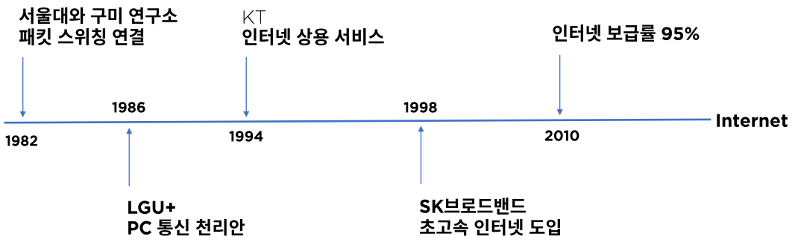
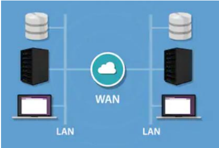

# 01. 네트워크의 정의와 역사

## 네트워크란?

분산되어 있는 컴퓨터들이 자원을 공유할 수 있게 통신망으로 연결한 것이다.

## 네트워크의 중요성

- 3차 산업혁명

  디지털 + 인터넷(공유) = 지식 정보화 사회 -> 급격한 기술의 발전

- 4차 산업혁명

  정보통신 기술의 융합 - 대표 요소 기술로 빅데이터, 인공지능, 사물인터넷 등 7가지

  On Network - 대부분 요소 기술들은 네트워크 위에서 동작

  블록체인 기술은 신뢰 가능한 인터넷

## 네트워크 역사

### 미국

### 한국

## 네트워크의 형태

- ### LAN(Local Area Network) 근거리 통신망

  사무실 또는 학교 등의 가까운 지역을 한데 묶은 네트워크

- ### VPN(Virtual Private Network) 가상 사설망

  공중망을 사설망처럼 사용, 암호화

- ### WAN(Wide Area Network) 장거리 통신망

  각각 떨어진 LAN 망을 연결, 규모가 큰 네트워크, ISP로 연결

## 네트워크 표준

- ### 네트워크 표준 기구

  ISO 국제표준화 기구

  IEEE 미국전기전자협회(주로 LAN)

  ITU-T 국제전기통신연합 통신표준본부(주로 WAN)

- ### 인터넷 표준 기구

  IETF 인터넷 엔지니어 테스크포스

  RFC - 프로토콜 정의 문서

- ### 이더넷 -> IEEE 802.3

- ### TCP/IP -> RFC 1122 & 1123, HTTP/1.1 -> RFC 2616

- ### OSI 7 Layer -> ISO Standard Model

