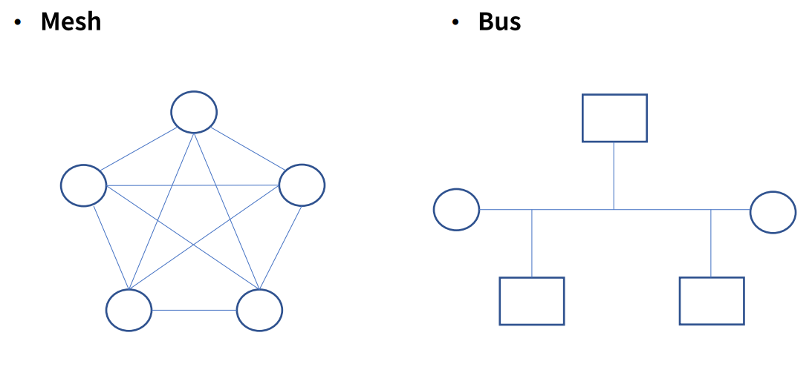
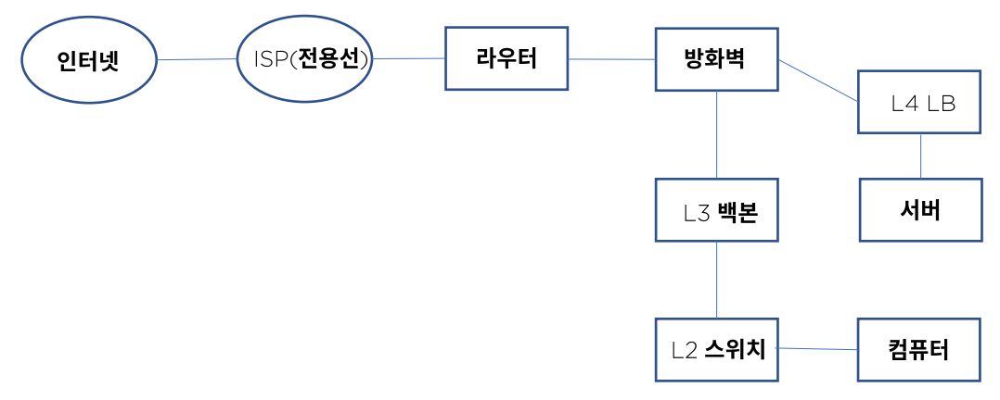
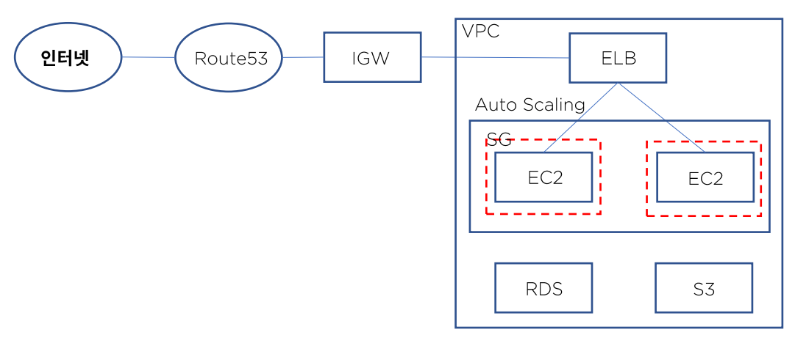

# 02. 네트워크 구조

- ### 규모

  회사나 학교 등의 집단 크기에 따라 구분 - 사용자, 대역폭

- ### 업종

  공공기관, 제조, 금융, 게임 등의 업종에 따른 서비스 중요도

- ### 통신 방식과 경로

  Server & Client, Peer to Peer

- ### 토폴로지

  Star, Ring, Mesh, Bus, Tree, Redundancy

  

> 원은 컴퓨터, 사각형은 중계기

- Ring 구조는 가까운 곳은 1 depth로 가게 되어 비용 절약 및 속도가 빨라지만, 갯수가 늘 수록 depth가 늘기 때문에 문제가 있다.

- 대부분의 네트워크 구조는 Tree 구조이다.
- Redundancy는 동일한 서버를 여러 대 두어, 서비스 가용성을 극대화 시킨다.

## 홈 네트워크

- 인터넷 - ISP - 모뎀 - 공유기 - 컴퓨터

## 기업용 네트워크

- 인터넷 - ISP - 전용선 - 라우터 - 방화벽 - L3 백본 - L2 스위치 - 서버, 컴퓨터 - L4 로드밸런서 - DMZ

## 클라우드 네트워크 - AWS 기준

- 인터넷 - Route53 - IGW - VPC - ELB - Auto Scaling - Security Group - EC2

- Route53 : URL을 IP주소로 변경해준다. dns service

- IGW : 인터넷 게이트 웨이나 모듈로 들어 가게 된다.

- VPC : routing 등의 논리적인 망으로 구성한다.

- ELB : 로드 밸런서로 각각의 서버로 분산한다.

- EC2 : 컴퓨터

- Security Group : 방화벽 역할을 한다.

- 특징 : Auto Scaling 자동으로 네트워크 대역폭과 서버의 저장 용량을 조절한다.