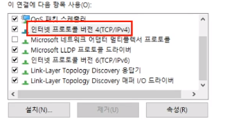
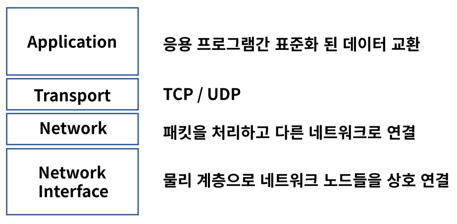
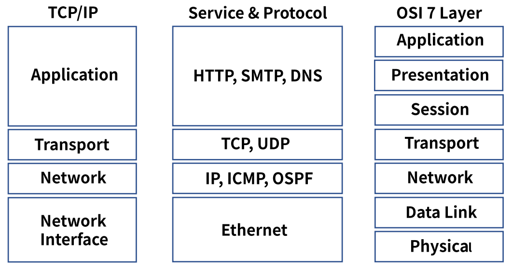
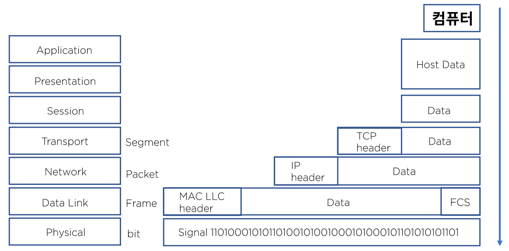
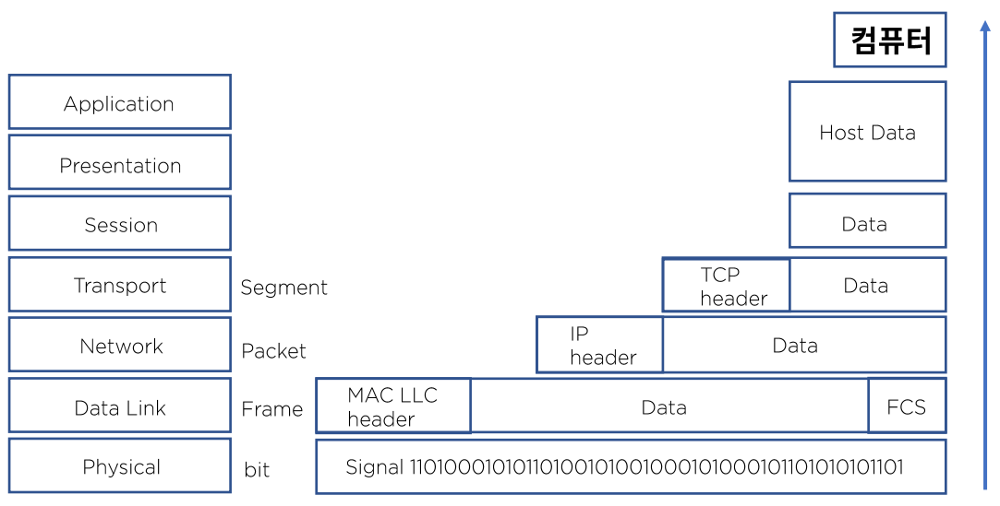

# 04. TCP/IP 모델 비교와 캡슐화

## TCP/IP란?

- ### 정의

  네트워크 프로토콜의 모음으로 패킷 통신 방식의 IP와 전송 조절 프로토콜인 TCP로 이루어져 있다.

- ### 역사

  - 1960년대 말 방위 고등연구계획국(DARPA)이 연구
  - 1990년대 네트워크 표준이 ISO 모델과 TCP/IP 모델로 좁혀진다.
  - 1990년대 말 TCP/IP 모델이 자주 쓰이면서 가장 일반적인 모델이 되었다.

  

## TCP/IP 모델

## TCP/IP 와 OSI 7 Layer 비교

네트워크라는 카테고리를 각각 모델링한 것이다.

## 인캡슐레이션

하나씩 **데이터를 캡슐화** 하고 **헤더를 붙이는 단계**이다.

OSI 7 계층에서 Application Layer에서 하드웨어까지 어떻게 통신이 되는지에 대한 내용이다.

1. 사용자가 접속을 하고, 어떤 데이터에 대해 상대방 컴퓨터에 통신을 하고자 한다. 
   - Host Data(예. 사람의 캐릭터, 그림)
2. Session -> Data로 표현(컴퓨터가 이해하는 일련의 정형화된 데이터)
3. Transport Layer : 데이터를 Segment라 부른다. 데이터가 몇 번 포트를 사용하는지 알고 있어야 한다.
   - TCP 헤더에 우리가 보내는 데이터가 어떤 서비스, 포트를 사용하는지 지정한다.
4. Network : Packet. 어떤 목적지 IP를 보내는지 IP Header를 붙인다.
5. Data Link : Mac 주소(네트워크 장비의 물리적 시리얼 번호)인지
   - Mac Header, 오류 검출을 위한 FCS라는 트레이를 붙인다.
6. Physical : bit. 전기신호(시그널)로의 변화

## 디캡슐레이션

1. Physical : Signal이 물리적 장비를 통해 들어온다.
2. Data Link : Mac Header가 붙고 Mac Adress를 통해 랜 어댑터로 전달한다.
3. Network : Mac Header를 버리고 IP Header를 통해 Layer로 올라가게 된다.
4. Transport : IP Header를 버리고 TCP Header를 통해 포트를 정의한다.
5. Session : Data가 형성된다.
6. Presentation, Application : Host로 넘어간다.
7. 컴퓨터 : 사용자 PC로 수신한다.

## 정리

- TCP/IP 모델은 패킷 통신 방식의 IP와 전송 조절 프로토콜인 TCP로 이루어져 있다.
- 1960년대 말에 개발되어 1990년대 말 네트워크 통신의 일반적인 모델이 된다.
- 캡슐화를 통해서 네트워크는 통신한다.