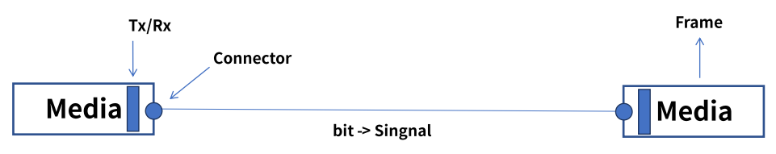
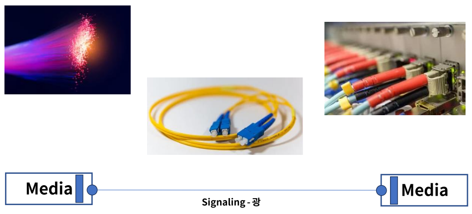
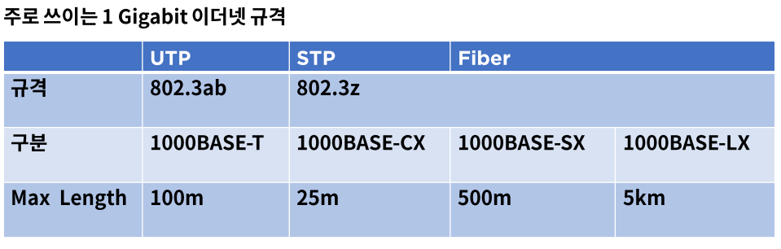
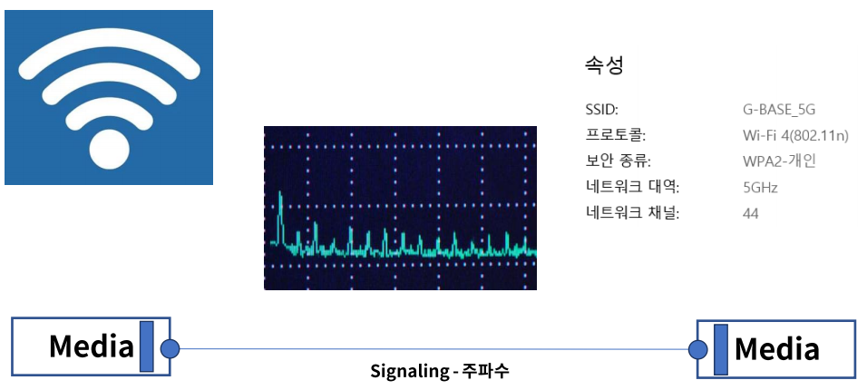
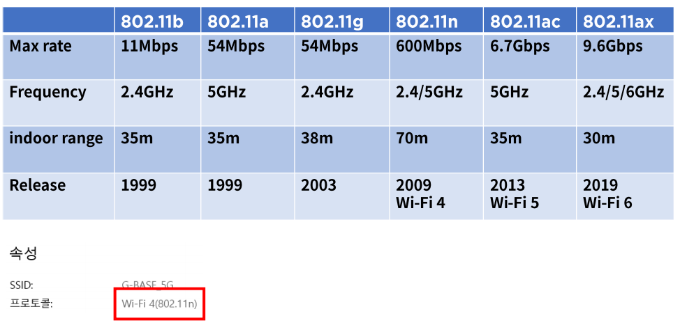
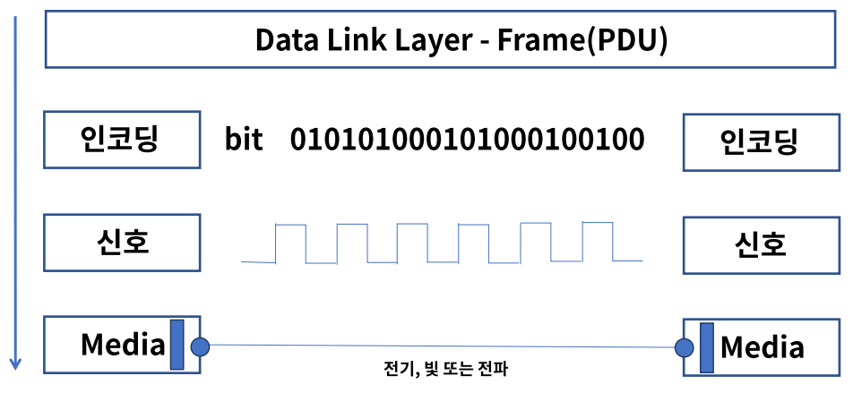

# 05. 물리계층의 역할과 기능

## 물리계층이란?

- ### 역할

  - OSI 7 Layer의 1 계층으로 하드웨어로 표현한다.
  - 네트워크 장치의 전기적, 기계적 속성 및 전송하는 수단을 정의한다.
  - 상위 계층인 데이터 링크 계층의 프레임을 신호로 인코딩하여 네트워크 장치로 전송한다.
  - 통신 장치와 커넥터, 인코딩(Bit -> Signal), 송수신을 담당하는 회로등의 요소가 있다.

  

## Signaling의 종류

- ### 전기

  - Copper 케이블을 사용하며 전화선, UTP, 동축 케이블 등이 이에 속한다.

  

- ### 광(빛)

  - Optical Fiber 케이블이 이에 속하며 빛의 패턴을 신호로 사용한다.

  

- ### IEEE 802.3

  - 이더넷에서 물리계층과 데이터 링크 계층의 매체 접근 제어를 정의, 케이블이 이에 속한다.

  

  - 첫 번째 숫자는 Speed를 의미한다.
  - 두 번째 BASE는 Baseband라는 전송방식을 의미한다.
  - 세 번째 숫자일 경우 전송 거리, 영문자일 때는 케이블 종류 또는 광타입이다.

- ### 전파

  - 무선이 이에 속하며 마이크로파 패턴을 신호로 사용한다.

  

- ### IEEE 802.11

  - 무선랜 규격

  

- ### 방식

  - OSI 7 Layer 2계층의 Frame은 아래와 같은 형태로 전달한다.

  

## 정리

- 물리계층은 네트워크 장치의 전기적, 기계적 속성 및 전송하는 수단을 정의한다.
- 전송하는 수단인 Signaling은 전기, 광, 무선 등이 있다.
- IEEE 802.3 케이블, IEEE 802.11 무선 표준이 있다.
- 물리계층은 bit를 인코딩하여 2계층(Data link)과 통신한다.