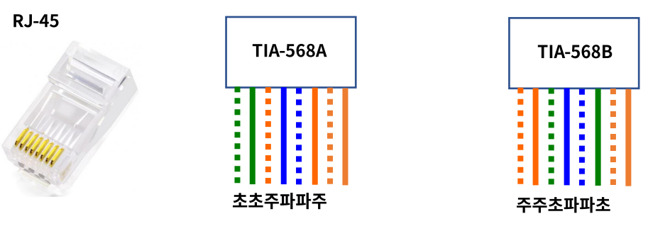
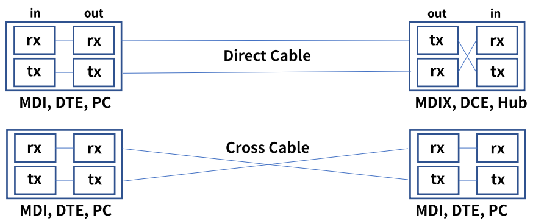
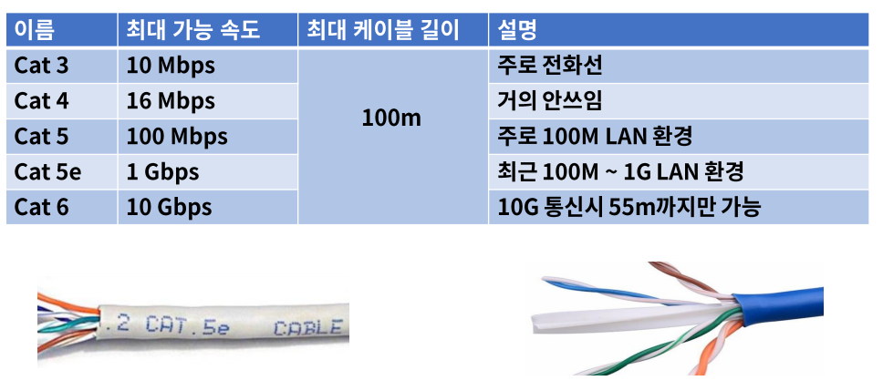
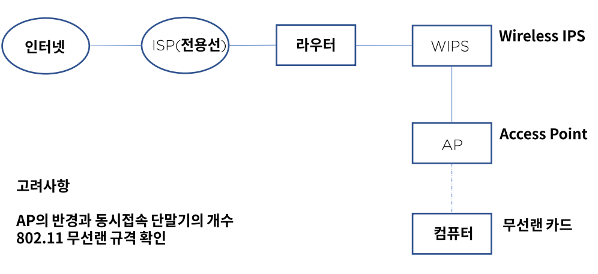

# 07. UTP 케이블과 Wi-Fi

## UTP 케이블

- ### 정의

  - UnShielded Twisted Pair, 주로 근거리 통신망(LAN)에서 사용되는 케이블이다.
  - 이더넷 망 구성시 가장 많이 보게 되는 케이블이다.
  - 알렉산더 그레이엄 벨이 AT&T에서 발명했다.

## 코드 배열

### 8P8C

**8개의 선 배열**에 따라 다이렉트 또는 크로스 케이블로 구성한다.

- Direct Cable(588B-568B) : PC to Hub ->DTE to DCE
- Cross Cable(568A-568B) : PC to PC, Hub to Hub -> DTE to DTE, DCE to DCE
- DTE(Data **Terminal** Equipment), DCE(Data **Communication** Equipment)

### Standard

- ISO / IEC 11801

  Copper & Fiber 케이블 등을 정의한다.

- TIA-568

  (Telecommunications Industry Association)

  통신 제품 및 서비스를 위한 상업용 케이블 스펙을 정의한다.

- EIA-568

  (Electronic Industries Alliance)

  최초 통신 시스템 케이블링의 표준을 정의했고 이후 TIA로 이관되었다.

### Auto MDI-X

- (Automatic Medium Dependent Interface Crossover)
- 어떤 노드의 연결인지에 따라서 다이렉트와 크로스 케이블을 선택 -> 불편
- **케이블 타입에 관계없이** 노드 상호간 **자동**으로 통신이 가능하게 하는 기술이다.
- MDI 포트 -> DTE & MDIX 포트 -> DCE, 송신과 수신의 관계

##  UTP 카테고리

- ### 정의

  UTP 케이블의 전송 가능한 대역폭을 기준으로 분류한다.

  

## WIFI

- ### 정의

  - 비영리 기구인 Wi-Fi Aliance의 상표로 전자기기들이 무선랜을 연결할 수 있게 하는 기술이다.
  - 1999년 몇몇 회사들이 브랜드에 상관 없이 무선 네트워킹 기술의 발전을 위해 협회 결성
  - 2000년 Wi-Fi 용어 채택
  - 수십개 나라에서 수백개 회사가 참여했다.
  - 802.11n Wi-Fi 4, 802.11ac Wi-Fi 5, 802.11ax WiFi 6로 불린다.

## 무선랜 구성

- 인터넷 - ISP - 라우터 - WIPS - AP - 컴퓨터

  

## 정리

- UTP(Unshielded Twisted Pair) : 주로 근거리 통신망(LAN)에서 사용되는 케이블이다.
- RJ-45 커넥터를 사용하며 TIA-568A &  TIA-568B 배열을 통해서 다이렉트 & 크로스 케이블로 구분한다.
- Auto MDI-X는 케이블 타입에 관계없이 자동으로 통신이 가능한 기술이다.
- UTP는 회선 속도 및 쓰이는 용도에 따라서 분류된다.
- Wi-Fi는 비영리 기구인 Wi-Fi Aliance의 상표로 전자기기들이 무선랜에 연결할 수 있게 하는 기술이다.
- 무선랜 구성시 WIPS(보안), AP(무선 Hub)가 필요하다. A반경과 동시접속 단말의 수를 고려해야 한다.