# 09. 데이터 링크 계층의 역할과 기능

## 데이터 링크 계층

- ### 역할

  OSI 7 Layer의 2계층으로 인접한 네트워크 노드끼리 데이터를 전송하는 기능과 절차를 제공한다.

  물리계층에서 발생할 수 있는 오류를 감지하고 수정한다.

  대표적인 프로토콜로 이더넷이 있으며 장비로는 스위치가 있다.

  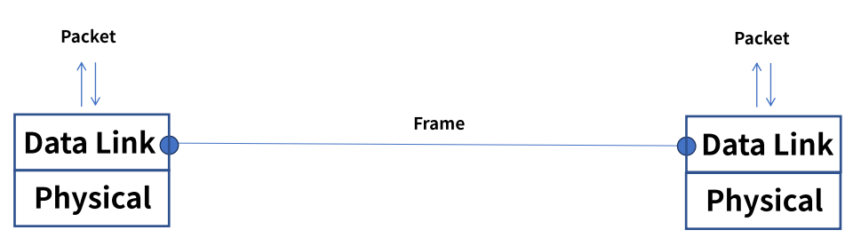

- ### 2개의 부 계층으로 구성

  - MAC(Media Access Control)

    물리적인 부분으로 매체간의 연결방식을 제어하고 1계층과 연결한다.

  - LLC(Logical Link Control)

    논리적인 부분으로 Frame을 만들고 3계층과 연결한다.

  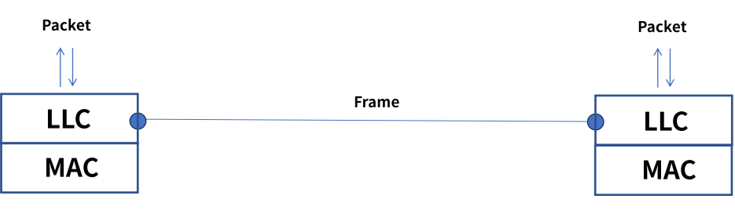

- ### MAC 주소

  명령어 cmd -> ipconfig/all 또는 네트워크 설정에서 확인한다.

  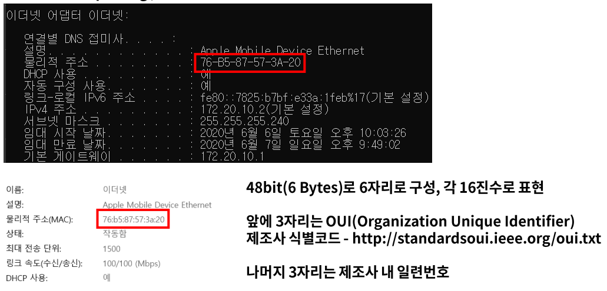

  - 제조사 식별코드 : 밴더들이 가지고 있는 번호이다. 어떤 회사의 제품인지 파악이 가능하다.

## 주요 기능

- ### Framing

  - 데이터그램을 캡슐화하여 프레임 단위로 만들고 헤더와 트레일러를 추가한다.
  - 헤더는 목적지, 출발지 주소 그리고 데이터 내용을 정의한다.
  - 트레일러는 비트 에러를 감지한다.

  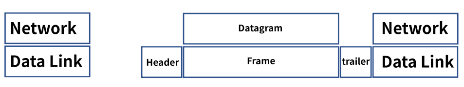

- ### 회선 제어

  - 신호간의 충돌이 발생하지 않도록 제어한다.

  - #### ENQ/ACK 방법

    - 전용 전송링크 1:1

    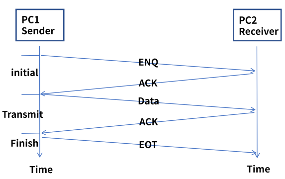

  

  - #### Polling 방법

    - 1:다
    - Select 모드 : 송신ㅇ자가 나머지 수신자들을 선택하여 전송한다.
    - Poll 모드 : 수신자에게 데이터 수신 여부를 확인하여 응답을 확인하고 전송한다. -multipoint

    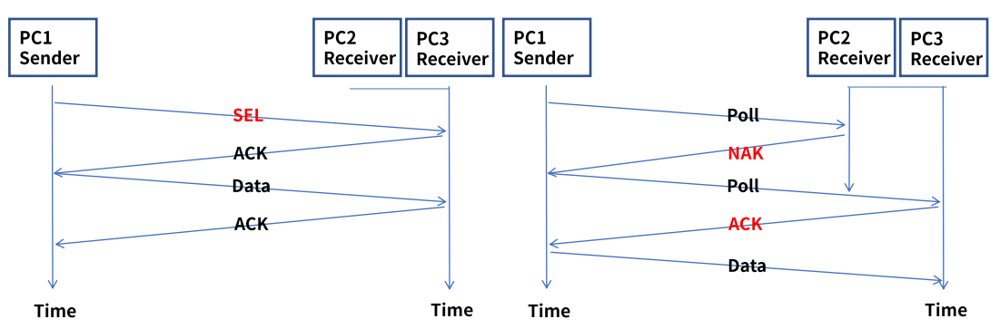

- ### 흐름 제어

  - 송신자와 수신자의 데이터를 처리하는 **속도 차이를 해결**하기 위한 제어이다.

  - Feedback 방식의 Flow Control이며 상위 계층은 Rate 기반이다.

  - ### Stop & Wait

    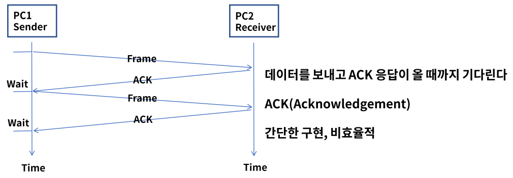

  - Frame을 재전송하게 되면 Duplicate  frame 문제가 발생될 수 있다.

  - Sequence number(1bit)를 사용하여 동일 frame인지 구분하여 상위 계층으로 전달한다.

    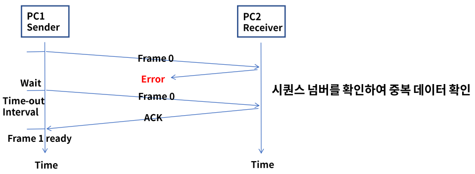

  - Sliding window

    ACK 응답 업싱 여러 개의 프레임이 연속으로 전송 가능하다.

    Window size는 전송과 수신측의 데이터가 저장되는 버퍼의 크기이다.

    

- ### 오류 제어

  - 전송 중에 오류나 손실 발생 시 수신측은 에러를 탐지 및 재전송한다.

  - ARQ(Automatic Repeat Request) : 프레임 손상시 재전송이 수행되는 과정이다.

  - ### Stop & Wait ARQ

    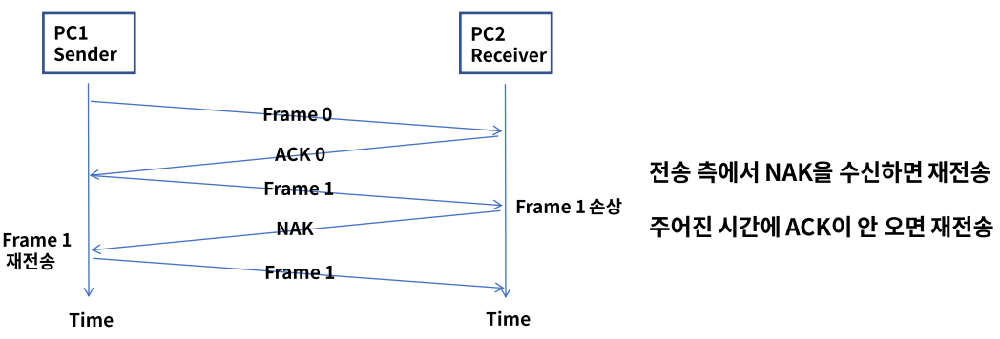

  - ### Go back n ARQ

    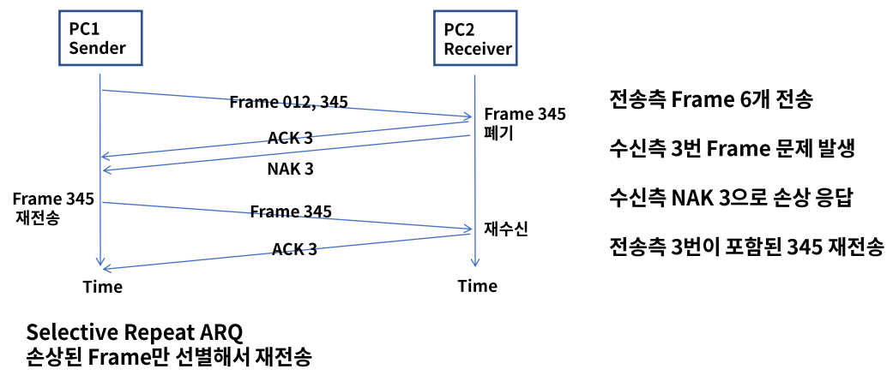

## 이더넷 프레임 구조

- ### Ethernet v2

  - 데이터 링크 계층에서 MAC(Media Access Control) 통신과 프로토콜의 형식을 정의한다.

  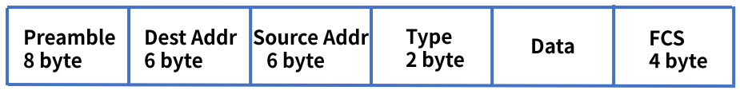

  - Preamble : 이더넷 프레임의 시작과 동기화
  - Dest Addr : 목적지 MAC주소, Src Addr : 출발지 MAC 주소
  - Type : 캡슐화되어 있는 패킷의 프로토콜 정의
  - Data : 상위 계층의 데이터로 46 ~ 1500 바이트의 크기, 46바이트보다 작은 면 뒤에 패딩이 붙는다.
  - FCS(Frame Check Sequence) : 에러 체크

## 정리

- 데이터 링크 계층은 인접한 네트워크 노드끼리 데이터를 전송하는 기능과 절차를 제공한다.
- 2개의 부계층 MAC, LLC로 구성
- 주요 기능으로 Framing, 회선 제어, 흐름 제어, 오류 제어 등이 있다.

