# 10. 스위치와 ARP

## 스위치

- ### 정의

  - 2계층의 대표적인 장비로 MAC주소 기반으로 통신한다.

  - 허브의 단점을 보완한다.

    Half Duplex -> Full Duplex

    1 Collision Domain -> 포트별 Collision Domain

  - 라우팅 기능이 있는 스위치를 L3 스위치라고도 부른다.

- ### 동작 방식

  목적지 주소를 MAC 주소 테이블에서 확인하여 연결된 포트로 프레임을 전달한다.

  1. Learning

     출발지 주소가 MAC 주소 테이블에 없으면 해당 주소를 저장한다.

  2. Flooding - Broadcasting

     목적지 주소가 MAC 주소 테이블에 없으면 전체 포트로 전달한다.

  3. Forwarding

     목적지 주소가 MAC 주소 테이블에 있으면 해당 포트로 전달한다.

  4. Filtering - Collision Domain

     출발지와 목적지가 같은 네트워크 영역이면 다른 네트워크로 전달하지 않는다.

  5. Aging

     MAC 주소 테이블의 각 주소는 일정 시간 이후에 삭제한다.

- ### Learning

  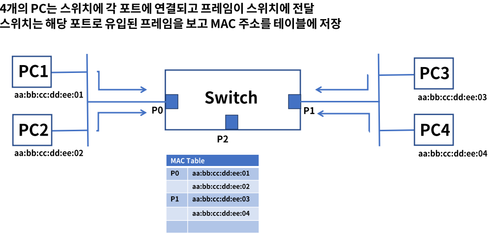

- ### Flooding

  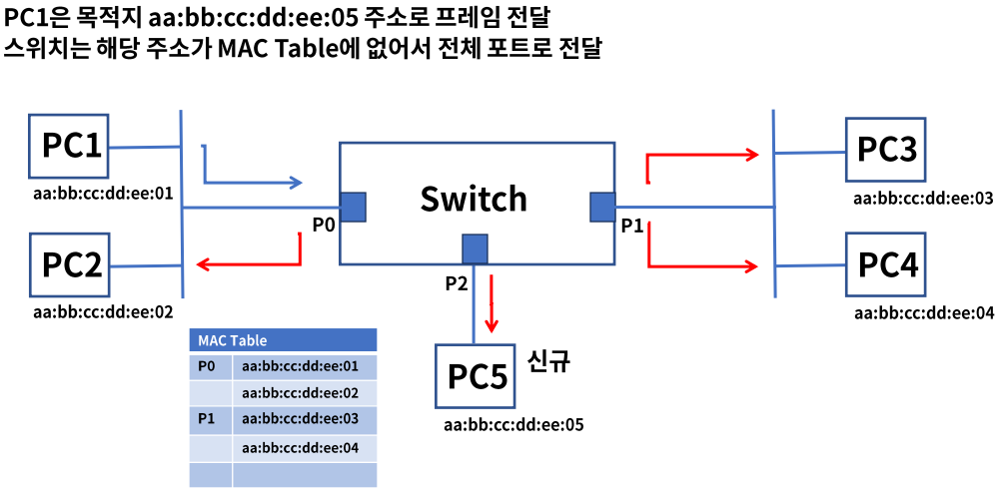

- ### Forwarding

  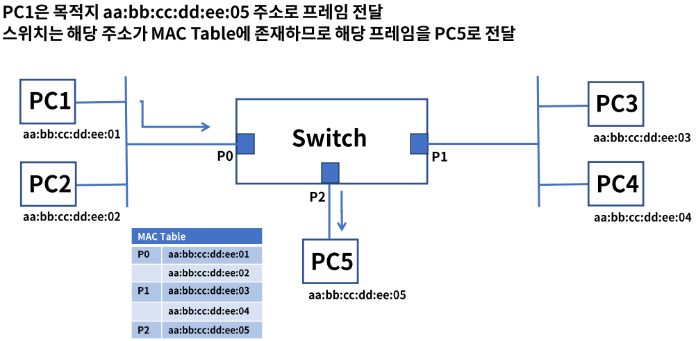

- ### Filtering

  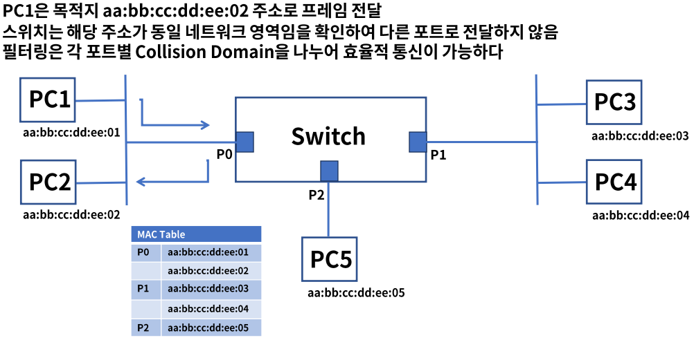

- ### Aging

  - 스위치의 MAC 주소 테이블은 시간이 지나면 삭제
  - 삭제되는 이유는 테이블 저장 공간을 효율적으로 사용
  - 해당 포트에 연결된 PC가 다른 포트로 옮겨진 경우도 발생
  - 기본 300초(Cisco 기준) 저장, 다시 프레임이 발생되면 다시 카운트

  

- ### 정리

  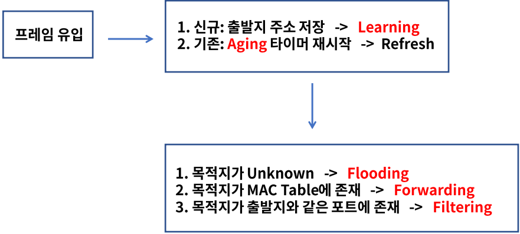

## ARP

- ### 역할

  - ARP(Address Resolution Protocol)

    IP주소를 통해서 MAC주소를 알려주는 프로토콜이다.

  - 컴퓨터 A가 컴퓨터 B에게 IP통신을 시도하고 통신을 수행하기 위해 목적지 MAC주소를 알아야 한다.

  - 목적지 IP에 해당되는 MAC주소를 알려주는 역할을 ARP가 해준다.

  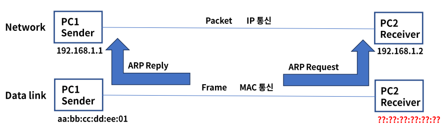

- ### 동작 과정

  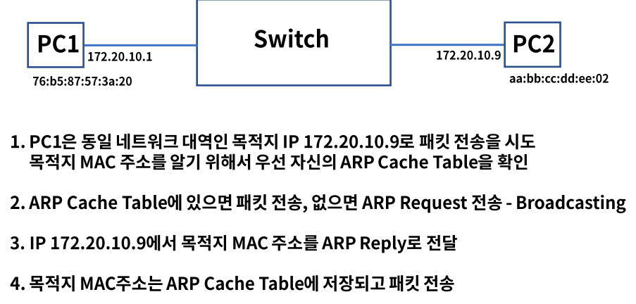

  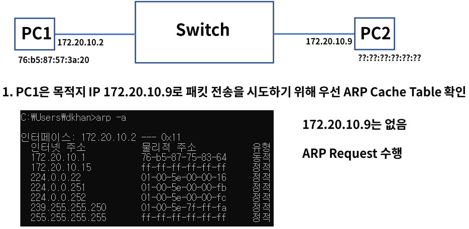

  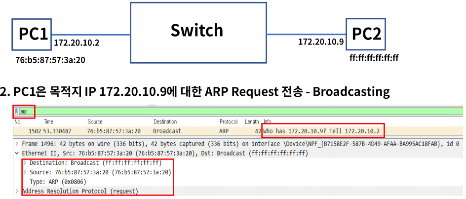

  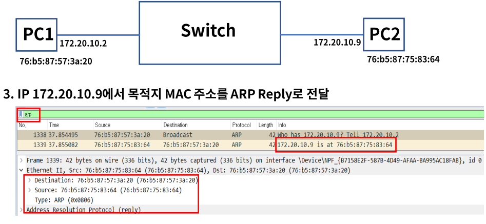

  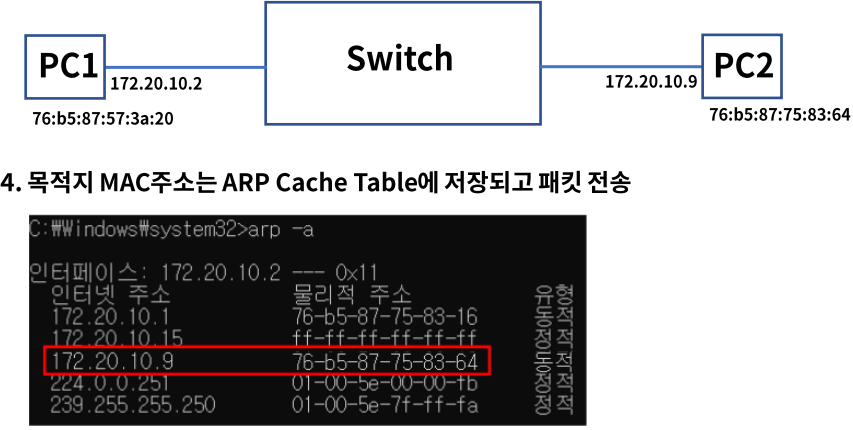

- ### ARP 헤더 구조

  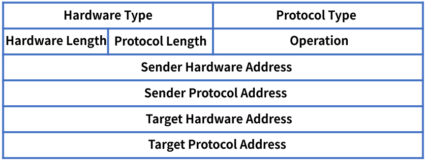

  - Hardware Type : ARP가 동작하는 네트워크 환경, 이더넷

  - Protocol Type : 프로토콜 종류, 대부분 IPv4

  - Hardware & Protocol Length : MAC 주소 6Byte, IP주소 4Byte

  - Operation : 명령코드, 1 = ARP Request, 2 = ARP Reply

    Hardware Address = MAC, Protocol Address = IP

- ### ARP 헤더 구조 - pcap

  

## 정리

- L2 스위치는 2계층의 대표적인 장비로 MAC주소 기반 통신

- 스위치의 동작방식은 아래 단계가 있다.

  Learning - Flooding - Forwarding - Filtering - Aging

- ARP는 IP주소를 통해서 MAC주소를 알려주는 프로토콜이다.

  