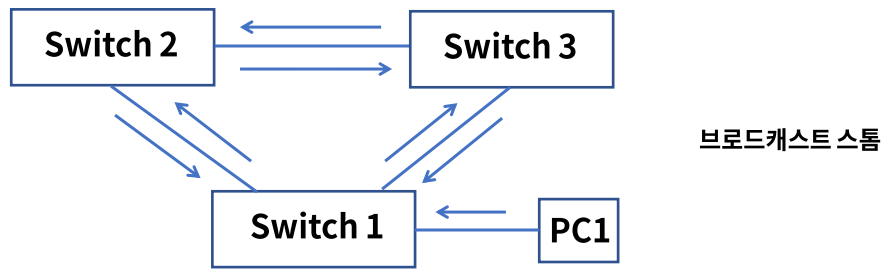
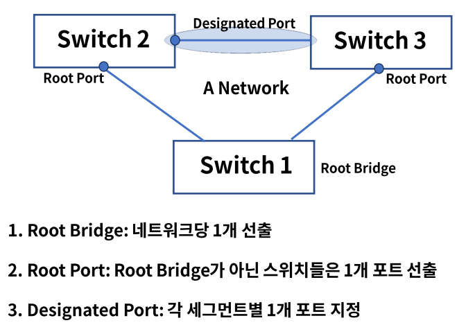
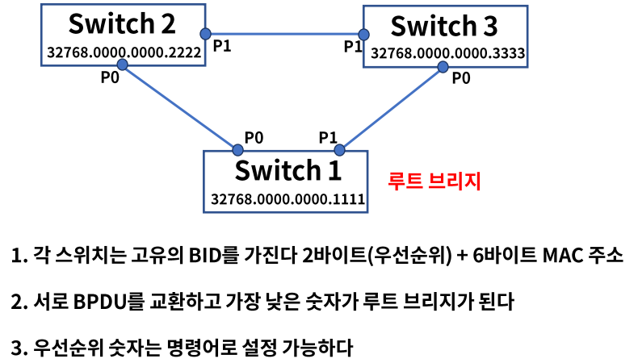
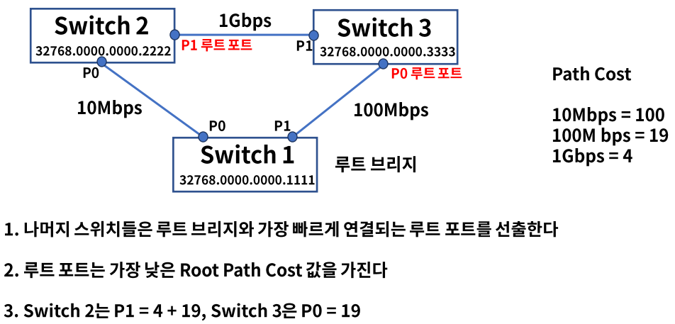
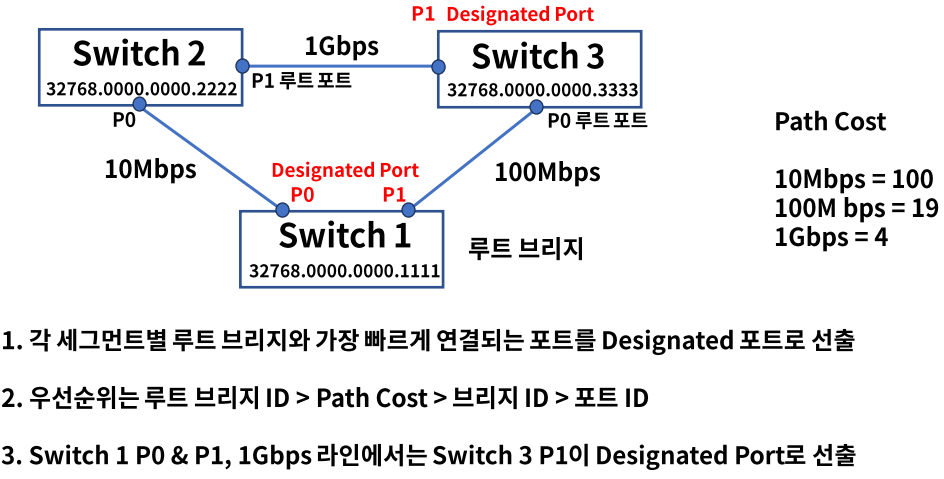
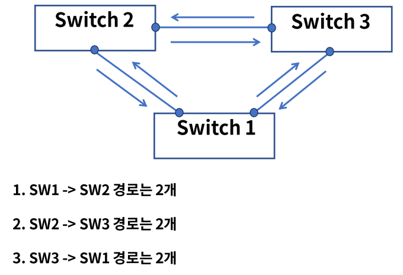
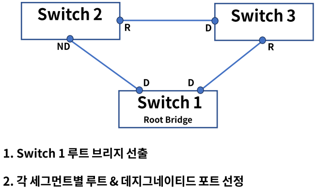
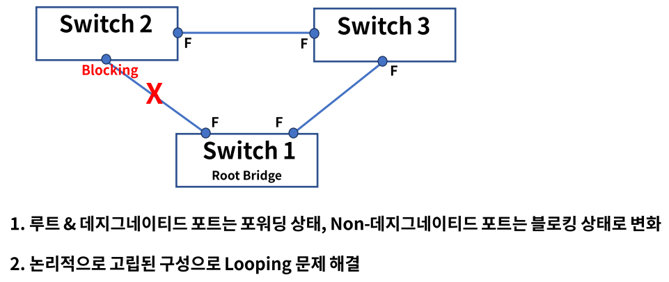

# 11. 스패닝트리 프로토콜과 루핑

## Looping

- ### 정의

  같은 네트워크 대역대에서 스위치에 연결된 경로가 2개 이상인 경우에 발생한다.

  PC가 브로드캐스팅 패킷을 스위치들에게 전달하고 전달 받은 스위치들은 Flooding을 한다.

  스위치들끼리 Flooding된 프레임이 서로 계속 전달되어 네트워크에 문제를 일으킨다.

  회선 및 스위치 이중화 또는 증축 등에 의해 발생한다.

  물리적인 포트 연결의 실수 또는 잘못된 이중화 구성으로 L2에서 가장 빈번히 발생하는 이슈이다.

- ### 구조

  

  1. PC1은 Switch 1에게 브로드캐스팅 전송
  2. Switch 1은 모든 포트에 브로드캐스팅 전송
  3. 전달받은 브로드캐스팅 프레임을 Switch 2, 3도 모든 포트에 전송
  4. Switch 1은 Switch 2, 3에게 다시 전달 받은 브로드캐스팅을 다시 모든 포트에 전송

## STP

- ### STP(Spanning Tree Protocol) : 스패닝 트리 프로토콜

  자동으로 루핑을 막아주는 알고리즘 -> 스패닝 트리 알고리즘

  스패닝 트리 알고리즘에 사용되는 프로토콜 -> STP

  IEEE 802.1d

  STP는 2가지 개념을 가지고 있다.

  1. Bridge ID

     스위치의 우선순위로 0 ~ 65535로 설정, 낮을수록 우선순위가 높다.

  2. Path Cost

     링크의 속도(대역폭), 1000/링크 속도로 계산되며 작을수록 우선순위가 높다.

     1Gbps 속도가 나오면서 계산법이 적합하지 않아 IEEE에서 각 대역폭 별 숫자를 정의한다.

     10Mbps = 100, 100M bps = 19, 1Gbps = 4

- ### STP(Spanning Tree Protocol)의 요소

  

- ### BPDU(Bridge Protocol Data Unit)

  스패닝 트리 프로토콜에 의해 스위치간 서로 주고받는 제어 프레임

  1. Configuration BPDU : 구성관련

     Root BID - 루트 브리지로 선출된 스위치 정보

     Path Cost - 루트 브리지까지의 경로 비용

     Bridge ID, Port ID - 나머지 스위치와 포트의 우선순위

  2. TCN(Topology Change Notification) BPDU

     네트워크 내 구성 변경시 통보

  우선순위 - 낮은 숫자가 더 높은 우선순위를 가진다.

  - 조건
    - 누가 더 작은 Root BID?
    - 루트 브리지까지 더 낮은 Path Cost?
    - 연결된 스위치 중 누가 더 낮은 BID?
    - 연결된 포트 중 누가 더 낮은 Port ID?

- ### Root Bridge 선출

  

  32678은 일반적인 스위치의 디폴트 값이다.

- ### Root Port 선출

  

- ### Designated Port 선출

  

- ### 상태 변화

  스위치의 포트는 스패닝 트리 프로토콜 안에서 5가지 상태로 표현된다.

  1. Disabled

     포트가 Shut Down인 상태로 데이터 전송 불가, MAC 학습 불가,  BPDU 송수신 불가

  2. Blocking

     부팅하거나 Disabled 상태를 Up했을 때 첫 번째 거치는 단계, BPDU만 송수신

  3. Listening - 15초

     Blocking 포트가 루트 또는 데지그네이티드 포트로 선정되는 단계, BPDU만 송수신

  4. Learning - 15초

     리스닝 상태에서 특정 시간이 흐른 후 러닝 상태가 된다, MAC 학습 시작, BPDU만 송수신

  5. Forwarding

     러닝 상태에서 특정시간이 흐른 후 포워딩 상태가 된다, 데이터 전송 시작, BPDU만 송수신

  - ### 예제 - Looping 상태

    

  - ### 예제 - BPDU 교환

    

  - ### 예제 - 상태 변화

    

## RSTP & MST

- ### RSTP(Rapid Spanning Tree Protocol)

  - IEEE 802.1w
  - STP를 적용하면 포워딩 상태까지 30 ~ 50초 걸린다, 이 컨버전스 타임을 1~2초 내외로 단축한다.
  - Learning & Listening  단계가 없다.

- ### MST(Multipe Spanning Tree)

  - IEEE 802.1s
  - 네트워크 그룹이 많아지면 STP or RSTP BPDU 프레임이 많아지고 스위치 부하 발생
  - 여러 개의 STP 그룹들을 묶어서 효율적으로 관리한다.

## 정리

- Looping은 같은 네트워크 대역 대에서 스위치에 연결된 경로가 2개 이상인 경우에 발생한다.

- STP(Spanning Tree Protocol)는 루핑 방지를 자동으로 하기 위한 프로토콜이다.

- 구성 요소로는 Root Bridge, Root Port, Designated Port, Path Cost가 있다.

- 상태 변화는 아래와 같다.

  Disabled - Blocking - Listening - Learning - Forwarding

- 그 외 컨버전스 타임을 개선한 RSTP, 부하를 줄이고 효율적 관리를 위한 MST가 있다.