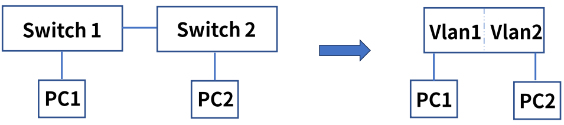
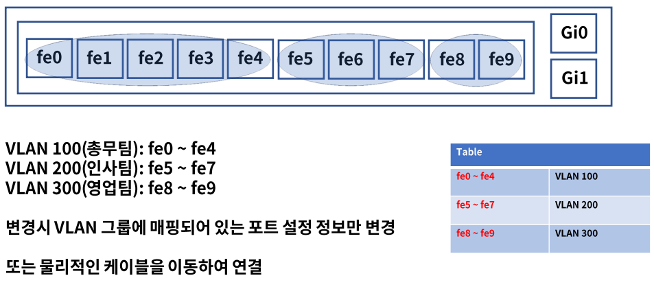
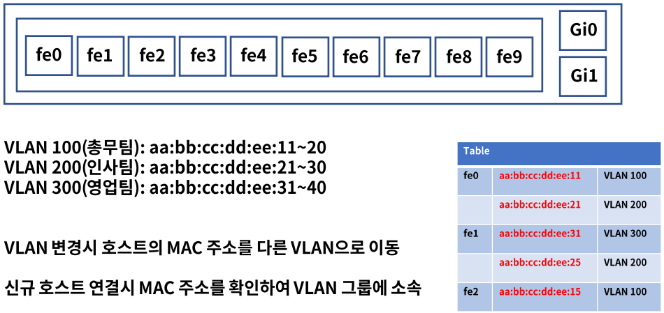
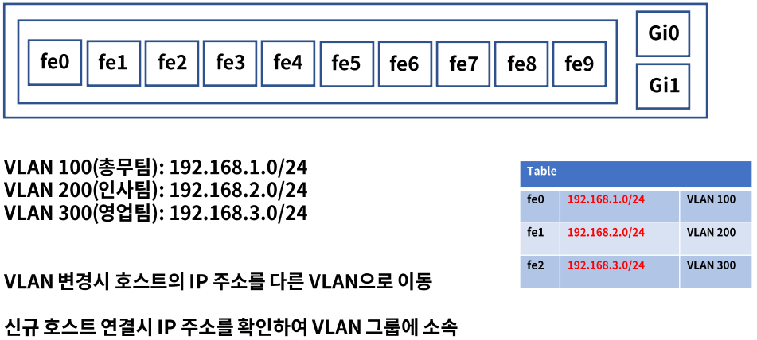
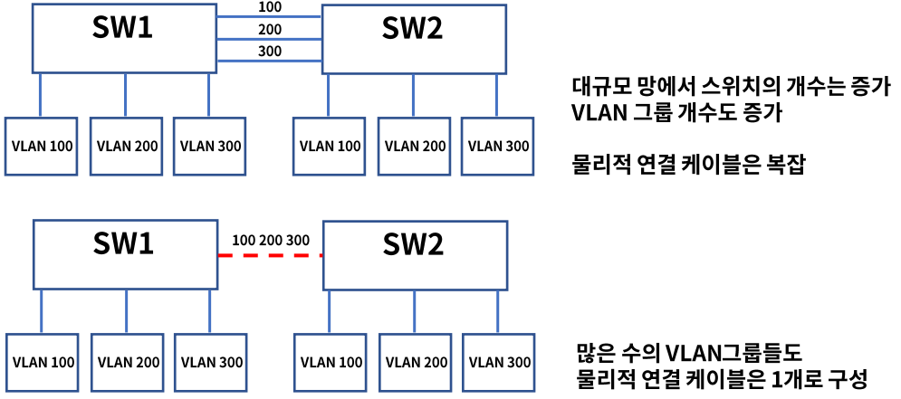
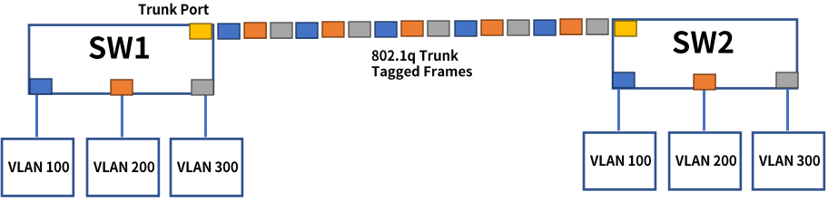
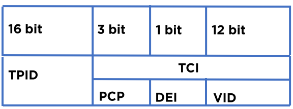

# 12. VLAN

## VLAN(Virtual Local Area Network)

- 물리적 구성이 아닌 논리적인 가상의 LAN을 구성하는 기술이다.
- 불필요한 데이터 차단 : 브로드캐스트 도메인 별로 나누어 관리한다.
- 관리의 용이성과 보안 : 호스트의 물리적 이동 없이 LAN 그룹 변경이 가능하다.
- 비용 절감 : 새로운 LAN 추가시 물리적 스위치 구매가 필요 없다.

- ### 종류

  1. Port 기반 LAN

     여러 개의 VLAN을 설정하고 각각의 LAN에 물리적인 포트를 지정한다.

     VLAN 변경이 필요한 호스트는 물리적인 포트 또는 스위치의 VLAN 설정을 변경한다.

  2. MAC주소 기반 VLAN

     각 호스트 또는 네트워크 장비의 MAC 주소를 각각의 VLAN에 정의한다.

     호스트가 이동되어도 VLAN 변경 필요 없다. 신규 호스트 연결시 설정 변경이 필요하다.

  3. IP주소 기반 VLAN

     IP주소 서브넷 기반으로 VLAN을 나누는 방법

     IP(Internet Protocol) : 3계층에서 사용하는 프로토콜, IP주소 예) 192.168.10.1

     서브넷 : IP 주소의 네트워크 영역의 크기를 나눈 것이다.

- ### Port 기반 VLAN

  

- ### MAC 주소 기반 VLAN

  

  

- ### IP 주소 기반 VLAN

  

## Trunk

- ### 정의

  물리적 스위치간 VLAN 연결시 하나의 물리적 연결로 VLAN 그룹들을 공유한다.

  

- ### 트렁크 프로토콜

  - 이더넷 프레임에 식별용 VLAN ID를 삽입하여 데이터를 구분하여 통신 및 제어가 가능하다.
  - IEEE 802.1q
  - VLAN Tagging : VLAN ID 정보

  

- ### 802.1q tagged format

  이더넷 프레임에 삽입되며 4바이트로 구성되어 있다.

  

  - TPID(Tag Protocol IDentifier) : 태그되지 않은 프레임과 태깅된 프레임을 구별한다.
  - TCI(Tag Control Information) : 태그 제어 정보

  1. PCP(Priority Code Point) : 프레임 우선 순위
  2. DEI(Drop Eligible Indicator) : 트래픽 혼잡시 제거되기 적합한 프레임들을 가리키는 용도이다.
  3. VID(VLAN Identifier) : VLAN이 어느 프레임에 속하는지를 결정한다.

## VLAN 구성

- ### VLAN 설계

  1. VLAN 그룹 정의

  2. VLAN 구성방법 정의

     포트, MAC주소, IP주소

     MAC 또는 IP주소 방식의 경우 미리 사전 조사가 필요하다.

  3. 트렁크 포트 정의

     대역폭 확인

     허가(Tagged)할 프레임 정의, 정의되지 않은 Tag는 통신이 불가하다.

- ### VLAN 설정

  1. VLAN 그룹 설정

     #vlan 100

     #vlan 200

     #vlan 300

  2. 엑세스 모드 : 사용할 포트에 1개의 VLAN ID 설정

     #interface GigabitEthernet1/0/1

     #switchport mode access

     #switchport access vlan 100

  3. 트렁크 모드 : 사용할 포트에 여러 개의 VLAN ID 설정

     #interface GigabitEthernet1/0/2

     #switchport mode trunk

     #switchport trunk allowed vlan 100, 200, 300

  4. 다이나믹 모드 : 연결된 포트들의 상태에 따라서 엑세스 또는 트렁크로 변경되는 모드

     #interface GigabitEthernet1/0/3

     #switchport mode dynamic desirable 또는 auto

  > 스위치 설정 방법은 각 제조사별 상이하며 홈페이지에서 매뉴얼 다운로드가 가능하다.

## 정리

- VLAN(Virtual LAN)은 물리적 구성이 아닌 논리적인 가상의 LAN을 구성하는 기술이다.
- VLAN 구성 방법은 Port, MAC주소, IP주소 기반이 있다.
- 트렁크는 스위치간 VLAN 연결 시 하나의 물리적 연결로 VLAN 그룹들을 공유하는 기술이다.
- VLAN 모드에는 엑세스, 트렁크, 다이나믹 모드가 있다.

