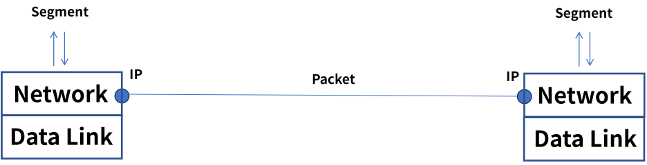
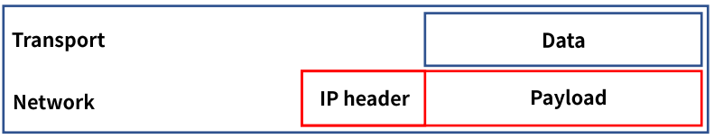
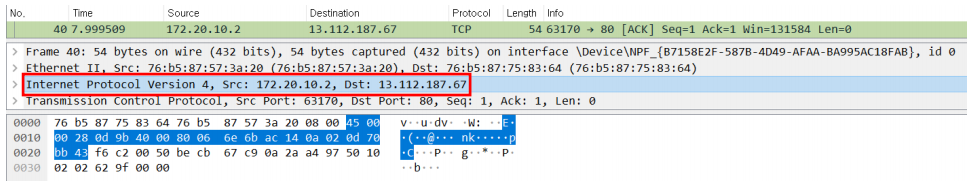
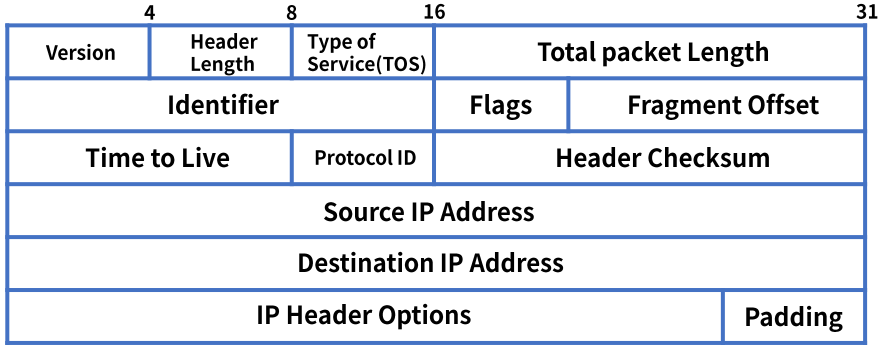
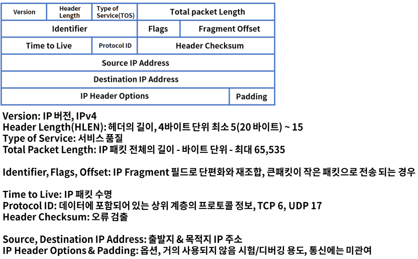
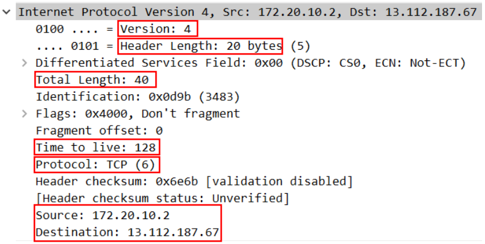
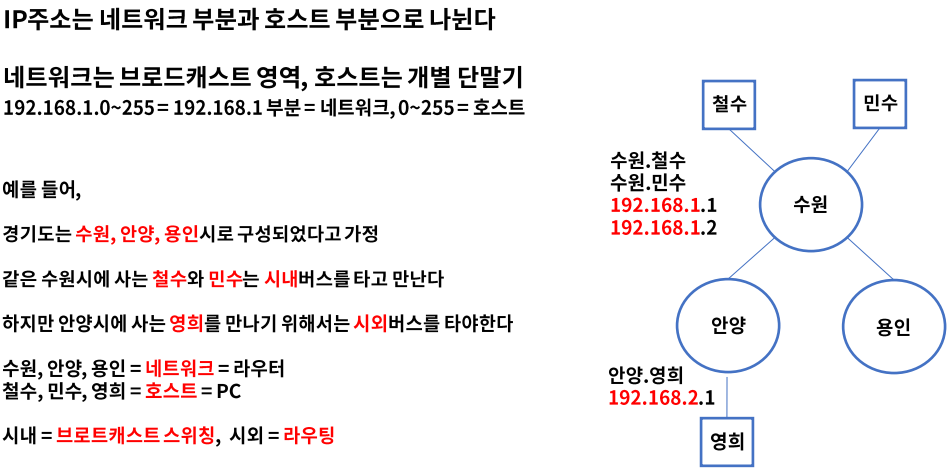
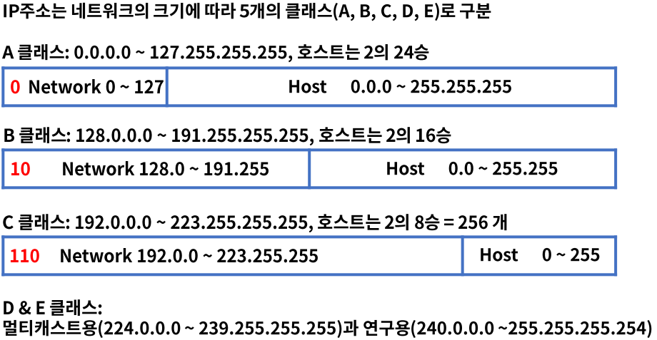

# 13. 네트워크 계층의 역할과 IP 구조

## 네트워크 계층

- ### 역할

  - OSI 7 Layer의 3계층으로 패킷 포워딩과 네트워크간 라우터를 통한 라우팅을 수행한다.
  - IP(Internet Protocol) 주소를 사용하여 통신, 계층적 구조이다.
  - 대표적인 장비는 라우터, 또는 L3라고 부른다.

  

## IP 정의와 구조

- ### IP(Internet Protocol)

  - 네트워크 계층에서 통신하는 주요 프로토콜로 라우팅을 구현하고 본질적인 인터넷을 구축하는 계기가 되었다.
  - 1974년 IEEE 논문 발표 "A Protocol for Packet Network Intercommunication"
  - 전송 제어 프로그램의 비연결 데이터그램 서비스로 시작 -> 연결 지향 서비스로 보완
  - RFC 760 -> RFC 791 IP, Connectionless
  - RFC 761 -> RFC 793 TCP, Connection-Oriented Service
  - TCP/IP 모델의 기원

  > 현재 사용중인 버전은 IPv4이며 후속 버전으로 IPv6 릴리즈

- ### IP 구조

  IP는 헤더와 페이로드로 구성되어 있다.

  

  헤더는 목적지 & 출발지 IP 주소 등을 포함, 페이로드는 전송되는 데이터를 의미한다.

  

- ### IPv4 헤더 구조

  최소 20바이트(옵션 미 지정시)

  

  

- ### IPv4 헤더 구조 상세

  

- ### IPv4 헤더 구조 - PCAP

  

- ### IP 주소 구성

  IP주소는 2진수 32비트로 구성

  - 예) 10101010.01101001.01010101.1001001

    총 2의 32승 = 4,294,967,296 = 24억 9천여개

  - 최초 IP주소 설계 시 충분한 수량이였으나 현재는 거의 고갈된 상태이다.

  - 2진수는 어렵기 때문에 일반적으로 10진수로 표현한다.

    예) 168.126.63.1

    2의 8승은 256 = 10진수 한 옥텟은 최대 0 ~ 255까지 가능하다.

## IP 주소 클래스

- ### 2진수 -> 10진수 표현

  2진수는 0 & 1, 2개로 구분한다.

  10진수는 0 ~ 9까지 총 10개로 표현한다.

  2의 0승 = 1 = 00000001, 2의 1승 = 2 = 00000010, 2의 2승 = 4 = 00000100

- ### 네트워크와 호스트

  

- ### IP 주소 클래스

  

## 정리

- 네트워크 계층은 패킷 포워딩과 네트워크간 라우팅을 수행한다.
- 주요 프로토콜로 IP(Internet Protocol)가 있으며 1974년 IPv4 공개한다.
- IPv4의 주소는 32비트로 구성되며 2의 32승으로 약 42억 9천여개이다.
- IP는 네트워크와 호스트로 나뉘며 크기와 용도에 따라 5개의 클래스로 구분한다.