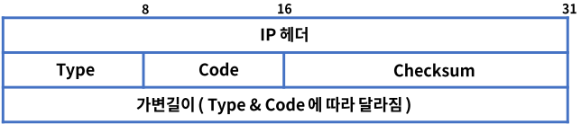
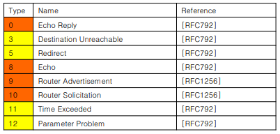
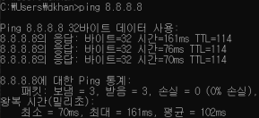
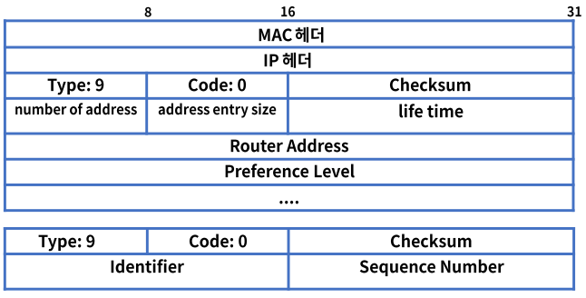
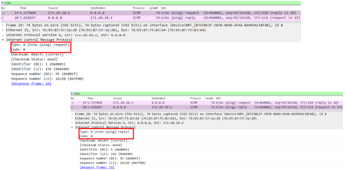
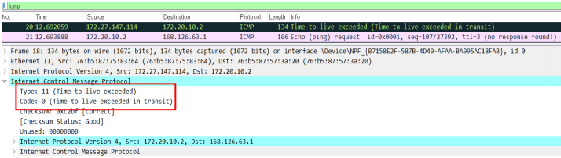

# 15. ICMP

## ICMP의 정의

- ### ICMP(Internet Control Message Protocol)

  인터넷 제어 메시지 프로토콜

  - IP 통신은 목적지에 패킷을 정상적으로 전달하는 방법은 있지만 에러 발생시 처리가 불가하다.
  - ICMP는 IP 통신의 에러 상황을 출발지에 전달 & 메시지 제어 역할을 한다.
  - RFC 792, 1981년 소개되었다.
  - ICMP는 IPv4 패킷으로 캡슐화
  - Protocol ID = 1
  - Ping & Traceroute 명령어를 사용한다.

## ICMP의 기능

- ### ICMP 포맷 구조

  IP 패킷에 포함한다.

  

  Type : ICMP 메시지 종류

  Code : 메시지 Type 별 세부 코드 정보

  Checksum : ICMP 헤더 손상 여부 확인

- ### ICMP Type

  - 0 ~ 254 까지 정의한다.

  - 주로 쓰이는 타입은 아래와 같으며 오류 보고 & 정보성으로 나눈다.

  - 정보용 : 8, 0, 9, 10          오류 보고용 : 3, 5, 11, 12

    

- ### Type 8 & 0 Echo Request & Reply

  - 네트워크 문제 진단시 사용한다.

  - 출발지에서 목적지  IP로 ICMP Echo Request 메시지를 보내면 목적지는 Echo Reply로 응답한다.

  - 목적지 도달 여부, RTT(Round-Trip delay Time), hop count 확인

    

  - TTL값에 따라서 일반적인 OS 종류를 알 수 있다.

    - Windows 계열 128, Linux 계열 64

- ### Type 9 & 10 라우터 광고 & 정보 요청

  - 자신이 라우터임을 응답 & 네트워크 진입시 라우터 정보 요청

    

- ### Type 3 Destination Unreachable & 5 Redirect

  - 라우터가 IP 패킷을 라우팅 하지 못하는 경우에 발생한다.
  - 0 = net unreachable
  - 1 = host unreachable
  - 2 = protocol unreachable
  - 3 = port unreachable
  - 4 = fragmentation needed and DF set
  - 5 = source route failed

  > Type 5 Redirect : 로컬 네트워크에 2개 이상의 경로가 있을 때 더 좋은 경로를 알려준다.

- ### Type 11 Time Exceeded & 12 Parameter Problem

  - 시간 초과, TTL 값이 "0"이 되면 출발지에게 응답
  - 0 = Time to Live Exceeded
  - 1 = Fragment Reassembly Time Exceeded
  - IP Fragmentation : IP 패킷을 작은 패킷으로 나누어서 전송하고 목적지에서 재조합한다.
  - MTU(Maximum Transmission Unit) : IP 패킷을 전송할 수 있는 최대 크기이다.
  - Type 12 Parameter Problem : IP 옵션을 잘못 사용하여 라우터에 패킷 폐기한다.

- ### Ping Type 8 echo Request & Type 0 echo reply

  

- ### Traceroute

  - Type 11 Time Exceeded

    

## 정리

- ICMP(Internet Control Message Protocol)
- IP 통신의 에러 상황을 출발지에 전달 또는 메시지 제어 역할
- 주 타입은 정보용(8,0,9,10)과 오류 보고용(3,5,11,12)으로 구분한다.
- Ping & Traceroute 명령어를 통해서 사용된다.
