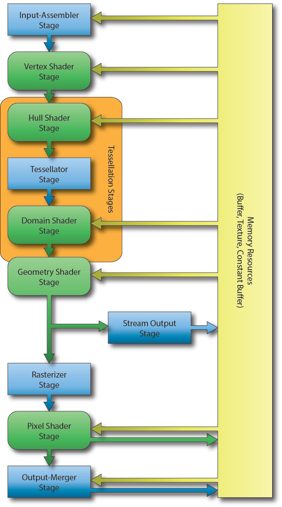

# DirectX 11 Rendering Pipeline

## 정의

3D 세계에 대한 기하학적 표현과 이 세계를 바라보는 관점을 정의하는 가상 카메라를 이용해 2D 이미지를 만들어내는 과정이다.

* 청색 단계는 **Fixed Function(고정 기능 단계)로 미리 정해진 특정한 연산들만 수행이 가능**하고, 실행 시점에서 기능을 바꿀 수 없지만, 상태 객체라는 개념을 이용하여 설정들의 변경이 가능하며, 임의로 실행을 하지 않을 수 없다.

* 녹색 단계는 **Programmable(프로그래밍 가능 단계)로 HLSL(High Level Shading Language, 고수준 셰이딩 언어)로 셰이더 프로그래밍이 가능**한 단계이다.

## 입력 조립기(Input Assembler)

* 렌더링 파이프라인의 첫번째 단계로, **사용자 정의 정점 및 인덱스 버퍼에서 기본 데이터를 읽어서 기하학적 기본요소(line lists, triangle strips 등)로 조립하는 것**이다. 

* 조립한 정보를 다음 단계인 정점 셰이더로 넘겨주는 역할을 한다.

## 정점 셰이더(Vertex Shader)

* **입력 조립기 단계에서 입력 받은 자료의 정점들을 한 번에 하나 씩 처리하여 출력**한다.  화면에 그려질 모든 정점은 정점 셰이더를 거친다. 

* 정점에 대한 변환, 조명, 변위 매핑 등 수많은 특수효과를 정점 셰이더에서 수행할 수 있다. 

* 또한 텍스처, 변환 행렬, 장면 광원 정보 등 GPU 메모리에 담긴 다른 자료에도 접근할 수 있다.

## 테셀레이션(Tessellation Stages)

* **한 메시의 삼각형들을 잘게 쪼개서 새로운 삼각형들을 만드는 과정**이다. 

* 만들어진 새 삼각형들을 새로운 위치로 이동함으로써 좀 더 세밀한 메시를 만들 수 있다. 

* 테셀레이션에는 세 단계(Hull Shader, Tessellator, Domain Shader)를 함께 사용하거나 사용하지 않아야 한다.

## 덮개 셰이더(Hull Shader)

* 정점 셰이더에서 입력 받은 기본 도형들을 받아 두 가지 작업을 수행한다. 

* 첫 번째 작업은 **각 기본 도형을 효율적으로 많은 삼각형으로 나눠 테셀레이션 계수들을 결정**한다. 이 계수들은 이후 과정에서 해당 기본 도형을 얼마나 세밀하게 분할해야 하는지 파악하는데 쓰인다. 

* 두 번째 작업은  바람직한 출력 제어 패치 구성의 각 제어점마다 실행되는 것으로, 여기서 덮개 셰이더는 이후 **영역 셰이더(Domain Shader)에서 기본도형을 실제로 분할하는 데 사용할 제어 점들을 만든다.**

## 테셀레이터(Tessellator Stage)

* **기본 도형 종류에 적합한 표본 추출 패턴(Sampling Pattern)을 결정**한다. 

* 테셀레이터 단계는 테셀레이션 계수들과 자신만의 구성을 이용해서 현재 기본 도형의 정점들 중 기본 도형을 더 작은 조각으로 분할하기 위한 표본으로 사용할 정점들을 결정한다. 

* 그 정점들로부터 산출한 일단의 무게 중심 좌표들을 다음 단계인 영역 셰이더(Domain Shader)에게 넘긴다.

## 영역 셰이더(Domain Shader)

* **무게 중심 좌표(Barycentric Coordinates)들과 덮개 셰이더가 생성한 제어점들을 입력으로 받아서 새 정점들을 생성**한다. 이 단계에서 현재 기본 도형에 대해 생성된 제어점들 전체와 텍스쳐, 절차적 알고리즘 등을 이용해서, 테셀레이션 된 각 점마다 무게중심 '위치'들을 출력 기하구조(geometry)로 변환해서 다음 단계로 넘겨준다. 

* 테셀레이션 단계에서 증폭된 정점 자료들로부터 출력 기하구조를 생성하는 부분의 유연성 덕분에 파이프라인 안에서 좀 더 다양한 테셀레이션 알고리즘을 구현할 수 있다.

## 기하 셰이더(Geometry Shader)

* **하나의 온전한 기본 도형을 입력 받아서 임의로 변형**한다. 정점 셰이더의 처리를 거친 정점을 가지고 기하구조를 생성하거나 파괴할 수 있다.(입력 기본 도형을 다른 여러 기본 도형들로 확장, 특정 조건에 따라 입력된 기본도형을 출력하지 않고 폐기 등)

* 기하 셰이더의 출력 정점 자료를 스트림 출력 단계(Stream Output Stage)를 통해 메모리의 버퍼에 저장해 두고 나중에 활용하는 것이 가능하다.

## 스트림 출력 단계(Stream Output Stage)

* **GPU 메모리에 기본 데이터를 다시 공급하기 위해 사용될 수 있는 임의의 고정 기능 단계**이다. 렌더링 파이프 라인으로 다시 순환되어 다른 셰이더 세트에서 처리 될 수 있다. 

## 래스터화기 단계(Rasterizer Stage)

* **주어진 기하 구조가 렌더 대상의 어떤 픽셀들을 덮는지 파악해서 그 픽셀들에 대한 단편 자료를 산출**한다. 

* 각 단편은 모든 정점별(per-vertex) 특성을 해당 픽셀 위치에 맞게 보간한 값들을 가진다. 

* 기본 요소를 2D 뷰포트로 매핑한다.

* 이렇게 생성된 단편은 픽셀 셰이더로 넘어간다.

## 픽셀 셰이더(Pixel Shader)

* **픽셀 단편(Pixel Fragment)마다 실행되며 보간된 정점 특성들을 입력받아서 하나의 색상을 출력**한다. 

* 고정된 상수 색상을 돌려주는 아주 간단한 형태부터 픽셀별 조명이나 반사, 그림자 효과를 수행하는 등의 좀 더 복잡한 형태까지 가능하다.

## 출력 병합기(Output Merger)

* **픽셀 셰이더 출력을 파이프라인에 연결된 깊이/스텐실 자원 및 렌더 대상 자원에 제대로 합치는 작업**을 한다. 

* 출력 병합기는 깊이 판정과 스텐실 판정, 혼합 함수 적용 등을 수행하며, 최종적으로는 출력을 해당 자원에 실제로 기록한다.