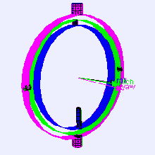
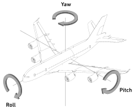

* # 짐벌락 현상 (Gimbal Lock)

* 짐벌(Gimbal)
  * 
  * 물체가 회전하도록 중심축을 가진 구조물이다.
  * 3차원 공간에서는 오일러 각도를 사용하여 **세 번의  회전**을 통해 얻는다.
  
* 오일러 각(Euler Angle)
  
  * 3차원 공간에서 각 **x, y, z 축의 회전량을 정해진 순서 대로 적용**했을 때 물체의 모든 방향을 표현할 수 있는 방법이다.
  
* 짐벌락(Gimbal Lock)

  * x축(Pitch), y축(Yaw), z축(Roll)의 세축이 회전 하다가 특정 축이 특정각으로 회전 했을 때, 두 축또는 세 축이 겹쳐서 한 축이 소실되는 현상이다.
  * 오일러 각 회전을 **순차적**으로 하기 때문에 발생한다.


* # D3DXMatrixRotationYawPitchRoll

  * z, x, y 순의 회전하여 짐벌락 현상을 최소화할 수 있다.

  * D3DXMatrixRotationYawPitchRoll(

    D3DXMATRIX * pOut,  //회전이 되어 나오는 행렬

    FLOAT Yaw,					//y축으로 radian 값만큼 회전한다.

    FLOAT Pitch,				  //x축으로 radian 값만큼 회전한다.

    FLOAT Roll 					//z축으로 radian 값만큼 회전한다.

  ​		);

  

  * ### Yaw(Vertical axis)
  
    * 물체의 바닥을 향하는 축이다.
  
    * 물체를 오른쪽으로 회전시키는 것이 양의 방향으로 움직인 것이다.
  
  * ### Pitch(Lateral axis)
  
    * 물체의 오른쪽으로 향하는 축이다.
  
    * 물체의 앞 부분을 위로 드는 것이 양의 방향으로 움직인 것이다.
  
  * ### Roll(Longitudinal axis)
  
    * 물체의 앞쪽으로 향하는 축이다.
  
    * 축을 중심으로 물체를 오른쪽으로 회전시키는 것이 양의 방향으로 움직인 것이다.
  
      
  
* # 사원수(Quaternion)

  * 3차원 그래픽에서 회전을 표현할 때, 행렬 대신 사용하는 수학적 개념으로 4개의 값으로 이루어진 복소수(Complex Number) 체계이다.

    * 복소수(Complex Number)란 실수부와 허수부의 합으로 구성된 수이다.

  * 행렬에 비해 연산 속도가 빠르고, 차지하는 메모리의 양도 적으며, 오류가 날 확률이 적다.

  * 4차원 복소수 공간의 벡터로서 다음과 같이 나타낸다.

    * q = <w, x, y, z> = w + xi + yj + zk

  *  ### D3DXQUATERNION

    * ```cpp
     typedef struct D3DXQUATERNION {
        	FLOAT x;
        	FLOAT y;
        	FLOAT z;
        	FLOAT w;
      } D3DXQUATERNION;
      ```
      
    * ```cpp
      D3DXQUATERNION q;
    D3DXQuaternionIdentity(q);	//단위 쿼터니온(x, y, z, w) = (0, 0, 0, 1) 반환
      
      q.x = sin(theta/2) * axis.x
      
      q.y = sin(theta/2) * axis.y
      
      q.z = sin(theta/2) * axis.z
      
      q.w = cos(theta/2)
      ```
      
      * 벡터를 정의하는 [x, y, z]의 값에 제 4의 성분을 추가해, 임의의 4D 벡터를 생성한다.
      
      * 정규화한 쿼터니온의 각 성분이 축/각도의 회전에 어떻게 관계하고 있는지 나타낸다.
      
         
  
  * ### D3DXQuaternionRotationAxis
  
    * ```cpp
    D3DXQUATERNION *D3DXQuaternionRotationAxis(      
      
          D3DXQUATERNION *pOut,	//연산 결과
          CONST D3DXVECTOR3 *pV,	//축의 각도
          FLOAT Angle				//회전의 각도(라디안 단위). 회전축을 중심으로 							원점 방향을 향한 시계회전으로 측정한 값
      );
      ```
      
    * 지정된 축을 회전축으로서 회전한 D3DXQUATERNION 구조체의 포인터를 반환한다.
    
      
    
  * ### D3DXMatrixRotationQuaternion
  
    * ```cpp
      D3DXMATRIX *D3DXMatrixRotationQuaternion(      
      
          D3DXMATRIX *pOut,
          CONST D3DXQUATERNION *pQ
      );
      ```
    
    * 쿼터니온에 의해 정의된 회전행렬을 반환한다.

