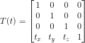
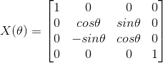
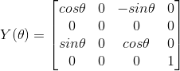
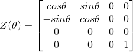
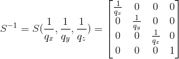

# 행렬 변환(Matrix Transformation)

* DirectX 3D를 이용한 프로그래밍에서는 **4×4 행렬이 변환에 적합**하다.
  * 따라서 벡터 또한 행렬곱에 따라 **1×4 행벡터**가 되어야한다.
  * 4×4 행렬 구조체인 D3DXMATRIX를 사용한다.

* 3차원 벡터를 4차원 벡터로 변환시켜주기 위해서는 **마지막 성분(w)에 대한 처리**가 필요하다.

  * **벡터를 포인터**로서 활용하기 위해서는 w = 1 **(이동이 가능) **
  * **벡터로서 활용**하기 위해서는 w = 0 **(이동이 불가능) **
  * 이렇게 필요에 따라 변환된 4D벡터를 3D 벡터의 **동치벡터(equivalent vector) **라고 한다.

* ## 이동 행렬(Translation Matrix)

  * (x, y, z, 1)벡터를 각 축 단위로 t 만큼의 이동
    * 
  * D3DXMATRIX* D3DXMatrixTranslation(D3DXMATRIX * pOut, CONST D3DXMATRIX* pM1,  FLOAT x, FLOAT, y, FLOAT z);
    * x, y, z : x, y, z축으로 이동할 수치
    * 이동 벡터 **p의 부호를 바꾸는 것**으로 **이동행렬의 역행렬**을 얻을 수 있다.

* ## 회전 행렬

  * 정해진 축을 기준으로 라디안 값만큼 회전 시킬 수 있는 행렬이다.

  * D3DXMATRIX* D3DXMatrixRotationX(D3DXMATRIX * pOut, Float Angle)

    * 

  * D3DXMATRIX* D3DXMatrixRotationY(D3DXMATRIX * pOut, Float Angle)

    * 

  * D3DXMATRIX* D3DXMatrixRotationZ(D3DXMATRIX * pOut, Float Angle)

    * 

    

* ## 크기 행렬

  * 정해진 축을 기준으로 스칼라 값만큼 크기를 변경 시킬 수 있는 행렬이다.
  * D3DXMATRIX* D3DXMatrixScaling(D3DXMATRIX * pOut, FLOAT sx, FLOAT sy, FLOAT sz);
    
    * 
    
      

* ## 벡터 변환 함수

  * 벡터에 행렬을 곱해서 행렬이 적용된 포인트 또는 벡터를 반환해주는 함수이다.
  * 마지막 성분(w)이 1인 포인트로 변환해 주는 함수
    * D3DXVECTOR3* D3DXVec3TransformCoord(D3DXVECTOR3* pOut, CONST D3DXVECTOR3 * pV, CONST D3DXMATRIX* pM);
  * 마지막 성분(w)이 0인 포인트로 변환해 주는 함수
    * D3DXVECTOR3* D3DXVec3TransformNormal(D3DXVECTOR3* pOut, CONST D3DXVECTOR3 * pV, CONST D3DXMATRIX* pM);