#  행렬(Matrix)

* 행(Row) + 열(Column)로 가로와 세로로 나열된 수의 집합이다.
* **벡터의 확장**이라고 볼 수 있으며, 벡터가 하나의 행 내지는 열만을 표현하는 데 비해 행렬은 **행 벡터들로 행을 구성**하거나 **열 벡터들로 열을 구성**하여 만들 수 있다.
* 임의의 두 행렬의 **차수가 같고**, **모든 상응하는 원소가 같은 것**을 **행렬의 상동**이라 한다.
* 행렬을 사용하여 컴퓨터 그래픽에서 점이나 오브젝트 등을 원하는 위치로 옮기거나 회전할 수 있다.


## 행렬의 종류

* ### 정방행렬(Square Matrix)

  * 행과 열의 개수가 같은 행렬이다. (n × n)

* ### 대각행렬(Diagonal Matrix)
  * a11	0	0	0

    0	a22	0	0
  
    0	0	a33	0
  
    0	0	0	a44
  
  * 행과 열이 같은 요소(대각)에 임의의 값이 저장되어 있는 행렬이다.
  
* ### 단위행렬(Identity Matrix)
  * 1	0	0	0

    0	1	0	0

    0	0	1	0

    0	0	0	1
  
  * 대각 행렬에서 대각선 성분의 값이 모두 1인 행렬이다.
  * 행렬의 초기화에 사용된다.
  * 임의의 행렬 A와 단위행렬을 곱하였을 때, 행렬 A는 변화가 없다.
  
* ### 전치행렬(Transpos Matrix)

  * a11	a12	a13	a14	
  
    a21	a22	a23	a24	
  
    a31	a32	a33	a34	
  
    a41	a42	a43	a44
  
    ​                  ↓
  
  * a11	a21	a31	a41
  
    a12	a22	a32	a42
  
    a13	a23	a33	a43
  
    a14	a24	a34	a44
  
  * 행렬을 대각선 성분에 대해 대칭 이동한 행렬이다.
  
  * m × n행렬의 전치행렬은 n x m행렬이 된다.
  
  * 행을 열로 자리바꿈하거나 열을 행으로 자리바꿈한 행렬이다.
  
  * 기호는 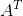이다.


## 행렬의 합과 차

* ### 행렬의 합

  * **크기가 같은** 두 행렬에 대하여, **각 상응하는 원소의 합**을 구한다.

  * 두 행렬을 더하는 함수의 예제 코드(3×3행렬의 합)

    ```cpp
    Matrix3X3 addMatrics(Matrix3X3 a, Matrix3X3 b)
    {
        Matrix3X3 temp;
        for(int i = 0; i < 3; i++)
        {
            for(int j = 0; j < 3; j++)
            {
                temp.index[i][j] = (a.index[i][j] + b.index[i][j]);
    		}
        }
        return temp;
    }
    ```

* ### 행렬의 차

  * **크기가 같은** 두 행렬에 대하여, **각 상응하는 원소의 차**를 구한다.

  * 두 행렬의 차를 구하는 예제 코드(4×4행렬의 차)

    ```cpp
    Matrix4X4 subtractMatrics(Matrix4X4 a, Matrix4X4 b)
    {
        Matrix4X4 temp;
        
        for(int i = 0; i < 4; i++)
        {
            for(int j = 0; j < 4; j++)
            {
                temp.index[i][j] = (a.index[i][j] - b.index[i][j]);
            }
        }
        return temp;
    }
    ```


## 행렬의 곱

* ### 행렬의 스칼라 곱

  * 행렬의 **각 원소**에 스칼라 값을 곱한다.
  
	* 행렬에 스칼라를 곱하는 예제 코드(3×3행렬에 스칼라 곱)
	
	  ```cpp
	  Matrix3X3 scalarMultiply(Matrix3X3 a, float scale)
	  {
	      Matrix3X3 temp;
	      
	      for (int i = 0; i < 3; i++)
	      {
	          for (int j = 0; j < 3; j++)
	          {
	              temp.index[i][j] = (a.index[i][j] * scale);
	          }
	      }
	      return temp;
	  }
	  ```
	
	  
	


* ### 행렬과 행렬의 곱

  
  * 행렬과 행렬간의 곱셈은 **첫 번째 행렬의 행**과 **두 번째 행렬의 열**과의 **내적**이다.
  
  
    * 예) 두 2X2 행렬의 곱
  
      임의의 두 행렬 A = 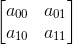 B = 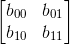에 대하여
  
      AB = 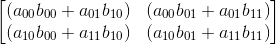
  
  * 행렬 곱 AB에 대하여 **행렬 A의 열의 수**와 **행렬 B의 행의 수가 같아야 한다.**
  
  * 행렬 곱 AB의 크기는 **행렬 A의 행과 행렬 B의 열의 개수를 가진다.**
  
  * 행렬의 곱은 **교환법칙이 성립하지 않는다.**
  
  
    * 임의의 크기를 갖는 두 행렬 A, B에 대하여 **AB != BA**
  
  * 두 행렬의 곱에 대한 예제 코드(3×3행렬)
  
    ```cpp
    Matrix3X3 multiply3X3Matrices(Matrix3X3 a, Matrix3X3 b)
    {
        Matrix3X3 temp = createFixed3X3Matrix(0);
        
        for(int i = 0; i < 3; i++)
        {
            for(int j = 0; j < 3; j++)
            {
                for(int k = 0; k < 3; k++)
                {
                    temp.index[i][j] += (a.index[i][j] * b.index[k][j]);
                }
            }
        }
        return temp;
    }
    ```
    


* ### 벡터와 행렬의 곱

  * 벡터와 행렬의 곱은 **1×3 행벡터와 3×3 행렬의 곱셈**을 한 것과 같다.
  * 임의의 벡터 v = 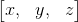와 행렬 A = 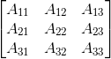는 선형결합(Linear Combination)을 통해 다음과 같이 나타낼 수 있다.
    * 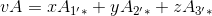


## 행렬식(Determinant)

* 정방행렬에 실수를 대응 시키는 함수이다.

* 행렬의 역을 구할때 사용된다.

* 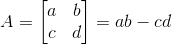또는  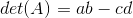

* ### 소행렬식(Minor)

  * 임의의 행렬 A에서 **i번째 행과 j번째 열을 제거 시켜 구성되는 (n-1)차 정방행렬**이다.
    * 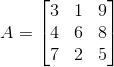인 행렬에서 원소 a_11의 소행렬식은 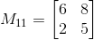이다.
  
* ### 여인수(Cofactor)

  * 임의의 행렬 A로부터 만들어지는 **소행렬식에 적당한 부호를 붙인 값**이다.
    * 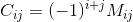

* ### 수반행렬(Adjoint Matrix)

  * n차 정방행렬 A에 대해 **A의 여인수 행렬의 전치행렬**이다.
  
  * 임의의 행렬 에 대해서 
  
    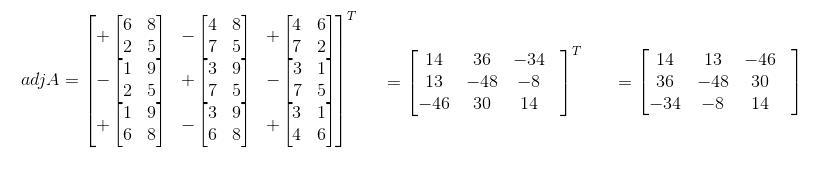
    
    


## 역행렬(Inverse Matrix)

* 행렬 A의 역행렬은 **A와 곱해서 단위행렬 E가 나오는 행렬**을 A의 역행렬이라고 한다.

* 행렬 A의 수반행렬(Adjoint Matrix)를 adjA라고 하고, 그 행렬식(Determinant)을 detA라고 할 때

  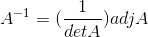
  
* 시계 방향으로 이동한 오브젝트를 다시 반시계방향으로 이동하는 등 여러가지 용도로 사용된다.

